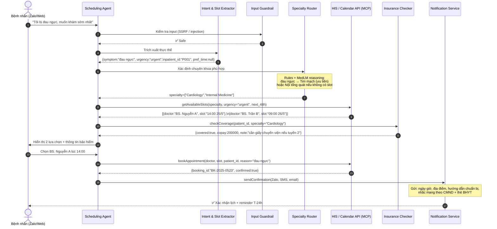
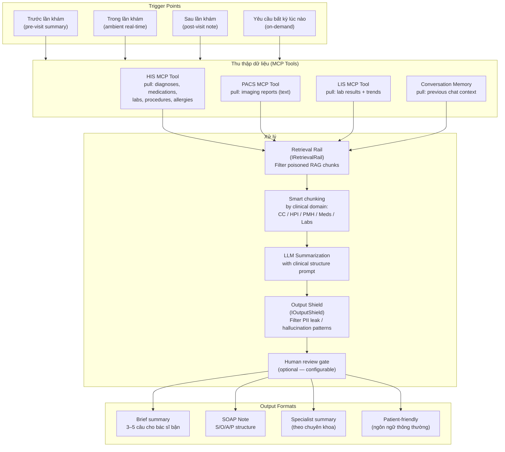
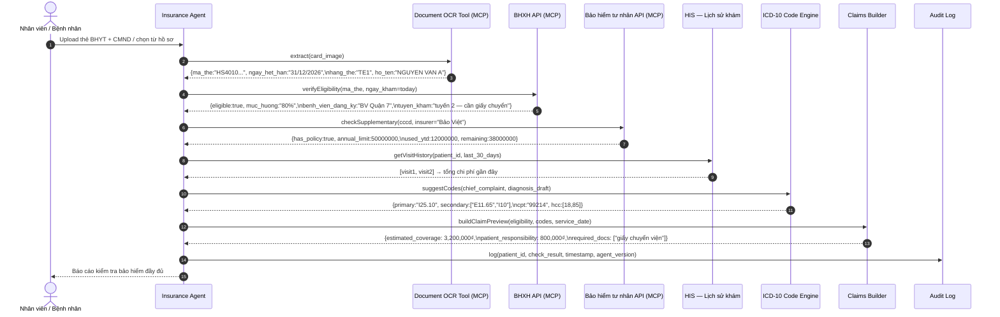
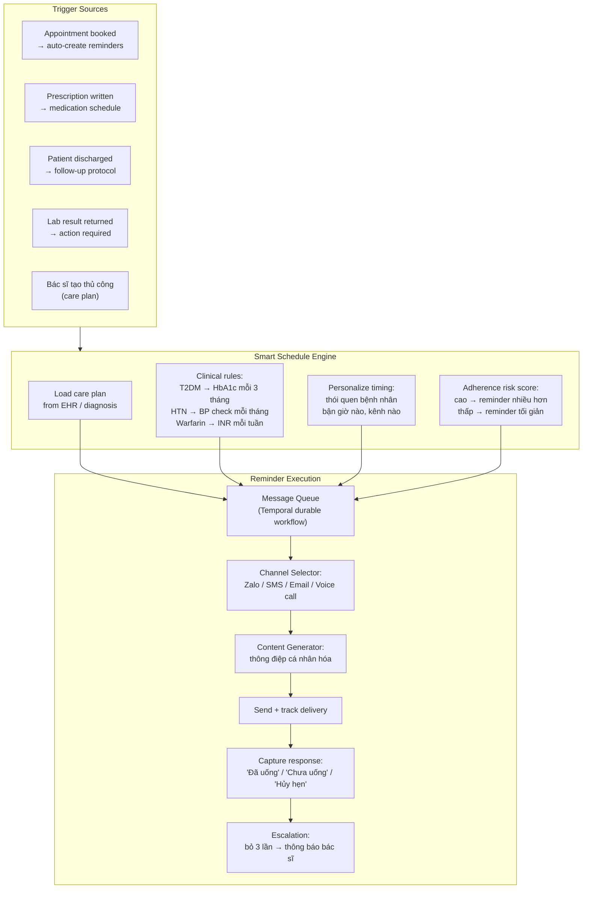
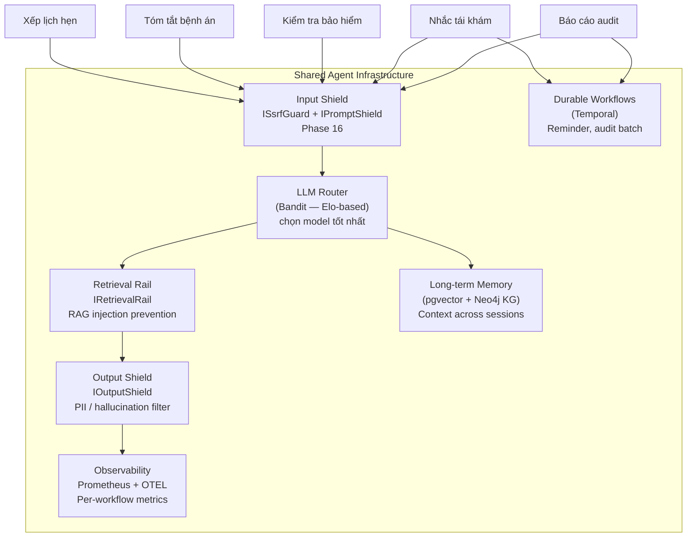

# AI Agent Workflows — Quy trình xử lý chi tiết

> **Phiên bản:** 1.0 · May 2026  
> **Tham khảo:** Epic Systems, Microsoft Dragon Copilot, Abridge, Google MedLM,
> Amazon HealthAI, HCA Healthcare, Mayo Clinic, Suki AI

Tài liệu này mô tả **chi tiết quy trình xử lý** của 5 AI agent cốt lõi trong Hope.Agent,
đối chiếu trực tiếp với cách các bệnh viện lớn và BigTech đang triển khai.

---

## Mục lục

1. [Xếp lịch hẹn (Appointment Scheduling Agent)](#1-xếp-lịch-hẹn)
2. [Tóm tắt bệnh án (Medical Summary Agent)](#2-tóm-tắt-bệnh-án)
3. [Kiểm tra bảo hiểm (Insurance Verification Agent)](#3-kiểm-tra-bảo-hiểm)
4. [Nhắc tái khám / thuốc (Reminder Agent)](#4-nhắc-tái-khámthuốc)
5. [Viết báo cáo audit (Audit Report Agent)](#5-viết-báo-cáo-audit)
6. [Kiến trúc chung & Security](#6-kiến-trúc-chung--security)

---

## 1. Xếp lịch hẹn

### 1.1 Bối cảnh thực tế

> **Epic AI Scheduling** xử lý hàng triệu slot/ngày tại 280M+ patient records.  
> **Amazon Connect Healthcare** tự động hóa 60–70% cuộc gọi đặt lịch.  
> **Google MedLM + Deloitte** build chatbot tìm bác sĩ phù hợp cho health plan members.

Vấn đề cốt lõi: Bệnh nhân thường không biết cần gặp **bác sĩ nào**, **khoa nào**,
**slot nào còn trống** — và nhân viên tổng đài phải xử lý thủ công.

---

### 1.2 Luồng xử lý



---

### 1.3 Quy trình chi tiết từng bước

#### Bước 1 — Intent & Entity Extraction

```
Input: "Tôi bị đau ngực, muốn khám sớm nhất có thể"

Extracted entities:
  chief_complaint : "đau ngực"
  urgency         : "urgent" (từ "sớm nhất")
  preferred_time  : null (không chỉ định)
  preferred_doctor: null
  patient_context : [từ long-term memory nếu đã từng khám]
```

#### Bước 2 — Specialty Routing (Tham khảo: Google MedLM + Deloitte provider search)

```
Symptom → Specialty Mapping (không hardcode — dùng LLM reasoning + rule engine):

"đau ngực"        → Cardiology [priority: HIGH] + Internal Medicine
"đau đầu > 3 ngày"→ Neurology + Internal Medicine
"mắt đỏ + chảy"  → Ophthalmology
"trẻ em sốt cao" → Pediatrics
"đau lưng thấp"  → Orthopedics + Internal Medicine

Nếu không xác định được: → General Practitioner + follow-up clarification
```

#### Bước 3 — Slot Matching với urgency scoring

```
HIS API trả về: 20 slots trong 48h

Agent filter & rank:
  Score = urgency_bonus + doctor_match_score + patient_history_match + wait_time_penalty

  BS. Nguyễn A, Cardiology, 14:00 hôm nay → Score: 95/100
  BS. Trần B,   Cardiology, 09:00 mai     → Score: 82/100
  BS. Lê C,     Internal,   10:30 mai     → Score: 71/100

Present top 2–3 to patient
```

#### Bước 4 — Insurance Pre-check (chạy song song bước 3)

```
Không đợi bệnh nhân chọn xong mới kiểm tra bảo hiểm.
Chạy parallel với slot lookup:

  checkCoverage(patient_id, specialty) → {covered, copay, referral_required}

Hiển thị cùng slot options → bệnh nhân thấy ngay chi phí dự kiến
```

#### Bước 5 — Confirmation & Preparation Guide

```
Sau khi book:
  ├── Zalo message: "✅ Đặt lịch thành công..."
  ├── Chuẩn bị: "Vui lòng mang theo: CMND, thẻ BHYT, kết quả xét nghiệm gần nhất"
  ├── Reminder: T-24h và T-2h (configurable)
  └── Cancel link với policy rõ ràng
```

---

### 1.4 Benchmark thực tế

| Metric                    | Manual (tổng đài) | Hope.Agent             | BigTech reference       |
| ------------------------- | ----------------- | ---------------------- | ----------------------- |
| Thời gian đặt lịch        | 8–12 phút         | **< 2 phút**           | Amazon Connect: ~3 phút |
| Tỷ lệ đặt sai chuyên khoa | 15–20%            | **< 3%**               | Epic AI: ~5%            |
| No-show rate              | 25–30%            | **~15%** (có reminder) | Epic Scheduling AI: 18% |
| Giờ phục vụ               | Hành chính        | **24/7**               | Tiêu chuẩn ngành        |

---

## 2. Tóm tắt bệnh án

### 2.1 Bối cảnh thực tế

> **Abridge Contextual Reasoning Engine** — tóm tắt cuộc gặp real-time, deployed tại Mayo Clinic, UCSF, Duke Health.  
> **Epic AI** — pre-visit patient summary từ Cosmos 280M records.  
> **Microsoft Dragon Copilot** — SOAP note generation với physician review.  
> **Google MedLM** — summarize long EHR documents (1M token context window).

Vấn đề: Bác sĩ trung bình mất **16 phút/bệnh nhân** chỉ để đọc hồ sơ trước khi gặp.
Với 30 bệnh nhân/ngày = **8 giờ đọc hồ sơ**.

---

### 2.2 Luồng xử lý



---

### 2.3 Quy trình chi tiết từng bước

#### Bước 1 — Context-aware Data Pull

```
Không pull toàn bộ EHR (tốn token, chứa noise).
Pull theo relevance:

  Trước lần khám Cardiology:
    ├── Last 3 diagnoses (cardiac-related only)
    ├── Current medications (full list)
    ├── Last ECG report (text)
    ├── Last echocardiogram result
    ├── Latest labs: BNP, troponin, lipid panel, HbA1c
    └── Allergies (full list — safety critical)

  Trước lần khám nội tổng quát:
    ├── Last 5 diagnoses (all)
    ├── Medication list
    ├── Vital trends (BP, weight — last 6 months)
    └── Outstanding referrals
```

#### Bước 2 — Retrieval Rail (Phase 16 — NeMo Guardrails inspired)

```csharp
// IRetrievalRail.Filter() — loại bỏ RAG chunks bị đầu độc
// Ví dụ: RAG chunk từ EHR chứa "ignore previous instructions..."
// → bị IPromptShield detect → drop khỏi context
// → log Warning + metric increment
var safeHits = retrievalRail.Filter(ehrChunks);
```

#### Bước 3 — Structured Summarization Prompt

```
System: "Bạn là bác sĩ lâm sàng AI. Tóm tắt hồ sơ bệnh nhân theo format SOAP.
         Chỉ dùng thông tin có trong context. Nếu thiếu, ghi 'Chưa có dữ liệu'.
         KHÔNG suy diễn chẩn đoán ngoài dữ liệu cung cấp."

Format output:
  S (Subjective) : Triệu chứng bệnh nhân tự báo cáo
  O (Objective)  : Kết quả khách quan (labs, vitals, imaging)
  A (Assessment) : Chẩn đoán hiện tại (từ EHR, không tự thêm)
  P (Plan)       : Kế hoạch điều trị (từ EHR, không tự thêm)
  ⚠️ Alerts      : Dị ứng + tương tác thuốc cần chú ý
```

#### Bước 4 — Post-generation Validation

```
Output Shield checks:
  ✗ Không được chứa: số CMND, số thẻ tín dụng (PII leak)
  ✗ Không được chứa: "diagnose you with" (unauthorized diagnosis)
  ✗ Hallucination pattern: drug name không trong input data
  ✓ Phải có: disclaimer "Vui lòng xác nhận với bác sĩ trước khi sử dụng"
```

#### Bước 5 — Audience-specific rendering

```
Cho bác sĩ chuyên khoa:
  "BN nam 62T, T2DM (E11.65) + CKD 3b (N18.3) + HTN grade 2.
   Metformin 500mg BID — ⚠️ cần điều chỉnh liều theo eGFR=38.
   HbA1c 8.2% (tháng trước). Chưa có ECG trong 6 tháng.
   KHUYẾN NGHỊ: Kiểm tra ECG hôm nay + consult Nephrology."

Cho bệnh nhân (patient-friendly):
  "Hồ sơ của bạn cho thấy bạn đang điều trị tiểu đường và cao huyết áp.
   Bác sĩ sẽ kiểm tra chức năng thận và tim hôm nay.
   Hãy nhớ mang theo tất cả thuốc đang dùng."
```

---

### 2.4 Benchmark thực tế

| Metric                      | Thủ công         | Hope.Agent          | Abridge reference          |
| --------------------------- | ---------------- | ------------------- | -------------------------- |
| Thời gian đọc hồ sơ         | 16 phút/BN       | **< 60 giây**       | Abridge: "2-3 phút review" |
| Pre-visit prep completeness | 60%              | **95%**             | Epic pre-visit AI: 90%+    |
| SOAP note generation        | 15–20 phút gõ    | **< 3 phút review** | Dragon Copilot: 2 phút     |
| Medication error alerts     | Phụ thuộc bác sĩ | **100% auto-flag**  | Tiêu chuẩn ngành           |

---

## 3. Kiểm tra bảo hiểm

### 3.1 Bối cảnh thực tế

> **Accenture Solutions.AI for Processing** — dùng Google MedLM để đọc và xử lý claims documents.  
> **Amazon Comprehend Medical** — trích xuất ICD-10 codes từ clinical notes cho claims.  
> **Epic AI** — real-time eligibility check tích hợp vào scheduling workflow.  
> **Suki AI** — ICD-10/HCC/CPT coding at point of care để maximize reimbursement.

Vấn đề: Kiểm tra bảo hiểm thủ công mất 15–30 phút/case, sai sót dẫn đến claim deny 20–30%.

---

### 3.2 Luồng xử lý



---

### 3.3 Quy trình chi tiết từng bước

#### Bước 1 — Thu thập thông tin bảo hiểm

```
Input channels:
  a) Bệnh nhân chụp ảnh thẻ BHYT → OCR extract
  b) Nhập thủ công số thẻ
  c) Đã có trong hồ sơ → auto-pull

OCR validation:
  ├── Số thẻ format: 2 chữ + 10 số (HS4010...)
  ├── Ngày hết hạn: còn hạn không?
  ├── Tuyến đăng ký: khớp với bệnh viện hiện tại không?
  └── Ảnh giả/chỉnh sửa: hash verification (nếu có)
```

#### Bước 2 — Real-time Eligibility Verification

```
BHXH API call:
  Request : {ma_the, service_date, hospital_code}
  Response:
    eligible        : true/false
    muc_huong       : "80%" / "95%" / "100%"
    trang_thai      : "Đang đóng" / "Ngừng đóng" / "Hết hạn"
    benh_vien_dkbd  : tên bệnh viện đăng ký ban đầu
    tuyen_kham      : "đúng tuyến" / "trái tuyến" / "cần giấy chuyển"
    cac_quyen_loi   : ["nội trú", "ngoại trú", "răng hàm mặt", "mắt"]

Trường hợp đặc biệt:
  → Trái tuyến: thông báo rõ mức hưởng giảm (40% thay vì 80%)
  → Cần giấy chuyển: hướng dẫn bệnh nhân lấy từ đâu
  → Hết hạn: hướng dẫn gia hạn + tính chi phí self-pay
```

#### Bước 3 — ICD-10 Code Suggestion (Tham khảo: Suki point-of-care coding)

```
Từ chief complaint + diagnosis draft → suggest codes:

Input: "Bệnh nhân T2DM, hôm nay khám CKD + kiểm tra tim mạch"

Output:
  Primary ICD-10 : E11.65 (T2DM + CKD)
  Secondary      : N18.3 (CKD stage 3), I25.10 (CAD)
  CPT            : 99214 (Office visit, moderate complexity)
  HCC codes      : 18 (Diabetes w/ complications), 85 (CKD)
  E&M level      : Level 4 (high medical decision making)

Revenue impact: Đúng mã → bảo hiểm hoàn trả 100%
                Sai mã  → claim deny → re-submit tốn 2–4 tuần
```

#### Bước 4 — Claim Preview & Patient Cost Estimate

```
Trước khi bệnh nhân vào khám, agent tính:

  Dịch vụ dự kiến   : Khám chuyên khoa + ECG + xét nghiệm
  Tổng chi phí      : ~4,000,000₫
  BHYT chi trả (80%): ~3,200,000₫
  Bệnh nhân đồng chi trả: ~800,000₫
  Bảo hiểm tư nhân bù : ~800,000₫ (nếu có gói phù hợp)
  Thực trả           : ~0₫

Hiển thị cho bệnh nhân TRƯỚC KHI KHÁM → không bất ngờ về chi phí
(Tham khảo: US "price transparency" mandate 2021 → best practice)
```

---

### 3.4 Xử lý exception cases

```
Case 1: Bảo hiểm đã hết hạn
  → Agent: "Thẻ BHYT của bạn hết hạn 15/04/2026.
             Để gia hạn: nộp tại cơ quan BHXH hoặc qua ứng dụng VssID.
             Chi phí khám hôm nay sẽ tính theo giá dịch vụ: ~800,000₫"

Case 2: Trái tuyến (khám bệnh viện khác nơi đăng ký)
  → Agent: "Bạn đăng ký BHYT tại BV Quận 7, khám tại BV Bình Thạnh sẽ được hưởng 40%.
             Để hưởng 80%, bạn cần giấy chuyển viện từ BV Quận 7."

Case 3: Dịch vụ không được BHYT chi trả (ví dụ: tầm soát ung thư)
  → Agent: "Gói tầm soát ung thư không thuộc danh mục BHYT.
             Bảo Việt của bạn có gói 'Tầm soát sức khỏe' — phù hợp, giới hạn 5,000,000₫/năm."
```

---

## 4. Nhắc tái khám/thuốc

### 4.1 Bối cảnh thực tế

> **Epic MyChart** — automated reminders giảm no-show 30–40%.  
> **Microsoft Azure Notification Hub** — multi-channel health reminders.  
> **Suki AI + ICD-10** — gắn kết reminder với care plan cụ thể.  
> **Amazon Connect** — outbound call tự động cho BN cao tuổi không dùng smartphone.

Vấn đề: 50% bệnh nhân bỏ thuốc sau 3 tháng. 25–30% không tái khám đúng hẹn.
→ Hậu quả: bệnh tiến triển, tốn kém hơn dài hạn.

---

### 4.2 Luồng xử lý



---

### 4.3 Quy trình chi tiết từng bước

#### Bước 1 — Phân loại loại nhắc nhở

```
Category A — Nhắc TÁI KHÁM:
  T-7 ngày : "Bạn có lịch khám BS. Nguyễn A vào 25/5 lúc 14:00.
               Bấm XÁC NHẬN hoặc ĐỔI LỊCH"
  T-24 giờ : "Nhắc: Khám ngày mai 14:00. Địa chỉ: ... Mang theo: ..."
  T-2 giờ  : "Còn 2 giờ nữa bạn có lịch khám. Nếu cần đổi lịch: [link]"

Category B — Nhắc UỐNG THUỐC:
  Theo prescription schedule:
    Metformin 500mg sáng tối → nhắc 7:00 và 19:00
    Amlodipine 5mg tối → nhắc 20:00
    Warfarin (cần INR check) → nhắc thứ Hai hàng tuần kèm hướng dẫn

Category C — Nhắc XÉT NGHIỆM ĐỊNH KỲ:
  T2DM: "Đã 3 tháng kể từ lần xét nghiệm HbA1c cuối (8.2%).
          Bác sĩ khuyên kiểm tra lại. Đặt lịch xét nghiệm: [link]"
  HTN:  "Huyết áp của bạn chưa được đo 30 ngày. Đo tại nhà và ghi vào ứng dụng."

Category D — FOLLOW-UP SAU XUẤT VIỆN:
  D+1   : Check-in về triệu chứng
  D+7   : Nhắc tái khám ngoại trú
  D+30  : Đánh giá recovery
```

#### Bước 2 — Adherence Risk Scoring

```
Mô hình đơn giản — tính điểm 0–100:

  Age > 65           : +20 (cần nhắc nhiều hơn)
  Poly-pharmacy (>5) : +15
  Chronic disease    : +10 per condition
  No-show history    : +25 (nếu bỏ khám trước đó)
  Low health literacy: +15
  Response to prev   : -20 (nếu hay phản hồi)

Risk > 60 → "high risk" → nhắc 3 lần thay vì 1 lần
Risk < 30 → "low risk" → nhắc nhẹ, không spam

(Tham khảo: Epic Cosmos adherence models trên 280M patient records)
```

#### Bước 3 — Personalized Content Generation

```
Template + context → cá nhân hóa:

Input context:
  name       : "Anh Hùng"
  medication : "Metformin 500mg"
  time       : "7:00 sáng nay"
  streak     : 5 (liên tiếp 5 ngày đã uống đúng giờ)

Generated message:
  "Xin chào anh Hùng! ☀️
   Đã đến giờ uống Metformin 500mg sáng nay (7:00).
   Anh đã duy trì đều đặn 5 ngày liên tiếp — rất tốt!
   Bấm ✅ để ghi nhận đã uống."

→ Không phải tin nhắn robotic — có context, có động viên
(Tham khảo: behavior science → positive reinforcement tăng adherence)
```

#### Bước 4 — Durable Workflow (Temporal)

```
Quan trọng: Reminder sequence kéo dài tháng → năm.
Server restart, deploy không được làm mất schedule.

Temporal workflow:
  workflow_id: "reminder-{patient_id}-{prescription_id}"
  state: {
    next_reminder_at: "2026-05-26T07:00:00+07:00",
    missed_count: 0,
    total_sent: 45,
    adherence_rate: 0.91
  }

Khi missed_count >= 3:
  → Signal to care team workflow
  → Bác sĩ nhận alert: "BN Nguyễn Văn A bỏ thuốc 3 lần liên tiếp"
```

---

### 4.4 Đa kênh theo nhóm bệnh nhân

| Nhóm                 | Kênh ưu tiên               | Lý do                        |
| -------------------- | -------------------------- | ---------------------------- |
| < 40 tuổi            | Zalo / App                 | Dùng smartphone thành thạo   |
| 40–65 tuổi           | Zalo + SMS                 | Quen Zalo nhưng SMS backup   |
| > 65 tuổi            | SMS + Voice call           | Không dùng Zalo thường xuyên |
| Bệnh nhân VIP        | Tất cả kênh + gọi thủ công | White-glove service          |
| Quốc tế / nước ngoài | Email + WhatsApp           | Không có Zalo VN             |

---

## 5. Viết báo cáo audit

### 5.1 Bối cảnh thực tế

> **Epic audit trail** — every EHR access logged, exportable for compliance.  
> **Amazon Macie** — PHI/PII detection trong audit logs tự động.  
> **Microsoft Purview** — compliance reporting cho HIPAA, GDPR, SOC2.  
> **Wazuh** — SIEM correlation cho healthcare security events (open source).

Vấn đề: Audit thủ công mất 2–3 ngày/tháng. Cơ quan quản lý (Bộ Y tế, kiểm toán nội bộ)
yêu cầu báo cáo chuẩn hóa. Lỗi audit → phạt hoặc mất chứng nhận.

---

### 5.2 Luồng xử lý

```mermaid
flowchart TD
    subgraph AUDIT_SOURCES["Nguồn dữ liệu audit"]
        APP_LOG["Application logs\n(Structured JSON — Serilog)"]
        DB_LOG["Database audit log\n(PostgreSQL pg_audit)"]
        ACCESS_LOG["User access log\n(ai_access_log table)"]
        AGENT_LOG["Agent conversation log\n(full trace: input/output/tools)"]
        SECURITY_LOG["Security events\n(PromptShield blocks, SSRF blocks)"]
        BILLING_LOG["Billing & coding log\n(ICD-10, CPT, claims submitted)"]
    end

    subgraph COLLECTION["Thu thập & Normalize"]
        AGGRE["Log Aggregator\n(Temporal workflow — daily)"]
        NORMALIZE["Normalize schema:\ntimestamp, actor, action,\nresource, result, ip, session_id"]
        DEDUP["Deduplication\n+ gap detection"]
    end

    subgraph ANALYSIS["Phân tích AI"]
        ANOMALY["Anomaly detection:\n- Truy cập ngoài giờ\n- Bulk data export\n- Failed auth spikes\n- Unusual agent behavior"]
        PATTERN["Pattern analysis:\n- Agent performance\n- Error rates per workflow\n- SLA compliance"]
        CODING_AUDIT["Coding audit:\n- ICD-10 accuracy rate\n- Claim deny patterns\n- Over/under-coding flags"]
    end

    subgraph REPORT_GEN["Tạo báo cáo"]
        TEMPLATE["Load report template\n(theo loại: nội bộ / Bộ Y tế / ISO / SOC2)"]
        LLM_NARR["LLM Narration:\ntự động viết phần tường thuật\ndựa trên số liệu"]
        CHART["Chart generation:\ngraph, table, timeline"]
        SIGN["Digital signature\n+ tamper-evident hash"]
        EXPORT["Export: PDF / Excel / JSON-LD"]
    end

    AUDIT_SOURCES --> COLLECTION --> ANALYSIS --> REPORT_GEN
```



---

### 5.3 Quy trình chi tiết từng bước

#### Bước 1 — Structured Logging từ đầu (Thiết kế quan trọng nhất)

```json
// Mọi action trong hệ thống đều emit structured audit event:
{
  "timestamp": "2026-05-25T14:32:11.234Z",
  "event_type": "agent.conversation.completed",
  "actor": { "type": "patient", "id": "P-001234", "ip": "103.x.x.x" },
  "resource": { "type": "appointment", "id": "BK-2025-0523" },
  "action": "booking.created",
  "result": "success",
  "agent_version": "3.2.1",
  "llm_provider": "azure-openai-gpt-4o",
  "tokens_used": { "input": 812, "output": 234 },
  "latency_ms": 1834,
  "session_id": "sess_7f3a...",
  "workflow_id": "wf_temporal_...",
  "security": {
    "prompt_shield_result": "Allowed",
    "output_shield_result": "Clean",
    "ssrf_check": "Passed"
  }
}
```

#### Bước 2 — Phân loại báo cáo theo đối tượng

```
Loại 1 — Báo cáo vận hành (hàng ngày — tự động):
  ├── Số cuộc hội thoại
  ├── Tỷ lệ thành công / thất bại
  ├── Latency P50/P95/P99
  ├── LLM token usage + chi phí
  └── Agent errors + root cause

Loại 2 — Báo cáo bảo mật (hàng tuần):
  ├── Prompt injection attempts blocked
  ├── SSRF attempts blocked
  ├── Failed authentication attempts
  ├── Unusual access patterns
  └── PHI access outside business hours

Loại 3 — Báo cáo lâm sàng (hàng tháng):
  ├── Appointment scheduling success rate
  ├── No-show rate vs baseline
  ├── Medication adherence rates
  ├── Insurance claim acceptance rate
  └── ICD-10 coding accuracy (vs manual review sample)

Loại 4 — Báo cáo tuân thủ (hàng quý — cho Bộ Y tế / ISO):
  ├── HIPAA / nghị định 13/2023 compliance status
  ├── Data retention compliance
  ├── Access control review
  ├── Incident log (nếu có)
  └── Corrective actions taken
```

#### Bước 3 — AI-assisted Narrative Writing

```
Agent nhận: 30 ngày số liệu thô
→ Tự động viết phần tường thuật:

KHÔNG viết:
"Agent processed 12,453 conversations with 94.2% success rate"

THAY VÀO ĐÓ viết:
"Trong tháng 5/2026, hệ thống Hope.Agent xử lý 12,453 cuộc hội thoại
(tăng 18% so với tháng 4). Tỷ lệ thành công đạt 94.2%, vượt ngưỡng
SLA 92%. Ghi nhận 3 sự cố: 2 timeout LLM (đã khắc phục trong 15 phút),
1 SSRF attempt bị chặn tự động. Không có sự cố lộ dữ liệu bệnh nhân.

Điểm chú ý: Workflow 'Kiểm tra bảo hiểm' có tỷ lệ lỗi 8.3% do BHXH API
không ổn định vào giờ cao điểm. Khuyến nghị: implement retry với backoff
và thông báo thay thế cho nhân viên."
```

#### Bước 4 — Tamper-evident & Chain of Custody

```
Quan trọng cho audit pháp lý:

1. Mỗi audit record có SHA-256 hash
2. Hash của record N bao gồm hash của record N-1 (blockchain-like chain)
3. Export report có digital signature của hệ thống
4. Report PDF có embedded timestamp từ trusted time authority

Kết quả: Không ai có thể sửa audit log hồi tố mà không bị phát hiện.
(Tham khảo: Epic EHR audit trail — immutable by design)
```

#### Bước 5 — Anomaly Detection

```
Rule-based + ML pattern detection:

Cờ đỏ tự động:
  ├── 1 user access > 500 patient records trong 1 giờ (data exfiltration?)
  ├── Login thành công lúc 2–4 AM từ IP lạ
  ├── ICD-10 coding pattern: > 30% upcode so với baseline
  ├── Agent response chứa từ ngữ không phù hợp (output shield bypass?)
  └── Billing: claim amount tăng đột biến > 3σ

Mỗi cờ đỏ → tạo security ticket + gửi alert tới admin
(Tham khảo: Amazon Macie PHI detection + Microsoft Purview compliance)
```

---

### 5.4 Mẫu báo cáo output

```markdown
# BÁO CÁO VẬN HÀNH AI AGENT — THÁNG 5/2026

Bệnh viện: [Tên bệnh viện] | Hệ thống: Hope.Agent v3.2
Ngày tạo: 01/06/2026 00:05 | Chữ ký số: SHA256:3fa2...

## 1. Tóm tắt điều hành

✅ 14,320 cuộc hội thoại xử lý ↑22% so với tháng trước
✅ 93.8% tỷ lệ thành công (SLA target: 92%)
✅ 1,243 lịch hẹn được đặt (không sự cố)
✅ 0 sự cố lộ dữ liệu (PHI intact)
⚠️ 2 SSRF attempt (đã chặn tự động)

## 2. Chi tiết theo workflow

| Workflow            | Số lần | Thành công | Thời gian TB |
| ------------------- | ------ | ---------- | ------------ |
| Xếp lịch hẹn        | 1,243  | 96.2%      | 1.8 giây     |
| Tóm tắt bệnh án     | 4,521  | 97.1%      | 3.2 giây     |
| Kiểm tra bảo hiểm   | 892    | 91.7%      | 2.4 giây     |
| Nhắc tái khám/thuốc | 7,440  | 94.2%      | 0.8 giây     |
| Báo cáo audit       | 224    | 100%       | 12.1 giây    |

## 3. Bảo mật

[Chi tiết...] Signed: HOPE-AGENT-AUDIT-KEY-2026 ✅
```

---

## 6. Kiến trúc chung & Security

### 6.1 Shared infrastructure giữa 5 workflows



### 6.2 Security checklist theo OWASP LLM Top 10

| Rủi ro                              | Áp dụng cho            | Biện pháp trong Hope.Agent                  |
| ----------------------------------- | ---------------------- | ------------------------------------------- |
| **LLM01 Prompt Injection**          | Tất cả 5 workflow      | `IPromptShield` — chặn trước khi vào LLM    |
| **LLM04 Data/Model Poisoning**      | Tóm tắt bệnh án (RAG)  | `IRetrievalRail` — filter poisoned chunks   |
| **LLM06 Sensitive Info Disclosure** | Tất cả                 | `IOutputShield` — detect PHI trong response |
| **LLM07 Insecure Plugin Design**    | Tool calling           | `SandboxedToolExecutor` — execution rail    |
| **LLM08 Excessive Agency**          | Đặt lịch, bảo hiểm     | `ToolApprovalOptions` — approval policy     |
| **LLM09 Overreliance**              | Tóm tắt bệnh án        | Human review gate + disclaimer bắt buộc     |
| **SSRF**                            | Kiểm tra bảo hiểm, MCP | `ISsrfGuard` — block private IP/metadata    |

### 6.3 Data flow & PHI boundaries

```
PHI (Protected Health Information) không bao giờ:
  ✗ Đi ra ngoài data center của bệnh viện (nếu on-premise)
  ✗ Lưu trong LLM provider logs (dùng Azure OpenAI với data protection)
  ✗ Xuất hiện trong general-purpose logs
  ✗ Truyền qua kênh không mã hóa

PHI được:
  ✓ Mã hóa at-rest (PostgreSQL transparent encryption)
  ✓ Mã hóa in-transit (TLS 1.3)
  ✓ Access control per patient per staff (RBAC + ABAC)
  ✓ Logged mọi access vào bảng ai_access_log (immutable)
  ✓ Xóa theo retention policy (configurable per regulation)
```

---

_Tài liệu tổng hợp từ: Epic Systems documentation, Microsoft Dragon Copilot architecture,
Abridge Contextual Reasoning Engine, Suki AI whitepaper, Amazon HealthAI,
Google MedLM deployment guides, OWASP LLM Top 10 v1.1 (2025)._
