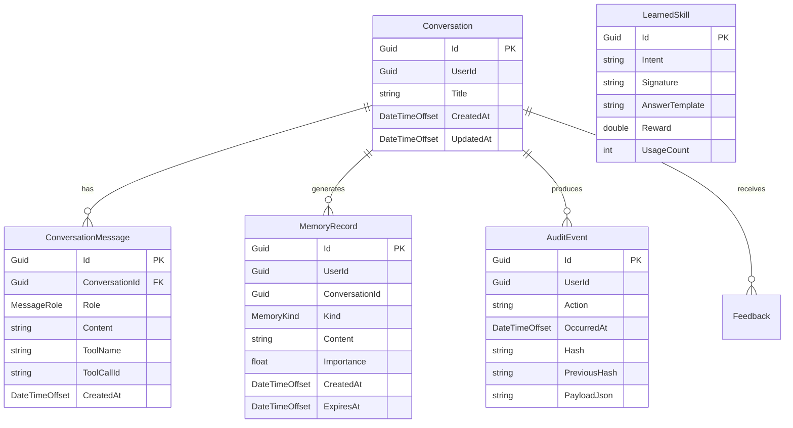

# Hope.Agent — Kiến Trúc & Luồng Request End-to-End

> **Tài liệu số 1/3** — Sơ đồ luồng request hoàn chỉnh từ Client đến Response  
> **Ngày**: 2026-06-03 | **Base**: .NET 9 + Clean Architecture

---

## 1. Tổng Quan Kiến Trúc

```
┌─────────────────────────────────────────────────────────────────────┐
│                        CLIENT LAYER                                  │
│  Web App (Blazor) │ Mobile App │ Zalo OA │ Slack │ HIS/EMR Webhook │
└────────────────────────────┬────────────────────────────────────────┘
                             │ HTTPS + Bearer JWT / HMAC
                             ▼
┌─────────────────────────────────────────────────────────────────────┐
│                    EDGE LAYER — Hope.Agent.Gateway                   │
│  YARP Reverse Proxy: JWT Validation · Rate Limiting · CORS          │
│  Trusted CIDR parsing · X-Forwarded-For verification               │
│  Port 5000 (public) → forwards to API port 5080 (internal)          │
└────────────────────────────┬────────────────────────────────────────┘
                             │ HTTP/2 (internal network)
                             ▼
┌─────────────────────────────────────────────────────────────────────┐
│                    API LAYER — Hope.Agent.Api                        │
│  ASP.NET Minimal API · 26 endpoint groups · OpenTelemetry           │
│                                                                      │
│  Middleware Pipeline (top→bottom):                                   │
│  1. ForwardedHeaders          — Resolve real client IP              │
│  2. SerilogRequestLogging     — Structured HTTP logging             │
│  3. ExceptionHandler          — SafeExceptionHandler → ProblemDetails│
│  4. ContentTypeGuard          — Rejects non-JSON/multipart          │
│  5. RequestContext            — CorrelationId injection             │
│  6. ApiVersionGuard           — Enforce v1 prefix                   │
│  7. HTTPS Redirection (prod)  — Redirect HTTP→HTTPS                 │
│  8. StatusCodePages           — Custom error pages                  │
│  9. CORS (StrictCors)         — Allowed domains only                │
│ 10. SecurityHeaders           — CSP, HSTS, X-Content-Type-Options   │
│ 11. RateLimiter               — Global + per-policy limits          │
│ 12. Authentication (JWT)      — JWT Bearer + API Key (MCP)         │
│ 13. Authorization             — RBAC + PatientAccess + TenantAccess │
│ 14. AuditLogging              — Every request → audit trail         │
│                                                                      │
│  Rate Limiting Policies:                                             │
│  · Global:     120 req/min per user/IP                              │
│  · Agent:       3 concurrent, 5 queued per user                     │
│  · Auth-Login:  10 req/min per IP (brute-force protection)          │
│  · Auth-Refresh: 60 req/min per IP                                  │
│  · MCP:         30 req/min per user                                 │
│  · Diagnostics: 20 req/min per user                                 │
│  · OpenAPI:     10 req/min per user                                 │
└────────────────────────────┬────────────────────────────────────────┘
                             │ DI Container
                             ▼
┌─────────────────────────────────────────────────────────────────────┐
│               ORCHESTRATION LAYER — AgentOrchestrator                │
│  Implements IAgentRuntime · Main entry point for all agent calls    │
│                                                                      │
│  ╔═══════════════════════════════════════════════════════════════╗  │
│  ║              REQUEST FLOW — RunAsync()                        ║  │
│  ╠═══════════════════════════════════════════════════════════════╣  │
│  ║                                                               ║  │
│  ║  INPUT: AgentRequest(UserId, Message, ConversationId?, ...)   ║  │
│  ║                                                               ║  │
│  ║  STEP 1 ── PROMPT SHIELD                                      ║  │
│  ║  ┌─────────────────────────────────────────────────────────┐  ║  │
│  ║  │ IPromptShield.Inspect(message)                          │  ║  │
│  ║  │ · Rule-based + adversarial pattern matching             │  ║  │
│  ║  │ · Returns (Allowed, SanitizedInput, Reasons[])          │  ║  │
│  ║  │ · BLOCKED → audit event + throw InvalidOperation        │  ║  │
│  ║  │ · ALLOWED → proceed with SanitizedInput                 │  ║  │
│  ║  └─────────────────────────────────────────────────────────┘  ║  │
│  ║                                                               ║  │
│  ║  STEP 2 ── CONVERSATION LOADING                               ║  │
│  ║  ┌─────────────────────────────────────────────────────────┐  ║  │
│  ║  │ convRepo.GetAsync(id) OR Conversation.Create(userId,...)│  ║  │
│  ║  │ · AddMessage(MessageRole.User, message, now)            │  ║  │
│  ║  └─────────────────────────────────────────────────────────┘  ║  │
│  ║                                                               ║  │
│  ║  STEP 3 ── CONTEXT GATHERING (parallel, fire-and-forget)      ║  │
│  ║  ┌─────────────────────────────────────────────────────────┐  ║  │
│  ║  │ ▸ Memory Retrieval (hybrid dense+sparse via Qdrant)     │  ║  │
│  ║  │   · Embed message → vector                               │  ║  │
│  ║  │   · SearchHybridAsync (RRF fusion) OR SearchAsync       │  ║  │
│  ║  │   · RetrievalRail.Filter() — drop injection chunks      │  ║  │
│  ║  │   · MemoryReranker (optional LLM rerank)                 │  ║  │
│  ║  │                                                          │  ║  │
│  ║  │ ▸ Skill Retrieval (past successful patterns)             │  ║  │
│  ║  │   · skillLibrary.RetrieveByIntentAsync(intent, topK=3)  │  ║  │
│  ║  │                                                          │  ║  │
│  ║  │ ▸ User Model (traits, preferences)                       │  ║  │
│  ║  │   · userModel.GetAsync(userId)                           │  ║  │
│  ║  │                                                          │  ║  │
│  ║  │ ▸ Conversation Compression (summarize old turns)         │  ║  │
│  ║  │   · compressor.MaybeCompressAsync(conv)                  │  ║  │
│  ║  │                                                          │  ║  │
│  ║  │ ▸ Clinical Context (HIS/EMR data per profile)            │  ║  │
│  ║  │   · clinicalContext.GetAsync(agentProfile)               │  ║  │
│  ║  └─────────────────────────────────────────────────────────┘  ║  │
│  ║                                                               ║  │
│  ║  STEP 4 ── MESSAGE ASSEMBLY                                   ║  │
│  ║  ┌─────────────────────────────────────────────────────────┐  ║  │
│  ║  │ BuildMessages(conv, memories, skills, traits, ...)      │  ║  │
│  ║  │                                                          │  ║  │
│  ║  │ Message Order:                                           │  ║  │
│  ║  │  [0] system: "You are Hope, a careful clinical..."      │  ║  │
│  ║  │  [1] system: PromptSpotlight.SystemDirective (LLM01)    │  ║  │
│  ║  │  [2] system: ClinicalContext (if available)             │  ║  │
│  ║  │  [3] system: UserTraits snapshot (if not empty)         │  ║  │
│  ║  │  [4] system: Compression summary (if any)               │  ║  │
│  ║  │  [5] system: Memory hits (each chunk spotlighted)       │  ║  │
│  ║  │  [6] system: Skill patterns (each spotlighted)          │  ║  │
│  ║  │  [7..N] History turns (user/assistant/tool)             │  ║  │
│  ║  │                                                          │  ║  │
│  ║  │ Spotlighting: Wraps untrusted content in delimited       │  ║  │
│  ║  │ blocks so injected instructions cannot hijack model.    │  ║  │
│  ║  └─────────────────────────────────────────────────────────┘  ║  │
│  ║                                                               ║  │
│  ║  STEP 5 ── ADAPTIVE ROUTING                                   ║  │
│  ║  ┌─────────────────────────────────────────────────────────┐  ║  │
│  ║  │ adaptiveRouter.SelectChatAsync(intent)                  │  ║  │
│  ║  │ · UCB1 multi-armed bandit per (intent → provider)       │  ║  │
│  ║  │ · Fallback: router.SelectChat()                         │  ║  │
│  ║  └─────────────────────────────────────────────────────────┘  ║  │
│  ║                                                               ║  │
│  ║  STEP 6 ── TOOL-CALL LOOP (max 6 iterations)                  ║  │
│  ║  ┌─────────────────────────────────────────────────────────┐  ║  │
│  ║  │  FOR iter = 0..MaxToolIterations:                       │  ║  │
│  ║  │    1. chat.CompleteAsync(messages, tools)               │  ║  │
│  ║  │       ↳ Hope.Agent.LLMGateway                          │  ║  │
│  ║  │         · OpenAI / Anthropic / Gemini / Ollama          │  ║  │
│  ║  │         · Resilience: retry + circuit-breaker + timeout │  ║  │
│  ║  │    2. IF no tool_calls → finalContent = resp.Content    │  ║  │
│  ║  │    3. FOR each tool_call:                               │  ║  │
│  ║  │       a. Tool lookup: tools.Find(call.Name)             │  ║  │
│  ║  │       b. RBAC check: accessPolicy.IsAllowed()           │  ║  │
│  ║  │       c. Approval policy: AutoDeny / RequireApproval    │  ║  │
│  ║  │       d. Sandbox execution: sandbox.InvokeAsync()       │  ║  │
│  ║  │       e. Append tool result → messages (as "tool" role) │  ║  │
│  ║  │       f. Log AgentToolExecution                         │  ║  │
│  ║  └─────────────────────────────────────────────────────────┘  ║  │
│  ║                                                               ║  │
│  ║  STEP 7 ── PERSISTENCE                                       ║  │
│  ║  ┌─────────────────────────────────────────────────────────┐  ║  │
│  ║  │ · convRepo.SaveChangesAsync() — save conversation      │  ║  │
│  ║  │ · PersistMemoryAsync()                                 │  ║  │
│  ║  │   → Consolidation: Mem0/A-Mem ADD/UPDATE/DELETE        │  ║  │
│  ║  │   → Fallback: raw episodic dump with dedup             │  ║  │
│  ║  └─────────────────────────────────────────────────────────┘  ║  │
│  ║                                                               ║  │
│  ║  STEP 8 ── POST-PROCESSING (fire-and-forget background)       ║  │
│  ║  ┌─────────────────────────────────────────────────────────┐  ║  │
│  ║  │ ▸ User-model Extract (traits from conversation)         │  ║  │
│  ║  │ ▸ Reflection (if enabled): critique + refine answer     │  ║  │
│  ║  │ ▸ Skill Distillation: record successful call pattern    │  ║  │
│  ║  │ ▸ Knowledge Graph Ingestion: extract facts → Neo4j      │  ║  │
│  ║  │ ▸ Shadow A/B: run challenger model asynchronously       │  ║  │
│  ║  │ ▸ Adaptive Router reward: update UCB1 bandit            │  ║  │
│  ║  └─────────────────────────────────────────────────────────┘  ║  │
│  ║                                                               ║  │
│  ║  STEP 9 ── OUTPUT SHIELD                                     ║  │
│  ║  ┌─────────────────────────────────────────────────────────┐  ║  │
│  ║  │ · outputShield.Inspect(finalContent)                   │  ║  │
│  ║  │   Detect credentials, secrets, tokens in LLM output    │  ║  │
│  ║  │ · egressGuard.Inspect(finalContent)                    │  ║  │
│  ║  │   Strip spotlight tokens + PHI + block if unsafe        │  ║  │
│  ║  └─────────────────────────────────────────────────────────┘  ║  │
│  ║                                                               ║  │
│  ║  STEP 10 ── AUDIT & METRICS                                   ║  │
│  ║  ┌─────────────────────────────────────────────────────────┐  ║  │
│  ║  │ · audit.WriteAsync(AuditEvent) — hash-chained          │  ║  │
│  ║  │ · HopeMeters: prompt/completion tokens, cost, duration  │  ║  │
│  ║  │ · OpenTelemetry spans exported to Jaeger               │  ║  │
│  ║  └─────────────────────────────────────────────────────────┘  ║  │
│  ║                                                               ║  │
│  ║  OUTPUT: AgentResponse(ConversationId, Reply,                ║  │
│  ║           ToolExecutions[], PromptTokens, CompletionTokens,  ║  │
│  ║           Provider, Model, Duration, CostUsd)                ║  │
│  ╚═══════════════════════════════════════════════════════════════╝  │
└─────────────────────────────────────────────────────────────────────┘
```

---

## 2. Luồng Stream End-to-End (StreamAsync)

```
Client Request
  │ POST /v1/agent/chat  (không hỗ trợ streaming trên endpoint này)
  │
  │ (StreamAsync chỉ được gọi nội bộ, không expose qua HTTP.
  │  Để streaming qua HTTP cần bổ sung endpoint riêng.)
  │
  ▼
StreamAsync(request, ct)
  ├─ LoadOrCreateConversationAsync → conv
  ├─ conv.AddMessage(User, message)
  ├─ RetrieveMemoriesAsync → memories
  ├─ BuildMessages (no skills, no traits, no compression)
  ├─ chat.StreamAsync(messages)
  │   └─ yield return từng chunk token-by-token
  ├─ conv.AddMessage(Assistant, fullContent)
  └─ convRepo.SaveChangesAsync
```

---

## 3. Luồng Tool Execution Chi Tiết

```
ExecuteToolAsync(call, request, conv, ct)
  │
  ├─ 1. Tool Lookup
  │   └─ tools.Find(call.Name) → null? → error JSON → AgentToolExecution(success=false)
  │
  ├─ 2. RBAC Check (LLM08)
  │   └─ accessPolicy.IsAllowed(call.Name, request.Roles)
  │       └─ DENIED → error JSON → AgentToolExecution(success=false)
  │
  ├─ 3. Approval Policy
  │   ├─ AutoDeny (policy.Kind == AutoDeny)
  │   │   └─ error JSON → AgentToolExecution(success=false)
  │   │
  │   └─ RequireApproval (policy.Kind == RequireApproval)
  │       └─ approvalGate.RequestAsync(input, ct)
  │           ├─ APPROVED → continue
  │           └─ DENIED → error JSON → AgentToolExecution(success=false)
  │
  ├─ 4. Sandboxed Execution
  │   └─ sandbox.InvokeAsync(tool, call.ArgumentsJson, ctx, ct)
  │       └─ Tool result JSON string
  │
  └─ 5. Append to Conversation
      └─ conv.AddMessage(MessageRole.Tool, output, call.Name, call.Id)
```

---

## 4. Infrastructure Layer Interactions

```
AgentOrchestrator
  │
  ├─ ILLMRouter (Hope.Agent.LLMGateway)
  │   ├─ SelectChat() → IChatCompletionProvider
  │   │   ├─ OpenAICompatibleProvider (OpenAI, Qwen, Ollama)
  │   │   ├─ AnthropicProvider (Claude)
  │   │   └─ GeminiProvider (Google)
  │   └─ SelectEmbedding() → IEmbeddingProvider
  │
  ├─ IMemoryStore (Hope.Agent.Infrastructure)
  │   ├─ QdrantMemoryStore (vector + hybrid BM25)
  │   ├─ MemoryConsolidationWorker (Mem0/A-Mem)
  │   └─ MemoryReranker (LLM-based)
  │
  ├─ IConversationRepository (Hope.Agent.Infrastructure)
  │   └─ EfConversationRepository → PostgreSQL (Npgsql)
  │
  ├─ IToolRegistry (Hope.Agent.Tools)
  │   ├─ PatientLookupTool, SchedulingTool, InsuranceVerificationTool...
  │   └─ McpToolDiscoveryService (external MCP servers)
  │
  ├─ IAuditSink (Hope.Agent.Infrastructure)
  │   └─ HashChainedAuditSink → EfAuditSink → PostgreSQL
  │
  ├─ IEventPublisher (Hope.Agent.Infrastructure)
  │   └─ KafkaEventPublisher → Kafka → KafkaToRealtimeWorker → SignalR
  │
  ├─ IWorkflowDispatcher (Hope.Agent.Workflows)
  │   └─ TemporalWorkflowDispatcher → Temporal.io server
  │
  ├─ IKnowledgeGraphStore (Hope.Agent.Infrastructure)
  │   └─ Neo4jKnowledgeGraphStore → Neo4j
  │
  ├─ ISkillLibrary (Hope.Agent.Infrastructure)
  │   └─ EfSkillLibrary → PostgreSQL
  │
  ├─ IAdaptiveRouter (Hope.Agent.Infrastructure)
  │   └─ UCB1 bandit → PostgreSQL (score persistence)
  │
  └─ IShadowComparator (Hope.Agent.Infrastructure)
      └─ Shadow A/B runner → PostgreSQL (comparison storage)
```

---

## 5. Workflow Integration (Temporal.io)

```
POST /v1/workflows/admissions
  │
  ▼
IWorkflowDispatcher.StartPatientAdmissionAsync(input, workflowId?)
  │
  ├─ Temporal Client: StartWorkflowAsync("PatientAdmissionWorkflow")
  │   └─ Task Queue: "hope-agent-workflows"
  │
  └─ Workflow Activities (sequential):
      ├─ VerifyInsuranceActivity
      ├─ AssignBedActivity
      ├─ ScheduleNurseActivity
      ├─ NotifyDoctorActivity
      └─ GenerateDischargePlanActivity
      │
      └─ Each activity: tool call → audit → metric
```

---

## 6. Webhook Integration (HIS/EMR)

```
POST /v1/webhooks/events (HMAC-SHA256 signed)
  │
  ├─ 1. Buffered body read
  ├─ 2. Timestamp check (replay protection, ±30s default)
  ├─ 3. HMAC validation: SHA256("{timestamp}.{body}", secret)
  ├─ 4. Nonce dedup: Redis SET NX with TTL (2× timestamp tolerance)
  ├─ 5. JSON parse → WebhookEventPayload
  └─ 6. RouteEventAsync:
      ├─ "patient.emergency_admission" → StartEmergencyTriageAsync
      └─ "patient.admission"            → StartPatientAdmissionAsync
```

---

## 7. Channel Integration (Zalo OA / Slack)

```
POST /v1/channels/zalo/webhook
  │
  ├─ 1. Check ZaloOptions.Enabled
  ├─ 2. Buffered body read
  ├─ 3. HMAC-SHA256 signature verification (X-ZEvent-Signature)
  ├─ 4. JSON parse → ZaloEvent
  ├─ 5. Filter: event_name == "user_send_text"
  ├─ 6. Sender whitelist check (AllowedSenderIds)
  ├─ 7. ChannelMessageRouter.RouteAsync → AgentOrchestrator
  └─ 8. Zalo outbound: channels.Find("zalo").SendAsync(sender, reply)

POST /v1/channels/slack/events
  │
  ├─ 1. Check SlackOptions.Enabled
  ├─ 2. Timestamp skew check + HMAC-SHA256 validation
  ├─ 3. URL verification handshake (type=url_verification)
  ├─ 4. Filter: type=event_callback, avoid bot_id/subtype
  ├─ 5. Channel whitelist check (AllowedChannelIds)
  ├─ 6. Fire-and-forget: Task.Run → RouteAsync → SendAsync
  └─ 7. Immediate 200 OK (Slack 3-second ack deadline)
```

---

## 8. Caching Layers

```
Layer 1: Semantic Prompt Cache (Redis)
  ┌──────────────────────────────────────────┐
  │ Prompt embedding → Cache key (SHA-256)   │
  │ Lookup: same prompt → skip LLM call      │
  │ Status: Tier S gap #16 — in progress     │
  └──────────────────────────────────────────┘

Layer 2: Tool Result Cache (Redis)
  ┌──────────────────────────────────────────┐
  │ (toolName, args, userId) → result        │
  │ TTL: 30s default                         │
  │ Only idempotent tools (read-only lookups)│
  │ Status: Tier S gap #17 — in progress     │
  └──────────────────────────────────────────┘

Layer 3: Memory Embedding Cache
  ┌──────────────────────────────────────────┐
  │ Embedding vectors cached per message      │
  │ Avoids re-embedding identical queries    │
  └──────────────────────────────────────────┘
```

---

## 9. Observability Trace Map

```
Trace: agent.run
  ├─ Span: memory.retrieve (Qdrant search)
  ├─ Span: llm.chat (OpenAI/Anthropic/Gemini API call)
  ├─ Span: tool.{toolName} (each tool execution)
  │   ├─ Tag: user.id
  │   ├─ Tag: tool.name
  │   └─ Tag: tool.success (bool)
  ├─ Span: memory.persist (consolidation or episodic)
  └─ Span: kg.ingest (Neo4j fact extraction)

Metrics (HopeMeters):
  · agent.runs (outcome: ok | blocked | egress_blocked)
  · agent.run_duration_ms (histogram)
  · llm.prompt_tokens (counter)
  · llm.completion_tokens (counter)
  · llm.cost_usd (counter)
  · tool.approvals.denied (counter, tags: tool, reason)
  · tool.errors (counter, tags: tool)
  · skill.hits (counter)
  · kg.entities_ingested (counter)
  · kg.relations_ingested (counter)
  · router.choices (counter, tags: intent, provider)
  · reflection.revisions (counter)
  · feedback.recorded (counter, tags: rating)
```

---

## 10. Security Enforcement Points

```
┌────────────────────────────────────────────────────────────┐
│ LAYER              │ CHECK                                 │
├────────────────────┼───────────────────────────────────────┤
│ Gateway            │ JWT validation + rate limit           │
│ ContentTypeGuard   │ Reject non-JSON/multipart             │
│ ApiVersionGuard    │ Enforce /v1/ prefix                   │
│ CORS               │ Strict domain whitelist               │
│ SecurityHeaders    │ CSP, HSTS, X-Content-Type-Options     │
│ RateLimiter        │ Global + per-policy limits            │
│ JWT Auth           │ HS256/RS256 + key rotation            │
│ RBAC (PatientAccess)│ BOLA prevention — own data only      │
│ RBAC (TenantAccess)│ Cross-tenant isolation                │
│ RBAC (McpPolicy)   │ MCP scope + API key support           │
│ PromptShield       │ Jailbreak/injection detection         │
│ RetrievalRail      │ Drop poisoned memory chunks            │
│ PromptSpotlight    │ Delimit untrusted content              │
│ ToolAccessPolicy   │ Role-based tool gating (LLM08)        │
│ ToolApprovalPolicy │ AutoDeny / RequireApproval decisions  │
│ ToolApprovalGate   │ Human-in-the-loop approval            │
│ SandboxedExecutor  │ Isolated tool execution               │
│ OutputShield       │ Credential/secret leak detection      │
│ EgressGuard        │ Spotlight + PHI strip + block         │
│ PhiDestructuring   │ Scrub PHI from Serilog destructuring  │
│ PhiSpanProcessor   │ Scrub PHI from OTel span attributes   │
│ PhiRedactor        │ Strip VN IDs, phone, MRN from logs    │
│ HashChainedAudit   │ SHA-256 chain per audit event         │
│ AuditLogging       │ Every request → tamper-evident log    │
│ HMAC Webhooks      │ SHA-256 signed + timestamp + nonce    │
│ Channel HMAC       │ Zalo X-ZEvent-Signature / Slack sig   │
│ Refresh Rotation   │ Single-use + family revocation        │
│ ConstantTime Auth  │ Prevent timing-based enumeration      │
└────────────────────────────────────────────────────────────┘
```

---

## 11. Data Model (Simplified)



---

_Tài liệu được tạo tự động từ source code Hope.Agent — 2026-06-03_
