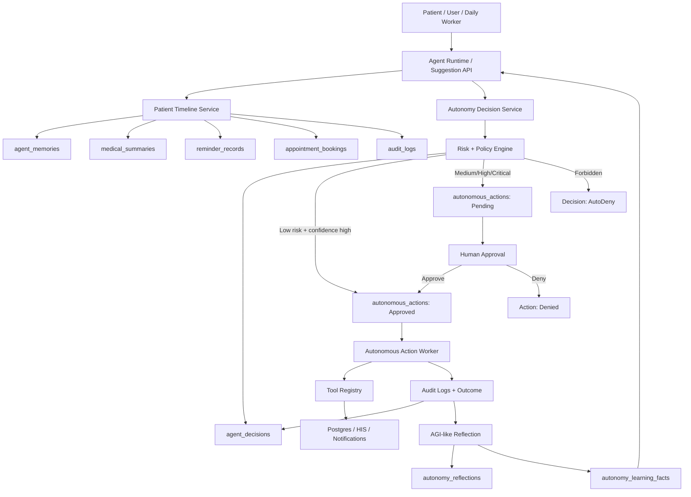
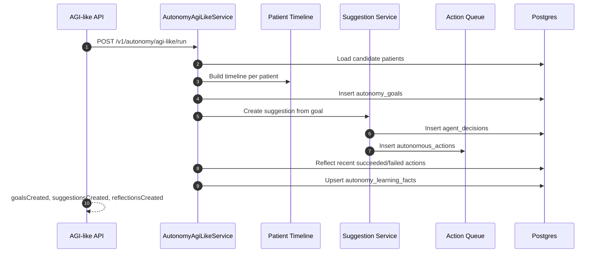
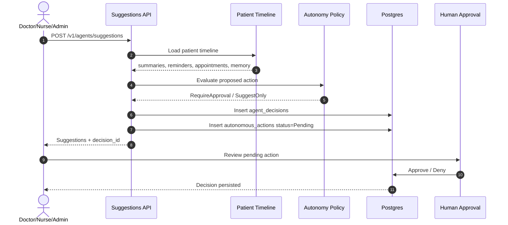
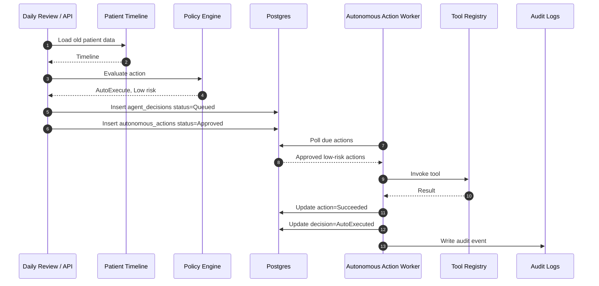
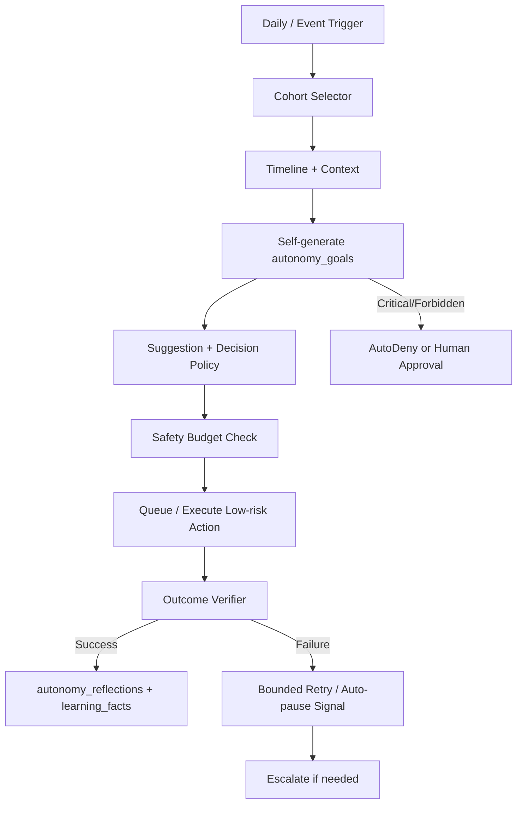

# Controlled Autonomy Levels — Hope.Agent

> Version: 1.1 · June 2026  
> Scope: Level 3, Level 4, Level 5 autonomy for clinical operations AI agents.

Tài liệu này mô tả luồng vận hành tự chủ của Hope.Agent sau khi bổ sung:

- Decision Ledger: `agent_decisions`
- Autonomous Action Queue: `autonomous_actions`
- Patient Timeline: memory + summaries + reminders + appointments + audit
- Daily Autonomy Review Worker
- AGI-like Goal/Reflection/Learning Loop
- Risk/Policy Engine
- Human approval gates

---

## 1. Tóm Tắt Mức Tự Chủ

| Level | Tên | AI được làm gì | Human role | Trạng thái hiện tại |
|---|---|---|---|---|
| Level 3 | Human-in-the-loop autonomy | AI phân tích dữ liệu cũ, tạo gợi ý/action, queue approval | Duyệt trước khi action rủi ro trung bình/cao chạy | Đã implement |
| Level 4 | Guarded autonomy | AI tự chạy action low-risk, tự tạo pending approval cho action rủi ro cao | Giám sát, duyệt exception/high-risk | Đã implement cho low-risk |
| Level 5 | Operational self-management | AI tự sinh operational goal, tự phản tư outcome, tự học pattern an toàn và tự chạy low-risk loop | Giám sát policy, duyệt clinical/PHI/financial high-risk | Đã implement dạng AGI-like có kiểm soát |

Nguyên tắc mặc định:

- Low-risk có thể auto-execute nếu confidence đủ cao.
- Medium/high/critical tạo decision/action nhưng yêu cầu approval.
- Medication change, PHI export, emergency disposition, diagnosis finalization luôn cần human approval.
- Postgres là source-of-truth cho audit; Qdrant chỉ phục vụ retrieval.
- AGI-like không phải AGI tổng quát; đây là self-management loop bị giới hạn bởi domain, tool, risk policy và approval.

---

## 2. Kiến Trúc Chung



Core components:

- `AutonomyDecisionService`: phân loại risk và quyết định `SuggestOnly`, `AutoExecute`, `RequireApproval`, `AutoDeny`.
- `AgentSuggestionService`: tạo gợi ý dựa trên timeline bệnh nhân.
- `AutonomousActionWorker`: chạy action đã approved/auto-approved.
- `AutonomyDailyReviewWorker`: chạy theo lịch hằng ngày để tự quét cohort bệnh nhân.
- `AutonomyAgiLikeService`: tự sinh goal từ dữ liệu cũ, gọi suggestion/action queue, phản tư outcome và ghi learning facts.
- `ToolApproval`: vẫn là lớp bảo vệ riêng cho write/critical tools.

---

## 2.1 AGI-like Controlled Loop

Hope.Agent không trở thành AGI tổng quát. Phần “AGI-like” được hiểu là năng lực tự quản lý trong phạm vi hẹp:

- tự phát hiện care gap từ timeline bệnh nhân,
- tự tạo operational goal có evidence,
- tự gọi suggestion engine để tạo decision/action,
- tự phản tư trên outcome đã chạy,
- tự ghi learning facts để cải thiện loop sau,
- vẫn bị chặn bởi risk policy, approval và safety budget.

### Bảng dữ liệu

| Table | Vai trò |
|---|---|
| `autonomy_goals` | Mục tiêu tự sinh: loại goal, evidence, priority, confidence, max risk, trạng thái |
| `autonomy_reflections` | Phản tư sau action: succeeded/failed, lessons, confidence delta |
| `autonomy_learning_facts` | Pattern học được: success/failure signal, care-gap pattern, confidence |

### Luồng



### API mới

- `POST /v1/autonomy/agi-like/run`: chạy thủ công loop AGI-like.
- `GET /v1/autonomy/agi-like/status`: xem trạng thái mở, số reflection, learning facts, action success/fail.
- `GET /v1/autonomy/goals`: xem goal tự sinh.
- `GET /v1/autonomy/reflections`: xem reflection sau action.
- `GET /v1/autonomy/learning-facts`: xem pattern hệ thống đã học.

### Guardrails

- `AutonomyAgiLike.MaxGoalRisk` mặc định tối đa `Medium`.
- Clinical critical, medication change, PHI export, emergency disposition vẫn không tự chạy.
- Action thực thi vẫn đi qua `AutonomyDecisionService`, `AutonomySafetyBudget`, `AutonomousActionWorker`, `AutonomyOutcomeVerifier`.
- Production không nên bật `AllowClinicalCriticalAutonomy`.

---

## 3. Level 3 — Human-In-The-Loop Autonomy

### 3.1 Mục tiêu

AI không chỉ trả lời, mà tự:

- đọc dữ liệu cũ của bệnh nhân,
- đánh giá tình huống,
- tạo gợi ý clinical/operational,
- tạo proposed action,
- ghi lại lý do, confidence, risk,
- chờ người duyệt với action rủi ro.

### 3.2 Luồng Level 3



### 3.3 Dữ liệu ghi nhận

`agent_decisions` ghi:

- `DecisionId`
- `PatientId`
- `Intent`
- `InputSummary`
- `EvidenceJson`
- `MemoryRefsJson`
- `ProposedActionJson`
- `RiskLevel`
- `Confidence`
- `PolicyDecision`
- `DecisionStatus`
- `Reason`
- `CorrelationId`

`autonomous_actions` ghi:

- `ActionId`
- `DecisionId`
- `ToolName`
- `ArgumentsJson`
- `RiskLevel`
- `Confidence`
- `Status`
- `ScheduledFor`
- `ExecutedAt`
- `ResultJson`
- `Error`
- `AttemptCount`

### 3.4 Ví dụ Level 3

Case: bệnh nhân có T2DM, hay quên Metformin, chưa có reminder active.

AI tạo:

```json
{
  "type": "follow_up_reminder",
  "risk_level": "Medium",
  "confidence": 0.91,
  "policy_decision": "RequireApproval",
  "proposed_action": {
    "tool": "create_reminder_record",
    "arguments": {
      "patient_id": "...",
      "medication_name": "Metformin",
      "frequency": "once_daily",
      "duration_days": 30
    }
  }
}
```

Kết quả:

- AI không tự tạo reminder mới nếu policy xem đây là medium-risk.
- Action vào queue `Pending`.
- Bác sĩ/nurse duyệt trước khi chạy.

### 3.5 Khi nào dùng Level 3

Áp dụng cho:

- tạo reminder mới,
- đề xuất lịch tái khám,
- đề xuất audit report/export,
- gợi ý follow-up sau medical summary,
- appointment booking chưa confirmed,
- clinical recommendation cần review.

Không dùng để tự động:

- đổi thuốc,
- đổi liều,
- đưa chẩn đoán cuối cùng,
- discharge/admission approval,
- PHI export.

---

## 4. Level 4 — Guarded Autonomy

### 4.1 Mục tiêu

AI được tự chạy hành động an toàn, lặp lại, có hậu quả thấp, với điều kiện:

- risk = `Low`,
- confidence >= threshold,
- action không thuộc nhóm forbidden,
- action có audit trail,
- action có retry bounded,
- có thể rollback/correct bằng human.

### 4.2 Luồng Level 4



### 4.3 Action được phép auto-execute

Ví dụ low-risk:

- `update_reminder_status` với trạng thái follow-up/suggested/confirmed.
- ghi memory clinical đã được tạo từ context hợp lệ.
- draft non-sensitive summary.
- read-only lookup.
- audit analysis không export PHI.

Ví dụ không auto-execute:

- `create_reminder_record` nếu tạo lịch nhắc thuốc mới từ suy luận chưa được duyệt.
- `commit_booking`.
- `export_audit_report`.
- bất kỳ medication change.
- bất kỳ emergency disposition.

### 4.4 Retry và failure

`AutonomousActionWorker` xử lý:

- poll mỗi chu kỳ,
- chuyển `Approved/Pending` low-risk sang `Executing`,
- gọi tool,
- success: `Succeeded`, decision `AutoExecuted`,
- failure: retry tối đa 3 lần,
- sau 3 lần: action `Failed`, decision `Failed`.

Failure không được swallow silently:

- lưu `Error`,
- ghi audit event nếu đã execute,
- không retry vô hạn.

### 4.5 Daily Review Level 4

`AutonomyDailyReviewWorker` chạy theo config:

```json
{
  "AutonomyDailyReview": {
    "Enabled": true,
    "TimeUtc": "00:30",
    "MaxPatientsPerRun": 500,
    "LookbackDays": 60,
    "Goal": "Daily autonomy review: evaluate old patient data and suggest safe follow-up actions."
  }
}
```

Cohort được chọn từ:

- `reminder_records`
- `medical_summaries`
- `appointment_bookings`
- `agent_memories`

Worker tránh duplicate:

- không review lại bệnh nhân đã có `daily_autonomy_review` trong cùng ngày.

Manual run:

```http
POST /v1/autonomy/daily-review/run
```

### 4.6 Trạng thái hiện tại

Đã verify bằng smoke test:

- daily review tạo `daily_autonomy_review`.
- low-risk `update_reminder_status` được queue.
- worker execute thành công.
- action status = `Succeeded`.
- decision status = `AutoExecuted`.

---

## 5. Level 5 — Operational Self-Management

### 5.1 Định nghĩa

Level 5 trong Hope.Agent nghĩa là AI có thể tự quản lý vòng vận hành hẹp:

- tự phát hiện vấn đề,
- tự tạo goal có evidence,
- tự tạo decision/action thông qua policy engine,
- tự xác minh outcome,
- tự phản tư và ghi learning facts,
- không cần human approval cho low-risk operations thường ngày.

Trong healthcare, Level 5 chỉ áp dụng cho **non-clinical hoặc very-low-risk operations**. Đây không phải AGI tổng quát và không phải Level 5 clinical autonomy.

### 5.2 Vì sao chưa nên bật Level 5 clinical

Không nên dùng Level 5 cho:

- medication change,
- diagnosis finalization,
- treatment plan finalization,
- emergency disposition,
- admission/discharge approval,
- PHI export,
- insurance/financial decision có ảnh hưởng lớn.

Lý do:

- cần trách nhiệm pháp lý rõ ràng,
- cần clinical accountability,
- data có thể thiếu/sai,
- model có thể hallucinate,
- cần giải thích được quyết định,
- cần kiểm soát PHI và consent.

### 5.3 Feature Level 5 Operational

| Feature | Mục tiêu | Trạng thái |
|---|---|---|
| Outcome Verifier | xác minh action tạo kết quả đúng chưa | đã implement cho tool output cơ bản |
| Safety Budget | giới hạn action/patient/day và tổng action/day | đã implement |
| Auto-pause | dừng tạo action mới khi failure/hour vượt ngưỡng | đã implement |
| Self-generated Goals | tự tạo operational goal từ timeline/evidence | đã implement qua `autonomy_goals` |
| Reflection Loop | tự phản tư trên action success/failure | đã implement qua `autonomy_reflections` |
| Learning Facts | ghi pattern học được để cải thiện loop sau | đã implement qua `autonomy_learning_facts` |
| Rollback/Compensation | undo/correct action đã chạy | đã implement compensation record + best-effort tool compensation |
| Model Confidence Calibration | hiệu chỉnh confidence theo outcome thực tế | đã implement theo success/failure window |
| Clinical Policy DSL | rule y tế versioned, testable, auditable | còn cần DSL đầy đủ; hiện có deterministic policy rules |
| Multi-agent Review | second-opinion agent cho high-risk | đã implement deterministic safety + clinical guard reviewers |
| Drift Monitoring | phát hiện policy/model/data drift | đã implement failure-rate drift signal |
| Formal Eval Gate | không deploy policy nếu fail golden suite | đã implement operational eval gate/readiness |
| Consent & Patient Preference Engine | action phải tôn trọng consent/channel preference | cần bổ sung |
| Incident Runbook | quy trình vận hành khi autonomy bị pause/fail | cần bổ sung |

### 5.4 Level 5 giới hạn có thể cho phép

Có thể cân nhắc Level 5 cho:

- housekeeping audit không chứa PHI,
- deduplicate memory,
- update internal reminder status từ patient confirmation,
- tạo internal task low-risk,
- retry notification nội bộ,
- cập nhật operational dashboard,
- tạo draft report không export.

Không gọi là Level 5 clinical; nên gọi là:

> Level 5 Operational Autonomy, Clinical Guarded.

### 5.5 Luồng Level 5 hiện tại



Level 5 operational hiện đã có:

- decision ledger,
- action queue,
- daily/event triggers,
- outcome verifier,
- safety budget,
- audit trail,
- automatic pause/kill switch,
- self-generated goals,
- reflection/learning facts,
- eval gate/readiness,
- drift detection,
- confidence calibration,
- deterministic multi-agent review,
- compensation records.

Các phần còn thiếu trước khi gọi là autonomy platform trưởng thành:

- clinical policy DSL đầy đủ, versioned và testable,
- consent/preference engine chi tiết,
- incident runbook có owner/SLA/escalation,
- rollback sâu cho từng external integration,
- model-based multi-agent review thay cho deterministic reviewer.

---

## 6. API Và Vận Hành

### 6.1 APIs

Patient timeline:

```http
GET /v1/patients/{patientId}/timeline
```

Create suggestions:

```http
POST /v1/agents/suggestions
Content-Type: application/json

{
  "patientId": "guid",
  "goal": "Đánh giá dữ liệu cũ và gợi ý follow-up nếu an toàn"
}
```

List decisions:

```http
GET /v1/autonomy/decisions?patientId={guid}&take=100
```

List actions:

```http
GET /v1/autonomy/actions?status=Pending
```

Approve/deny action:

```http
POST /v1/autonomy/actions/{actionId}/approve
POST /v1/autonomy/actions/{actionId}/deny
```

Manual daily review:

```http
POST /v1/autonomy/daily-review/run
```

AGI-like controlled loop:

```http
POST /v1/autonomy/agi-like/run
GET /v1/autonomy/agi-like/status
GET /v1/autonomy/goals
GET /v1/autonomy/reflections
GET /v1/autonomy/learning-facts
```

Level 5 control-plane:

```http
POST /v1/autonomy/level5/eval-gate/run
POST /v1/autonomy/level5/drift/detect
GET /v1/autonomy/level5/readiness
```

### 6.2 Status mappings

Decision status:

| Status | Ý nghĩa |
|---|---|
| Suggested | chỉ gợi ý, chưa queue action |
| Queued | đã tạo action queue |
| AutoExecuted | action đã tự chạy thành công |
| RequiresApproval | cần human approval |
| Approved | human approved |
| Denied | human denied |
| Failed | action/policy failed |

Action status:

| Status | Ý nghĩa |
|---|---|
| Pending | chờ approval hoặc chờ điều kiện |
| Approved | được phép chạy |
| Executing | worker đang chạy |
| Succeeded | tool chạy thành công |
| Failed | hết retry hoặc lỗi nghiêm trọng |
| Denied | human denied |
| Cancelled | bị hủy |

---

## 7. Guardrails

### 7.1 Always require human approval

Các nhóm sau luôn cần human approval:

- đổi thuốc/liều thuốc,
- ngưng thuốc,
- chẩn đoán cuối cùng,
- treatment plan final,
- emergency disposition,
- admission/discharge approval,
- PHI export,
- official audit export,
- confirmed booking nếu production policy yêu cầu.

### 7.2 Auto-deny candidates

Nên auto-deny nếu:

- prompt/tool args chứa injection rõ ràng,
- action vượt quyền role,
- action thiếu patient id / consent,
- action yêu cầu external export không có approval,
- confidence quá thấp với risk cao.

### 7.3 Kill switch

Có thể tắt autonomy bằng:

```json
{
  "Autonomy": {
    "Enabled": false
  },
  "AutonomyDailyReview": {
    "Enabled": false
  }
}
```

Khi tắt:

- không tạo decision/action mới qua autonomy service,
- daily worker không chạy,
- existing pending actions vẫn nằm trong DB để audit.

---

## 8. Acceptance Criteria

Level 3 đạt khi:

- suggestion API tạo `agent_decisions`,
- medium/high action tạo `autonomous_actions` pending,
- approval endpoint có thể approve/deny,
- audit trail đầy đủ.

Level 4 đạt khi:

- low-risk + confidence cao tạo action `Approved`,
- worker tự execute,
- action chuyển `Succeeded`,
- decision chuyển `AutoExecuted`,
- failure retry bounded,
- daily review tự tạo suggestions theo lịch.

Level 5 chỉ được xem là đạt cho operational low-risk khi:

- có outcome verifier,
- có safety budget,
- có compensation/rollback,
- có drift/eval monitoring,
- có auto-pause khi incident,
- không áp dụng cho clinical critical decisions.

---

## 9. Smoke Test

Script:

```powershell
.\tests\hope-autonomy-flows.ps1
```

Script kiểm tra:

- seed patient timeline realistic,
- gọi `/v1/agents/suggestions`,
- gọi `/v1/autonomy/daily-review/run`,
- xác nhận `agent_decisions` tăng,
- xác nhận `autonomous_actions` tăng,
- đợi worker execute,
- xác nhận latest low-risk action `Succeeded`.

Kỳ vọng:

```text
Controlled autonomy flow result: PASS
```
