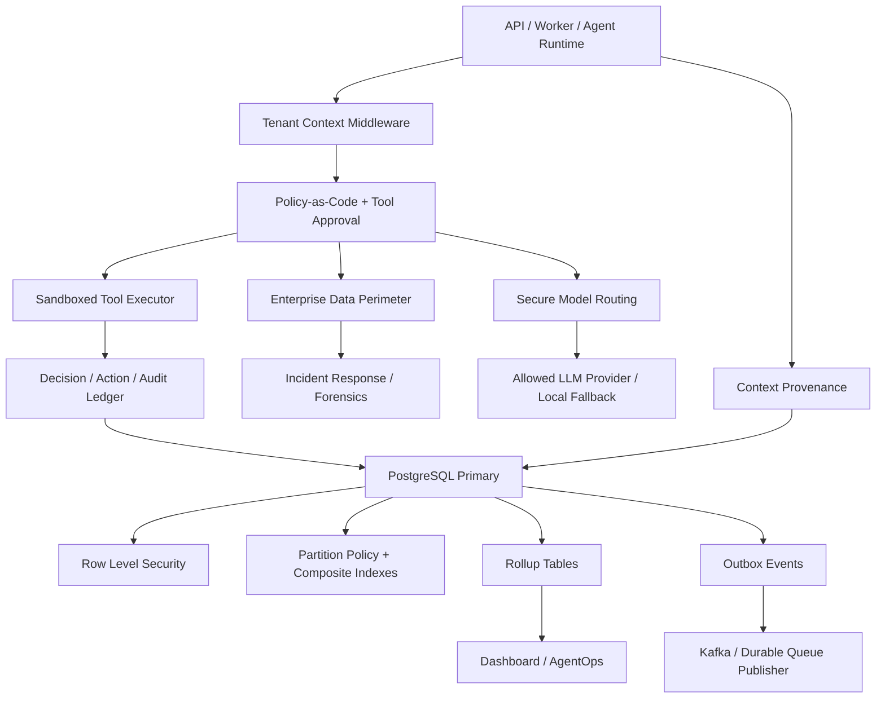
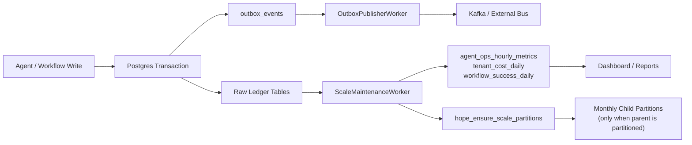
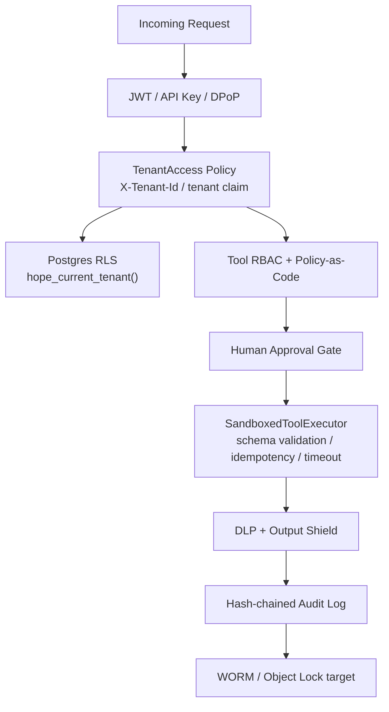
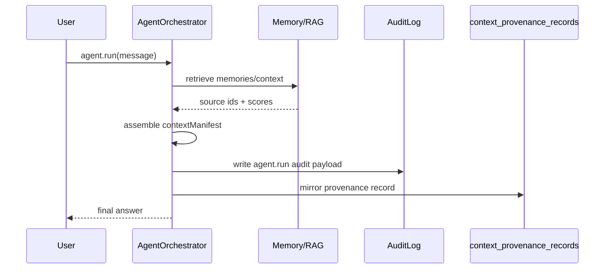
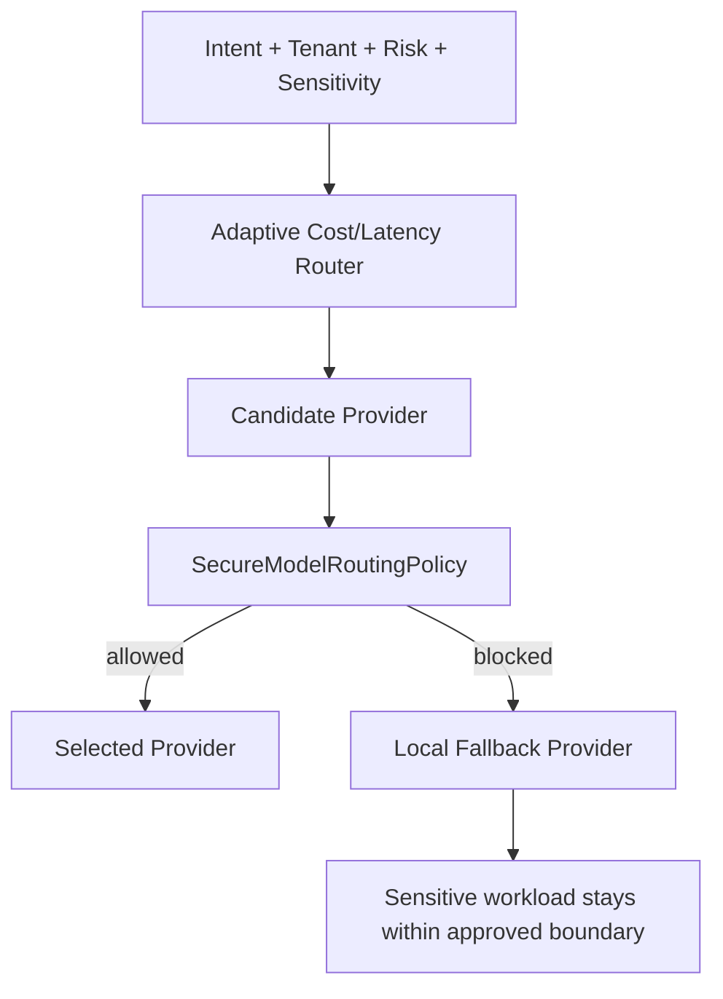
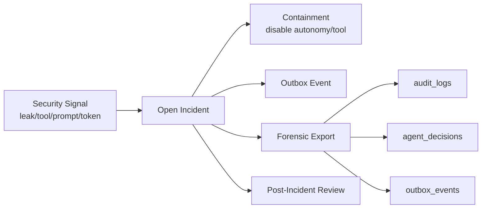

# Hope.Agent Database Partition and Security Upgrade

Tai lieu nay mo ta cac nang cap da implement cho scale database va security hardening cua Hope.Agent, gom partition policy, indexing, outbox, rollup, tenant isolation, policy-as-code, sandboxed tool execution, enterprise data perimeter va incident response.

## 1. Tong Quan

He thong da duoc nang cap theo 3 lop:

- **Database scale layer**: composite indexes, full-text/trigram indexes, outbox pattern, rollup tables, partition policy ledger va maintenance function.
- **Production security layer**: tenant isolation, PostgreSQL RLS, zero-trust config, KMS/envelope encryption abstraction, DLP, egress allowlist, immutable audit posture.
- **Enterprise security layer**: region-aware data residency, purpose-based access, secure model routing, context provenance, continuous adversarial simulation, incident response va forensic export.



## 2. Database Partition and Scale

### 2.1 Da Implement

Migration chinh:

- `20260607110000_AddDatabaseScaleOptimizations`
- `20260607120000_AddProductionSecurityP0`
- `20260607152405_AddEnterpriseSecurityP2`

Thanh phan da co:

| Thanh phan | Bang / file | Muc dich |
|---|---|---|
| Partition policy ledger | `scale_partition_policies` | Luu bang nao can partition, partition key, retention hot/archive |
| Partition maintenance function | `hope_ensure_scale_partitions(months_ahead)` | Tao child partitions theo thang neu parent table da la partitioned table |
| Outbox pattern | `outbox_events` | Dam bao write DB + event publish khong mat event |
| Ops rollup | `agent_ops_hourly_metrics` | Dashboard AgentOps khong count truc tiep bang raw |
| Cost rollup | `tenant_cost_daily` | Tong hop cost theo tenant/agent/model |
| Workflow rollup | `workflow_success_daily` | Tong hop success/failure/latency workflow |
| Full-text index | `medical_summaries`, `reminder_records`, `audit_logs`, `conversation_messages` | Tang toc RAG/search |
| Trigram index | `medical_summaries.SummaryText`, `conversation_messages.Content` | Fuzzy search / tieng Viet keyword |

### 2.2 Partition Policy Hien Tai

`scale_partition_policies` seed cac bang:

| Table | Partition key | Strategy | Hot retention | Archive after |
|---|---|---|---:|---:|
| `audit_logs` | `OccurredAt` | `monthly-time-tenant` | 365 days | 2555 days |
| `agent_decisions` | `CreatedAt` | `monthly-time-tenant` | 180 days | 2555 days |
| `autonomous_actions` | `CreatedAt` | `monthly-time-tenant` | 180 days | 2555 days |
| `agentic_rag_retrievals` | `CreatedAt` | `monthly-time-runid` | 90 days | 365 days |
| `agentic_rag_steps` | `CreatedAt` | `monthly-time-runid` | 90 days | 365 days |

Luu y quan trong: function `hope_ensure_scale_partitions` **chi tao child partitions neu parent table da la partitioned table**. No khong tu rewrite bang hien huu thanh partitioned parent, vi viec do co rui ro lock/data migration lon trong production.

### 2.3 Database Scale Flow



### 2.4 Composite Indexes Chinh

| Index | Use case |
|---|---|
| `audit_logs (TenantId, Action, OccurredAt DESC)` | Audit cursor, security investigation |
| `agent_decisions (TenantId, PatientId, CreatedAt DESC)` | Patient timeline, autonomy suggestions |
| `autonomous_actions (TenantId, Status, ScheduledFor)` | Worker scheduling |
| `agentic_rag_retrievals (RunId, Iteration, CreatedAt)` | RAG trace/provenance |
| `outbox_events (TenantId, Status, ScheduledFor)` | Durable publisher polling |

### 2.5 Production Partition Runbook

Khi chuyen sang partition production thuc su:

1. Tao bang moi dang partitioned parent, vi PostgreSQL khong bien bang lon hien huu thanh partitioned table ma khong co migration ke hoach.
2. Backfill theo tung thang/tenant vao child partitions.
3. Tao index tren partitioned parent va validate query plan.
4. Swap ten bang trong maintenance window hoac dung logical replication.
5. Chay:

```powershell
dotnet ef database update --project src\Hope.Agent.Infrastructure --startup-project src\Hope.Agent.Api --connection "<prod-connection>"
```

6. Sau khi parent da partitioned, worker/function se tao child partitions truoc:

```sql
SELECT hope_ensure_scale_partitions(3);
```

## 3. Security Architecture

### 3.1 Security Layers



### 3.2 P0 Production Security Da Implement

| Control | Implement |
|---|---|
| TenantId bat buoc | `TenantId` NOT NULL/default tren PHI/memory/decision/action/audit/outbox tables |
| PostgreSQL RLS | `ENABLE ROW LEVEL SECURITY` + policies select/insert/update/delete |
| Tenant DB context | `hope_current_tenant()`, `hope_set_tenant_context(uuid)`, `TenantSessionConnectionInterceptor` |
| Security posture ledger | `security_posture_checks` |
| Zero-trust options | `ZeroTrustOptions` |
| Secrets/KMS options | `SecretManagementOptions`, `IEnvelopeEncryptionService` |
| Audit immutability | hash-chain audit + scheduled verification worker |
| DLP external channel | Slack/Email/Zalo redaction via DLP channel wrapper |
| Egress allowlist | `EgressPolicyOptions`, SSRF guard |

### 3.3 P1 Bigtech Harness Da Implement

| Control | Implement |
|---|---|
| Policy-as-code | `PolicyAsCodeOptions`, `JsonPolicyEngine`, signed policy bundle |
| Explainability | deny reason gom policy/version/rule/input explain |
| Runtime sandbox guard | kill switch, write-tool isolation requirement, timeout, idempotency |
| Strict tool execution | `SandboxedToolExecutor` + JSON schema validation |
| Continuous security gate | `tests/hope-security-gate-p1.ps1`, `tests/hope-redteam-regression.ps1` |
| Supply chain CI | Trivy, Checkov, cosign readiness, SLSA note |
| Security metrics | blocked tool calls, policy denials, prompt injection, PHI redaction, cross-tenant denied |

### 3.4 P2 Enterprise Security Da Implement

| Control | Implement |
|---|---|
| Data perimeter | `EnterpriseDataPerimeterOptions`, `IDataPerimeterService` |
| Region-aware residency | deny khi requested region khong khop tenant region |
| Purpose-based access | `PurposeAccess`, allowed purposes per tenant |
| Break-glass | `/v1/security/enterprise/break-glass`, `break_glass_access_records` |
| Secure model routing | `SecureModelRoutingOptions`, `ISecureModelRoutingPolicy` |
| PHI model guard | local fallback / block provider khong duoc phep |
| Context provenance | `context_provenance_records`, `/v1/security/enterprise/provenance` |
| Adversarial simulation | `AdversarialSimulationWorker`, `adversarial_simulation_runs` |
| Incident response | `/v1/security/enterprise/incidents`, forensic export |

## 4. Fine-Grained Provenance

Moi agent answer/action co the duoc trace theo:

- `source IDs`
- retrieval query
- trust score
- token budget
- filtered/dropped context reason
- policy version
- correlation id
- answer hash



Debug endpoints:

| Endpoint | Muc dich |
|---|---|
| `GET /v1/harness/context-provenance` | Doc context manifest tu `audit_logs` |
| `GET /v1/security/enterprise/provenance` | Doc fine-grained provenance table |
| `GET /v1/rag/agentic/runs/{runId}/provenance` | RAG retrieval trace/provenance |

## 5. Secure Model Routing

Routing khong chi dua tren cost/latency. Neu workload nhay cam:

1. Xac dinh sensitivity: `Phi`, `Restricted`, `Confidential`, ...
2. Kiem tra tenant provider allowlist.
3. Kiem tra risk provider allowlist.
4. Neu PHI va provider khong duoc phep, fallback ve `LocalFallbackProvider`.
5. Neu cost/latency router muon chon provider khong duoc phep cho PHI, policy block.



## 6. Incident Response and Forensics

Incident response da co:

- `security_incidents`
- auto-disable autonomy flag cho severity high/critical
- tool disabled flag cho wrong tool execution
- outbox event `hope.security.incidents`
- forensic export gom audit/outbox/decision ledger quanh correlation/tenant



Runbooks configured:

- `data_leakage`
- `wrong_tool_execution`
- `compromised_token`
- `prompt_injection_campaign`

## 7. Validation Commands

Build:

```powershell
dotnet build Hope.Agent.sln
```

Apply migrations:

```powershell
dotnet ef database update --project src\Hope.Agent.Infrastructure --startup-project src\Hope.Agent.Api --connection "Host=localhost;Port=55432;Database=hope_agent;Username=hope;Password=hope;Ssl Mode=Disable"
```

Security/scale validation:

```powershell
.\tests\hope-database-scale-optimizations.ps1
.\tests\hope-production-security-p0.ps1
.\tests\hope-security-gate-p1.ps1
.\tests\hope-enterprise-security-p2.ps1
.\tests\hope-redteam-regression.ps1
```

Check migrations:

```powershell
dotnet ef migrations list --project src\Hope.Agent.Infrastructure --startup-project src\Hope.Agent.Api --connection "Host=localhost;Port=55432;Database=hope_agent;Username=hope;Password=hope;Ssl Mode=Disable"
```

Expected applied migrations include:

- `20260607110000_AddDatabaseScaleOptimizations`
- `20260607120000_AddProductionSecurityP0`
- `20260607152405_AddEnterpriseSecurityP2`

## 8. Operational Checklist

### Before Production Scale

- [ ] Confirm all protected tables have non-null `TenantId`.
- [ ] Confirm RLS enabled and application sets tenant context per request/worker action.
- [ ] Confirm `security_posture_checks` reports P0 controls configured.
- [ ] Confirm policy bundle is signed and `RequireSignedBundle=true` in production.
- [ ] Confirm `RuntimeSandbox.Mode=container` in production.
- [ ] Confirm PHI providers are allowlisted per tenant/risk.
- [ ] Confirm DLP applies before Slack/Email/Zalo/API exports.
- [ ] Confirm WORM/Object Lock archive target is configured for audit.
- [ ] Confirm outbox publisher has bounded retry/backoff.
- [ ] Confirm dashboard reads from rollup/read-replica path when available.

### Before True Table Partition Cutover

- [ ] Measure table sizes and query plans for `audit_logs`, `agent_decisions`, `autonomous_actions`, `agentic_rag_*`.
- [ ] Create partitioned shadow tables.
- [ ] Backfill by month/tenant in batches.
- [ ] Validate indexes on child partitions.
- [ ] Swap tables in a maintenance window or use logical replication.
- [ ] Run `SELECT hope_ensure_scale_partitions(3);`.
- [ ] Validate application queries and RLS policies against partitioned tables.

## 9. File Map

| Area | Files |
|---|---|
| Database scale options | `src/Hope.Agent.Application/Governance/GovernancePolicyOptions.cs` |
| Scale worker | `src/Hope.Agent.Infrastructure/Maintenance/ScaleMaintenanceWorker.cs` |
| Database scale migration | `src/Hope.Agent.Infrastructure/Migrations/20260607110000_AddDatabaseScaleOptimizations.cs` |
| Security P0 migration | `src/Hope.Agent.Infrastructure/Migrations/20260607120000_AddProductionSecurityP0.cs` |
| Enterprise P2 migration | `src/Hope.Agent.Infrastructure/Migrations/20260607152405_AddEnterpriseSecurityP2.cs` |
| Security options | `src/Hope.Agent.Application/Security/ProductionSecurityOptions.cs` |
| Enterprise security options | `src/Hope.Agent.Application/Security/EnterpriseSecurityP2.cs` |
| Enterprise security services | `src/Hope.Agent.Infrastructure/Security/EnterpriseSecurityP2Services.cs` |
| Enterprise security endpoints | `src/Hope.Agent.Api/Endpoints/EnterpriseSecurityEndpoints.cs` |
| Tool sandbox | `src/Hope.Agent.AgentRuntime/Security/SandboxedToolExecutor.cs` |
| Context provenance mirror | `src/Hope.Agent.AgentRuntime/AgentOrchestrator.cs` |
| P2 validation | `tests/hope-enterprise-security-p2.ps1` |
