# Hope.Agent — Developer Guide

> **Phiên bản tài liệu:** Phase 8 · .NET 9 · Clean Architecture · Build: ✅ 13/13 projects, 0 errors

Tài liệu này mô tả toàn bộ kiến trúc, luồng xử lý và các quyết định thiết kế của **Hope.Agent**
qua 7 phase phát triển liên tiếp. Mỗi phase được giải thích kèm **lưu đồ Mermaid**, danh sách
file liên quan và bảng cơ sở dữ liệu.

---

## Mục lục

1. [Tổng quan kiến trúc](#1-tổng-quan-kiến-trúc)
2. [Phase 1 — Foundation (MVP)](#2-phase-1--foundation-mvp)
3. [Phase 2 — RAG + Memory](#3-phase-2--rag--memory)
4. [Phase 3 — Multi-Agent System](#4-phase-3--multi-agent-system)
5. [Phase 4 — Durable Workflows (Temporal)](#5-phase-4--durable-workflows-temporal)
6. [Phase 5 — Realtime Bus (SignalR + Kafka)](#6-phase-5--realtime-bus-signalr--kafka)
7. [Phase 6 — Continuous Learning Loop](#7-phase-6--continuous-learning-loop)
8. [Phase 7 — KG Extraction · Shadow A/B · Adversarial Shield](#8-phase-7--kg-extraction--shadow-ab--adversarial-shield)
9. [Phase 8 — Telegram Bot · Scheduled Tasks · Webhook Trigger](#9-phase-8--telegram-bot--scheduled-tasks--webhook-trigger)
10. [Observability & Metrics](#10-observability--metrics)
11. [Configuration Reference](#11-configuration-reference)
12. [Database Schema](#12-database-schema)
13. [Migration Commands](#13-migration-commands)

---

## 1. Tổng quan kiến trúc

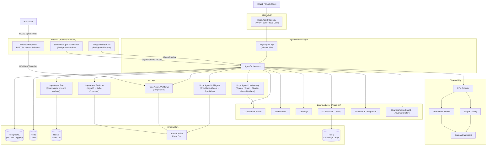

### Nguyên tắc thiết kế

| Nguyên tắc                     | Áp dụng                                                                      |
| ------------------------------ | ---------------------------------------------------------------------------- |
| **Clean Architecture**         | Domain → Application → Infrastructure (không có vòng phụ thuộc)              |
| **Dependency Inversion**       | Tất cả service được inject qua interface                                     |
| **Central Package Management** | `Directory.Packages.props` — không dùng version trong csproj                 |
| **TreatWarningsAsErrors**      | Bật toàn solution — 0 warning được phép                                      |
| **CA1805**                     | Không gán `= false` hay `= 0` cho bool/int vì đó là default                  |
| **Fire-and-forget**            | KG ingestion, Shadow A/B, Skill distillation chạy nền — không block response |
| **Guid.CreateVersion7()**      | Tất cả ID mới dùng UUIDv7 (time-sortable)                                    |

---

## 2. Phase 1 — Foundation (MVP)

### Mục tiêu

Xây dựng một AI agent hoàn chỉnh với tool-calling, auth, observability và audit trail.

### Luồng xử lý chính

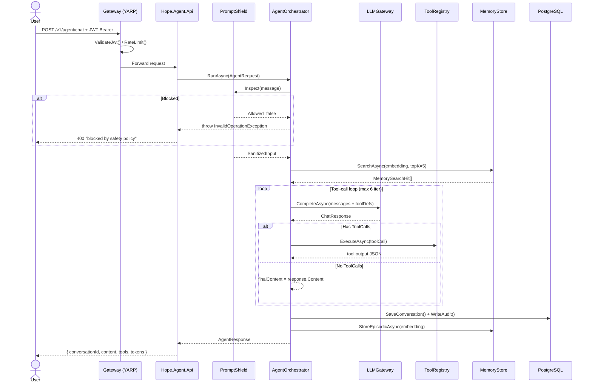

### Tool-call loop detail


### Files liên quan

| File                                                              | Vai trò                                                        |
| ----------------------------------------------------------------- | -------------------------------------------------------------- |
| `src/Hope.Agent.AgentRuntime/AgentOrchestrator.cs`                | Điểm vào chính của mọi agent run                               |
| `src/Hope.Agent.Api/Endpoints/AgentEndpoints.cs`                  | `POST /v1/agent/chat`, `POST /v1/agent/stream`                 |
| `src/Hope.Agent.Api/Program.cs`                                   | DI composition root                                            |
| `src/Hope.Agent.Gateway/`                                         | YARP reverse proxy + JWT middleware                            |
| `src/Hope.Agent.Infrastructure/Security/HeuristicPromptShield.cs` | Static hard-blocks + regex                                     |
| `src/Hope.Agent.Infrastructure/Security/RegexPhiRedactor.cs`      | Xóa PHI khỏi audit log                                         |
| `src/Hope.Agent.LLMGateway/Providers/`                            | OpenAI, Anthropic, Gemini, Ollama adapters                     |
| `src/Hope.Agent.Tools/`                                           | BuiltIn tools: patient_lookup, schedule, insurance, guidelines |

### Bảng DB

`conversations`, `conversation_messages`, `memory_records`, `audit_events`, `tool_executions`

---

## 3. Phase 2 — RAG + Memory

### Mục tiêu

Tích hợp Retrieval-Augmented Generation: ingest tài liệu lâm sàng, tìm kiếm ngữ nghĩa qua Qdrant,
bổ sung context vào prompt trước khi gọi LLM.

### Pipeline Ingestion

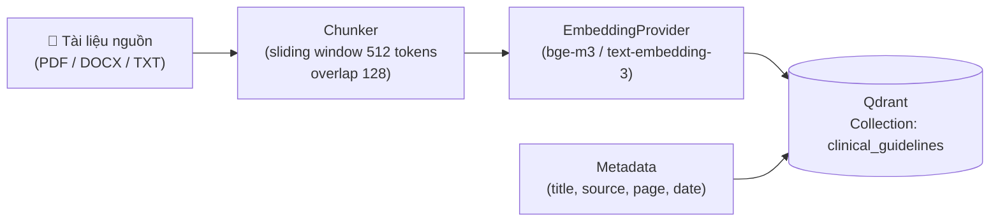

### Pipeline Retrieval (trong agent turn)

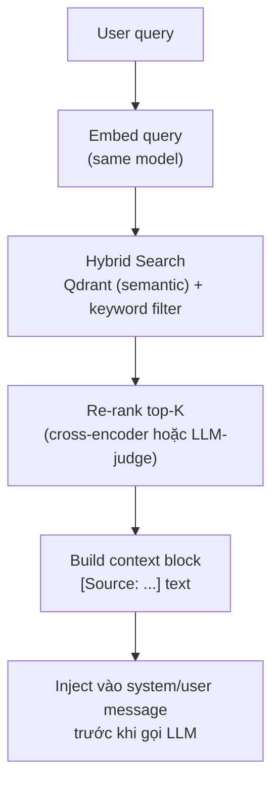

### RAG + Memory tích hợp vào Orchestrator

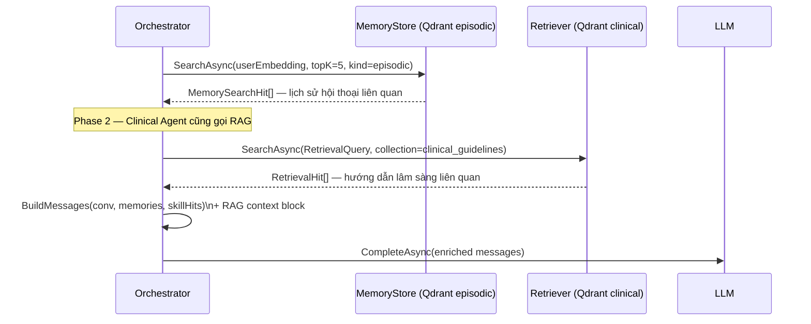

### Files liên quan

| File                                              | Vai trò                                     |
| ------------------------------------------------- | ------------------------------------------- |
| `src/Hope.Agent.Rag/Ingestion/`                   | Document loader + chunker pipeline          |
| `src/Hope.Agent.Rag/Retrieval/`                   | Hybrid retriever, re-ranker                 |
| `src/Hope.Agent.Rag/Chunking/`                    | Sliding window chunker                      |
| `src/Hope.Agent.Api/Endpoints/RagEndpoints.cs`    | `POST /v1/rag/ingest`, `GET /v1/rag/search` |
| `src/Hope.Agent.Infrastructure/Memory/`           | Qdrant + Redis episodic store               |
| `src/Hope.Agent.Api/Endpoints/MemoryEndpoints.cs` | CRUD memory records                         |

### Bảng DB

`memory_records` (PostgreSQL metadata), Qdrant collections: `hope_memories`, `clinical_guidelines`

---

## 4. Phase 3 — Multi-Agent System

### Mục tiêu

Nhiều specialist agents cộng tác qua `ChiefMedicalAgent` orchestrator với handoff protocol
và event publishing qua Kafka.

### Hierarchy

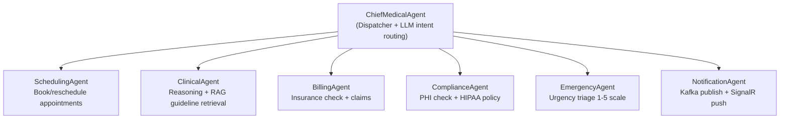

### Luồng dispatch

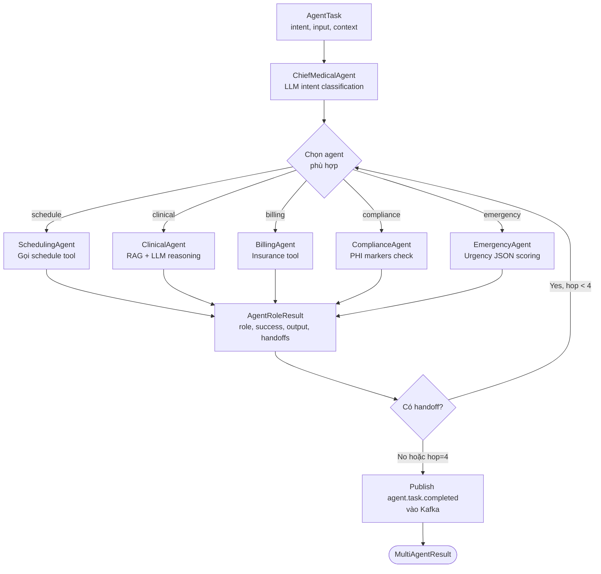

### Handoff protocol

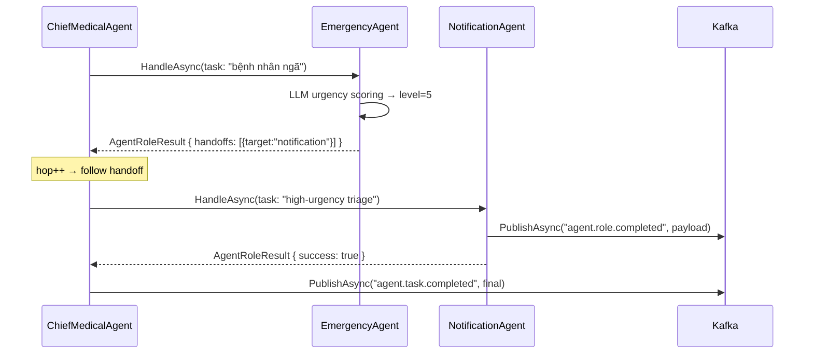

### Files liên quan

| File                                                            | Vai trò                         |
| --------------------------------------------------------------- | ------------------------------- |
| `src/Hope.Agent.MultiAgent/Orchestration/ChiefMedicalAgent.cs`  | Dispatcher orchestrator         |
| `src/Hope.Agent.MultiAgent/Roles/Roles.cs`                      | 6 specialist agents             |
| `src/Hope.Agent.Api/Endpoints/MultiAgentEndpoints.cs`           | `POST /v1/multi-agent/dispatch` |
| `src/Hope.Agent.Infrastructure/Eventing/KafkaEventPublisher.cs` | Idempotent producer (zstd)      |

### Bảng DB / Topics

`agent_tasks`, Kafka topics: `agent.task.completed`, `agent.role.completed`

---

## 5. Phase 4 — Durable Workflows (Temporal)

### Mục tiêu

Long-running clinical journeys với retry, compensation, human approval gates — durable qua restart.

### PatientAdmissionWorkflow

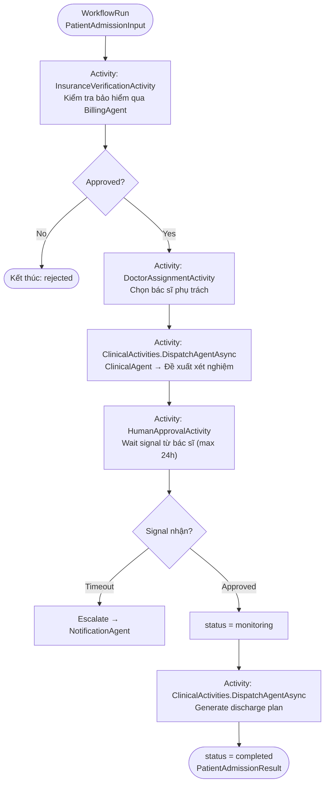

### Temporal activity isolation

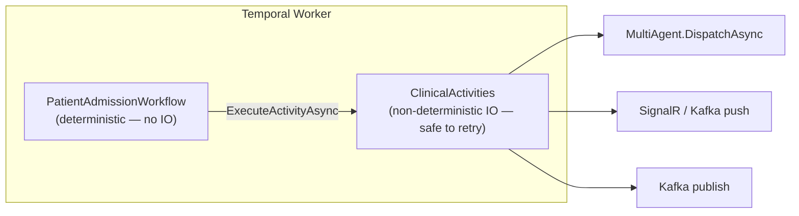

### Files liên quan

| File                                                                          | Vai trò                                              |
| ----------------------------------------------------------------------------- | ---------------------------------------------------- |
| `src/Hope.Agent.Workflows/WorkflowsImpl/PatientAdmissionWorkflow.workflow.cs` | Main workflow                                        |
| `src/Hope.Agent.Workflows/Activities/ClinicalActivities.cs`                   | Activity implementations                             |
| `src/Hope.Agent.Api/Endpoints/WorkflowEndpoints.cs`                           | `POST /v1/workflows/start`, `GET /v1/workflows/{id}` |

### Bảng DB

Temporal quản lý state riêng; Hope.Agent log vào `agent_tasks`, `audit_events`

---

## 6. Phase 5 — Realtime Bus (SignalR + Kafka)

### Mục tiêu

Push notification realtime tới client qua WebSocket (SignalR), consume sự kiện từ Kafka
để trigger agent actions.

### Luồng Realtime

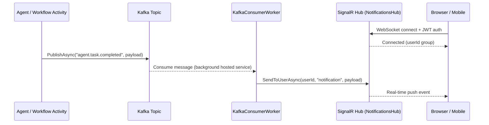

### Kafka topics & consumers

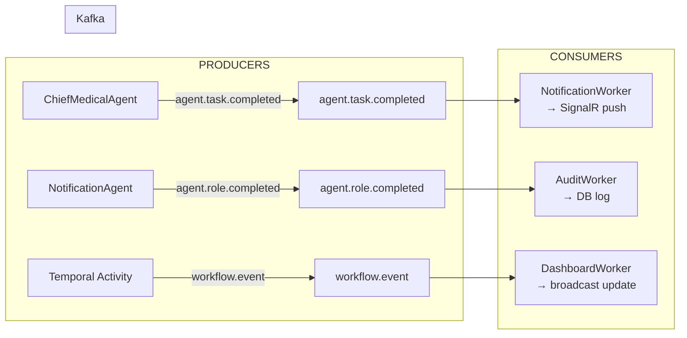

### Files liên quan

| File                                                            | Vai trò                                  |
| --------------------------------------------------------------- | ---------------------------------------- |
| `src/Hope.Agent.Realtime/Hubs/NotificationsHub.cs`              | SignalR hub với JWT auth                 |
| `src/Hope.Agent.Realtime/Workers/`                              | Kafka consumer background services       |
| `src/Hope.Agent.Infrastructure/Eventing/KafkaEventPublisher.cs` | Idempotent producer (zstd)               |
| `src/Hope.Agent.Api/Program.cs` line `MapNotificationsHub()`    | WebSocket endpoint `/hubs/notifications` |

---

## 7. Phase 6 — Continuous Learning Loop

### Mục tiêu

Agent tự cải thiện theo thời gian: UCB1 bandit routing, skill distillation, self-critique
(Constitutional AI), LLM-as-Judge, và daily golden-suite evaluation.

### Tổng quan Learning Loop

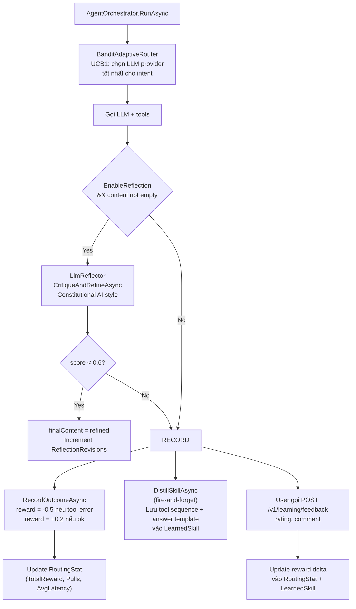

### UCB1 Bandit Algorithm

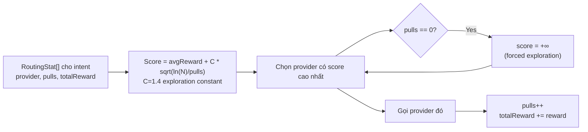

### LlmReflector (Constitutional AI)

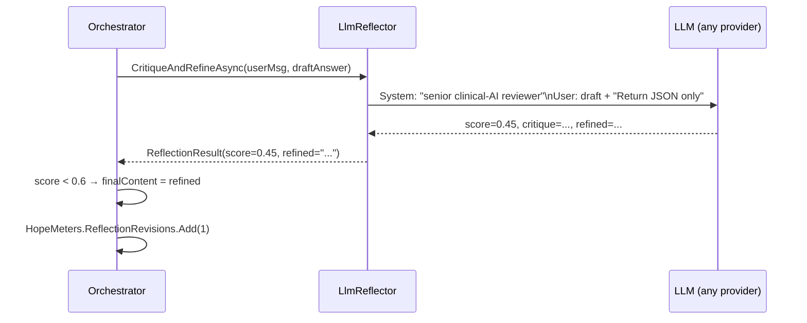

### LlmJudge + EvaluationHarness

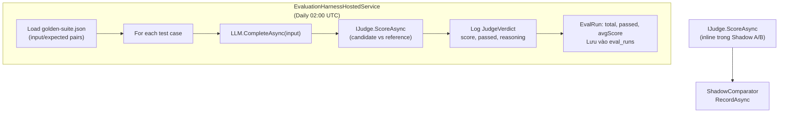

### Files liên quan Phase 6

| File                                                                       | Vai trò                               |
| -------------------------------------------------------------------------- | ------------------------------------- |
| `src/Hope.Agent.Infrastructure/Learning/BanditAdaptiveRouter.cs`           | UCB1 bandit                           |
| `src/Hope.Agent.Infrastructure/Learning/EfLearningStores.cs`               | Feedback + Skill EF stores            |
| `src/Hope.Agent.Infrastructure/Learning/EvaluationHarness.cs`              | Golden suite runner                   |
| `src/Hope.Agent.Infrastructure/Learning/EvaluationHarnessHostedService.cs` | Daily background service              |
| `src/Hope.Agent.Infrastructure/Learning/golden-suite.json`                 | Test cases cho eval harness           |
| `src/Hope.Agent.LLMGateway/Learning/LlmReflectorAndJudge.cs`               | Reflector + Judge                     |
| `src/Hope.Agent.Api/Endpoints/LearningEndpoints.cs`                        | Feedback / skill / router / eval APIs |

### API Learning Endpoints

| Method | Path                           | Mô tả                               |
| ------ | ------------------------------ | ----------------------------------- |
| `POST` | `/v1/learning/feedback`        | Ghi nhận user feedback (rating 1-5) |
| `GET`  | `/v1/learning/skills/{intent}` | Xem learned skills theo intent      |
| `GET`  | `/v1/learning/routing-stats`   | Xem UCB1 stats                      |
| `POST` | `/v1/learning/eval/run`        | Trigger eval suite thủ công         |
| `GET`  | `/v1/learning/eval/runs`       | Lịch sử eval runs                   |

### Bảng DB Phase 6

`feedback`, `learned_skills`, `routing_stats`, `eval_runs`

---

## 8. Phase 7 — KG Extraction · Shadow A/B · Adversarial Shield

### Tổng quan

Phase 7 bổ sung 3 upgrade lấy cảm hứng từ big-tech:

| Feature                      | Inspired by                                 | Mô tả                                                                         |
| ---------------------------- | ------------------------------------------- | ----------------------------------------------------------------------------- |
| **KG Extraction → Neo4j**    | Microsoft GraphRAG / Google Knowledge Vault | Sau mỗi hội thoại, LLM trích xuất entity/relation lưu vào knowledge graph     |
| **Shadow A/B Gate**          | OpenAI / Anthropic shadow deployment        | Champion vs challenger model song song; auto-promote khi win-rate ≥ threshold |
| **Adversarial Auto-Promote** | Lakera / Microsoft Prompt Shields           | Block → log signature → tự promote vào live block list khi đủ hits            |

---

### 8.1 Knowledge Graph Extraction

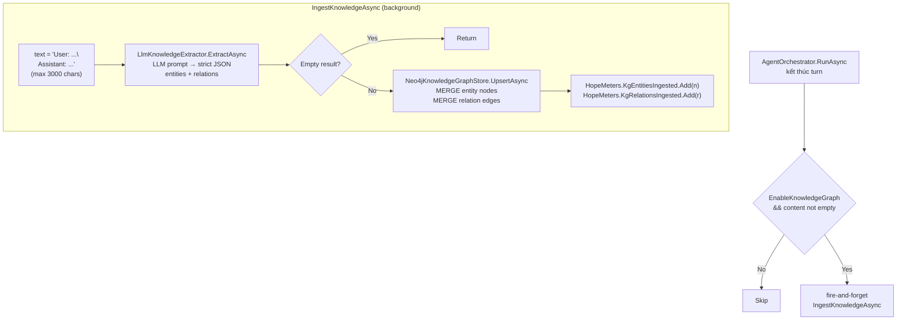

### LLM Knowledge Extractor prompt

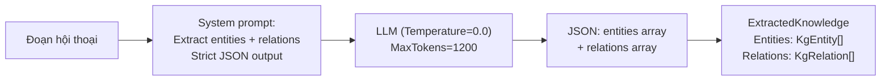

### Neo4j Cypher patterns

```cypher
-- Upsert entity (idempotent)
MERGE (n:Entity {id: $id})
ON CREATE SET n.name=$name, n.type=$type, n.description=$desc,
              n.firstSeen=$firstSeen, n.mentions=1
ON MATCH  SET n.lastSeen=$lastSeen, n.mentions=coalesce(n.mentions,0)+1

-- Upsert relation
MATCH (a:Entity {id: $src}), (b:Entity {id: $tgt})
MERGE (a)-[rel:REL {predicate: $pred}]->(b)
ON CREATE SET rel.confidence=$conf, rel.count=1
ON MATCH  SET rel.confidence=(rel.confidence+$conf)/2.0, rel.count=coalesce(rel.count,0)+1

-- Search entities
MATCH (n:Entity) WHERE toLower(n.name) CONTAINS toLower($q) RETURN n LIMIT $take

-- Neighbors (depth 1..3)
MATCH (a:Entity {id: $id})-[r:REL*1..2]->(b:Entity) RETURN b, r
```

---

### 8.2 Shadow A/B Model Promotion Gate

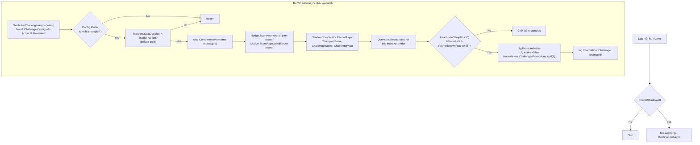

### Shadow A/B State Machine

```mermaid
stateDiagram-v2
    [*] --> Active: POST /v1/learning/challengers\nUpsertChallengerAsync

    Active --> Sampling: RunShadowAsync fires\n(TrafficFraction % của traffic)

    Sampling --> Active: total < MinSamples

    Sampling --> Promoted: total ≥ MinSamples\n&& winRate ≥ 0.55

    Promoted --> [*]: Champion thay đổi\n(user deploy manually)

    Active --> Demoted: Manual demotion\n(POST /v1/learning/challengers/{id}/demote)
```

---

### 8.3 Adversarial Pattern Auto-Promotion

```mermaid
flowchart TD
    subgraph INSPECT["HeuristicPromptShield.Inspect (SYNCHRONOUS — hot path)"]
        INPUT2["User input"] --> HARD["Check HardBlocks[]\n7 static strings"]
        HARD --> REGEX["Check RoleSpoofRx()\nDataExfilRx() via [GeneratedRegex]"]
        REGEX --> DYNAMIC["Check ActiveSamples dictionary\n(ConcurrentDictionary — thread-safe)"]
        DYNAMIC --> HIT{Any reason?}
        HIT -->|No| ALLOW["PromptShieldResult(Allowed=true)"]
        HIT -->|Yes| BLOCK["PromptShieldResult(Allowed depends on type)\nHopeMeters.PromptShieldBlocks.Add(1)"]
        BLOCK --> OBSERVE["fire-and-forget ObserveAsync\n(EfAdversarialPatternStore)"]
    end

    subgraph OBSERVE_FLOW["ObserveAsync (background DB write)"]
        NORM["Normalize input:\nlowercase, strip non-alphanumeric"]
        NORM --> SIG["SHA256(normalized)[0..32] = signature"]
        SIG --> EXIST2{Signature\nexists?}
        EXIST2 -->|New| CREATE["AdversarialPattern\nHits=1, Active=false, Confidence=0.1"]
        EXIST2 -->|Existing| UPDATE["Hits++\nConfidence = min(1.0, Hits/20.0)"]
        CREATE & UPDATE --> SAVE2["SaveChangesAsync"]
    end

    subgraph PROMOTER["AdversarialAutoPromoter (BackgroundService, mỗi 5 phút)"]
        LOAD2["AllAsync(500) — top patterns by hits"]
        LOAD2 --> FOREACH2["For each pattern"]
        FOREACH2 --> THRESH{"!Active\n&& Hits ≥ 10?"}
        THRESH -->|No| NEXT2[Next]
        THRESH -->|Yes| PROMOTE2["PromoteAsync(id)\nActive=true, PromotedAt=now"]
        PROMOTE2 --> METRIC2["HopeMeters.AdversarialPromotions.Add(1)"]
        METRIC2 --> NEXT2
        NEXT2 --> REFRESH["ActivePatternsAsync()\nHeuristicPromptShield.RefreshActive()\n→ update ConcurrentDictionary"]
        REFRESH --> SLEEP["Task.Delay(5 min)"]
    end
```

### Adversarial pattern confidence curve

```
Confidence = min(1.0, Hits / 20.0)

Hits=1  → 0.05  (observed once, very uncertain)
Hits=5  → 0.25  (pattern emerging)
Hits=10 → 0.50  (auto-promote threshold)
Hits=20 → 1.00  (high confidence)
```

### Files liên quan Phase 7

| File                                                                  | Vai trò                                                    |
| --------------------------------------------------------------------- | ---------------------------------------------------------- |
| `src/Hope.Agent.Domain/Knowledge/KnowledgeEntities.cs`                | KgEntity, KgRelation, ExtractedKnowledge                   |
| `src/Hope.Agent.Domain/Learning/ShadowEntities.cs`                    | ShadowComparison, ChallengerConfig                         |
| `src/Hope.Agent.Domain/Security/AdversarialPattern.cs`                | Adversarial signature domain object                        |
| `src/Hope.Agent.Application/Knowledge/IKnowledgeAbstractions.cs`      | IKnowledgeGraphStore, IKnowledgeExtractor                  |
| `src/Hope.Agent.Application/Learning/IShadowComparator.cs`            | IShadowComparator                                          |
| `src/Hope.Agent.Application/Security/IAdversarialPatternStore.cs`     | IAdversarialPatternStore                                   |
| `src/Hope.Agent.LLMGateway/Knowledge/LlmKnowledgeExtractor.cs`        | LLM → JSON entities/relations                              |
| `src/Hope.Agent.Infrastructure/Knowledge/Neo4jKnowledgeGraphStore.cs` | Cypher MERGE upsert                                        |
| `src/Hope.Agent.Infrastructure/Learning/ShadowComparator.cs`          | EF store + promotion logic                                 |
| `src/Hope.Agent.Infrastructure/Security/EfAdversarialPatternStore.cs` | SHA256 dedup + confidence                                  |
| `src/Hope.Agent.Infrastructure/Security/HeuristicPromptShield.cs`     | Inspect + ObserveAsync + AdversarialAutoPromoter           |
| `src/Hope.Agent.Api/Endpoints/KnowledgeEndpoints.cs`                  | `/v1/kg/entities`, `/v1/kg/neighbors/{id}`                 |
| `src/Hope.Agent.Api/Endpoints/ShadowEndpoints.cs`                     | `/v1/learning/challengers`, `/v1/learning/shadow/{intent}` |
| `src/Hope.Agent.Api/Endpoints/AdversarialEndpoints.cs`                | `/v1/security/adversarial` CRUD + promote/demote           |

### API Phase 7

| Method | Path                                    | Mô tả                               |
| ------ | --------------------------------------- | ----------------------------------- |
| `GET`  | `/v1/kg/entities?q=&take=`              | Tìm entity trong knowledge graph    |
| `GET`  | `/v1/kg/neighbors/{id}?depth=`          | Lấy neighbor nodes (depth 1-3)      |
| `POST` | `/v1/learning/challengers`              | Đăng ký challenger model cho intent |
| `GET`  | `/v1/learning/challengers/{intent}`     | Xem active challenger               |
| `GET`  | `/v1/learning/shadow/{intent}?take=`    | Xem lịch sử so sánh                 |
| `GET`  | `/v1/security/adversarial?take=`        | Xem tất cả adversarial patterns     |
| `POST` | `/v1/security/adversarial/{id}/promote` | Promote pattern thủ công            |
| `POST` | `/v1/security/adversarial/{id}/demote`  | Demote pattern                      |

### Bảng DB Phase 7

`shadow_comparisons`, `challenger_configs`, `adversarial_patterns`
Neo4j nodes: `:Entity`, relationships: `:REL`

---

## 10. Phase 8 — Telegram Bot · Scheduled Tasks · Webhook Trigger

### Tổng quan

Phase 8 mở rộng kênh tiếp cận Hope.Agent ra ngoài REST API:

| Feature                    | Mô tả                                                                              | File                                            |
| -------------------------- | ---------------------------------------------------------------------------------- | ----------------------------------------------- |
| **Telegram Bot**           | Nhân viên y tế hỏi qua điện thoại — không cần mở trình duyệt                       | `Infrastructure/Messaging/TelegramBotService.cs` |
| **Scheduled Agent Tasks**  | Tự động chạy agent theo lịch UTC (hàng ngày, theo ngày trong tuần)                 | `Infrastructure/Scheduling/ScheduledAgentTaskRunner.cs` |
| **Webhook Trigger (HIS)**  | HIS/EMR gửi sự kiện HMAC-signed → Hope.Agent khởi động Temporal workflow tức thì   | `Api/Endpoints/WebhookEndpoints.cs`             |

---

### 9.1 Telegram Bot Integration

#### Kiến trúc

```mermaid
flowchart TD
    STAFF["Nhân viên y tế\n(Telegram mobile)"] -->|Text message| TG_CLOUD["Telegram Cloud"]
    TG_CLOUD -->|Long polling\n(TelegramBotClient v22)| BOT["TelegramBotService\n(BackgroundService)"]
    BOT --> AUTH{"Chat ID\ntrong AllowedChatIds?"}
    AUTH -->|No| REJECT["Gửi: Unauthorized"]
    AUTH -->|Yes| SCOPE["IServiceScope\nIAgentRuntime.RunAsync"]
    SCOPE --> ORC["AgentOrchestrator"]
    ORC --> LLM & TOOLS & RAG
    ORC --> SCOPE
    SCOPE --> BOT
    BOT -->|bot.SendMessage\n(≤3000 chars)| TG_CLOUD
    TG_CLOUD --> STAFF
```

#### Cấu hình

```json
{
  "Telegram": {
    "Enabled": true,
    "BotToken": "<token từ @BotFather>",
    "AllowedChatIds": [123456789, 987654321],
    "AgentProfile": "clinical-mobile",
    "MaxReplyLength": 3000
  }
}
```

> **Bảo mật:** `AllowedChatIds` là whitelist bắt buộc — để mảng rỗng đồng nghĩa với block mọi tin nhắn.
> `BotToken` phải lưu trong Docker Secret hoặc environment variable, không commit vào git.

#### Telegram.Bot v22 API notes

| v21 (cũ)             | v22 (hiện tại)                                                                       |
| -------------------- | ------------------------------------------------------------------------------------- |
| `GetMeAsync()`       | `GetMe(ct)`                                                                           |
| `SendTextMessageAsync()` | `SendMessage(chatId, text, cancellationToken: ct)`                               |
| Manual `GetUpdatesAsync` loop | `bot.OnMessage += async (msg, _) => { ... }` (constructor polling)         |

#### Lấy Chat ID

1. Gửi bất kỳ tin nhắn nào cho bot.
2. Gọi `https://api.telegram.org/bot<TOKEN>/getUpdates`.
3. Đọc `message.chat.id` trong response JSON.

#### UserId mapping

Telegram user ID (long) được ánh xạ thành Guid qua SHA-256 deterministic:

```csharp
private static Guid DeriveAgentUserId(long telegramUserId)
{
    var hash = SHA256.HashData(
        Encoding.UTF8.GetBytes($"tg:{telegramUserId}"));
    return new Guid(hash.AsSpan(0, 16));
}
```

---

### 9.2 Scheduled Agent Tasks

#### Cơ chế hoạt động

```mermaid
flowchart TD
    subgraph RUNNER["ScheduledAgentTaskRunner (BackgroundService)"]
        WAKE["Tỉnh đầu mỗi phút\n(Task.Delay đến :00 giây tiếp theo)"]
        WAKE --> CHECK["Với mỗi task trong config"]
        CHECK --> MATCH{"HH:mm UTC khớp\n&& ngày hôm nay\nchưa chạy?"}
        MATCH -->|No| SLEEP["Bỏ qua"]
        MATCH -->|Yes| MARK["_lastRun[name] = DateOnly.today"]
        MARK --> SCOPE["IServiceScope\nIAgentRuntime.RunAsync"]
        SCOPE --> PUB["IEventPublisher\nPublish → \"agent.notifications\""]
        PUB --> SLEEP
        SLEEP --> WAKE
    end
```

#### Cấu hình

```json
{
  "ScheduledTasks": {
    "Enabled": true,
    "Tasks": [
      {
        "Name": "morning-or-briefing",
        "TimeUtc": "00:00",
        "DaysOfWeek": ["Monday", "Tuesday", "Wednesday", "Thursday", "Friday", "Saturday"],
        "Prompt": "Hãy tóm tắt lịch phòng mổ hôm nay {date} ({dow}) và các ca nhập viện đang chờ xử lý.",
        "AgentProfile": "clinical-mobile"
      }
    ]
  }
}
```

| Placeholder | Giá trị                      |
| ----------- | ---------------------------- |
| `{date}`    | `yyyy-MM-dd` (UTC run date)  |
| `{dow}`     | `Monday`, `Tuesday`, v.v.    |

> **Double-fire protection:** `_lastRun` dictionary (`Dictionary<string, DateOnly>`) ngăn task chạy 2 lần trong cùng một ngày dù có nhiều ticks khớp.

#### Kafka publish

Kết quả mỗi scheduled run được publish vào topic `agent.notifications`, `KafkaToRealtimeWorker` sẽ push qua SignalR đến client đang kết nối.

---

### 9.3 Webhook Trigger từ HIS / EMR

#### Luồng xử lý

```mermaid
sequenceDiagram
    participant HIS as HIS / EMR
    participant HOOK as POST /v1/webhooks/events
    participant HMAC as ValidateHmacSignature
    participant DISP as IWorkflowDispatcher
    participant TEMP as Temporal.io

    HIS->>HOOK: POST body + X-Hope-Signature-256: sha256=<hex>
    HOOK->>HMAC: HMACSHA256(body, secret) == provided?
    alt Invalid / missing signature
        HMAC-->>HOOK: false
        HOOK-->>HIS: 401 Unauthorized
    end
    HMAC-->>HOOK: true
    HOOK->>HOOK: Deserialize WebhookEventPayload
    alt event = "patient.emergency_admission"
        HOOK->>DISP: StartEmergencyTriageAsync(input)
        DISP->>TEMP: EmergencyTriageWorkflow
        TEMP-->>DISP: WorkflowStartResult
        HOOK-->>HIS: 202 Accepted { workflowId, runId }
    else event = "patient.admission"
        HOOK->>DISP: StartPatientAdmissionAsync(input)
        DISP->>TEMP: PatientAdmissionWorkflow
        HOOK-->>HIS: 202 Accepted { workflowId, runId }
    else unknown event
        HOOK-->>HIS: 422 Unprocessable Entity
    end
```

#### Payload format

```json
{
  "event": "patient.emergency_admission",
  "payload": {
    "patient_id": "<uuid>",
    "symptoms": "đau ngực dữ dội, khó thở",
    "location": "Khoa Cấp cứu A1"
  }
}
```

```json
{
  "event": "patient.admission",
  "payload": {
    "patient_id": "<uuid>",
    "reason": "viêm phổi nặng",
    "insurance": "Bảo Việt",
    "doctor_id": "DR-042",
    "priority": "2"
  }
}
```

#### HMAC signature (phía HIS)

```python
# Python example (phía HIS gửi request)
import hmac, hashlib, requests, json

body = json.dumps(payload).encode()
digest = hmac.new(SECRET.encode(), body, hashlib.sha256).hexdigest()
requests.post(
    "https://hope-agent.hospital.vn/v1/webhooks/events",
    data=body,
    headers={
        "Content-Type": "application/json",
        "X-Hope-Signature-256": f"sha256={digest}"
    }
)
```

#### Bảo mật

| Đặc điểm                         | Cơ chế                                                              |
| --------------------------------- | ------------------------------------------------------------------- |
| Không cần JWT Bearer               | Webhook là server-to-server; HMAC thay thế JWT                     |
| Constant-time comparison           | `CryptographicOperations.FixedTimeEquals` — chống timing attack     |
| Secret chưa cấu hình              | `Secret = ""` → reject **tất cả** request (safe default)           |
| Replay attack                      | HIS nên thêm timestamp trong payload và Hope.Agent validate age     |

#### Cấu hình

```json
{
  "Webhook": {
    "Secret": "<secret chia sẻ với HIS — lưu trong Docker Secret>"
  }
}
```

---

### Files liên quan Phase 8

| File                                                                          | Vai trò                                                  |
| ----------------------------------------------------------------------------- | -------------------------------------------------------- |
| `src/Hope.Agent.Infrastructure/Messaging/TelegramBotOptions.cs`               | Config model Telegram bot                                |
| `src/Hope.Agent.Infrastructure/Messaging/TelegramBotService.cs`               | BackgroundService long-polling Telegram.Bot v22          |
| `src/Hope.Agent.Infrastructure/Scheduling/ScheduledTaskOptions.cs`            | Config model scheduled tasks                             |
| `src/Hope.Agent.Infrastructure/Scheduling/ScheduledAgentTaskRunner.cs`        | BackgroundService chạy agent theo UTC schedule           |
| `src/Hope.Agent.Api/Endpoints/WebhookEndpoints.cs`                            | `POST /v1/webhooks/events` + HMAC validation             |
| `src/Hope.Agent.Infrastructure/DependencyInjection.cs`                        | Register TelegramBotService, ScheduledAgentTaskRunner    |
| `src/Hope.Agent.Api/Program.cs`                                               | `MapWebhookEndpoints()` + `Configure<WebhookOptions>`    |

### Packages mới Phase 8

| Package          | Version    | Dùng cho                  |
| ---------------- | ---------- | ------------------------- |
| `Telegram.Bot`   | 22.10.0.1  | TelegramBotService polling |

---

## 10. Observability & Metrics

### OTel Pipeline

```mermaid
flowchart LR
    APP["Hope.Agent.Api\n(OTel SDK)"] --> COLLECT["OTel Collector\notel-collector.yaml"]
    COLLECT --> JAEGER["Jaeger\nTracing :16686"]
    COLLECT --> PROM["Prometheus\nMetrics :9090"]
    PROM --> GRAF["Grafana\nDashboard :3000"]
```

### Custom Metrics (HopeMeters)

| Metric                              | Type      | Mô tả                                 |
| ----------------------------------- | --------- | ------------------------------------- |
| `hope_llm_prompt_tokens`            | Counter   | Token prompt theo provider/model      |
| `hope_llm_completion_tokens`        | Counter   | Token completion theo provider/model  |
| `hope_agent_runs_total`             | Counter   | Agent runs theo outcome (ok/blocked)  |
| `hope_agent_run_duration_ms`        | Histogram | P50/P95/P99 latency                   |
| `hope_tool_errors_total`            | Counter   | Tool failures theo tool name          |
| `hope_prompt_shield_blocks_total`   | Counter   | Prompt injection attempts theo reason |
| `hope_feedback_total`               | Counter   | User feedback theo rating             |
| `hope_skill_hits_total`             | Counter   | Learned skill cache hits              |
| `hope_router_choices_total`         | Counter   | Bandit routing decisions              |
| `hope_judge_score`                  | Histogram | LLM judge score distribution          |
| `hope_reflection_revisions_total`   | Counter   | Constitutional AI revisions           |
| `hope_shadow_comparisons_total`     | Counter   | Shadow A/B runs                       |
| `hope_challenger_promotions_total`  | Counter   | Challenger promotions                 |
| `hope_adversarial_promotions_total` | Counter   | Adversarial pattern auto-promotions   |
| `hope_kg_entities_total`            | Counter   | KG entities ingested                  |
| `hope_kg_relations_total`           | Counter   | KG relations ingested                 |

### Distributed Tracing Activities

| Activity Source         | Span Name         | Tags                    |
| ----------------------- | ----------------- | ----------------------- |
| `Hope.Agent.Runtime`    | `agent.run`       | `user.id`               |
| `Hope.Agent.MultiAgent` | `role.{name}`     | `role.name`             |
| `Hope.Agent.Workflows`  | Temporal built-in | workflow.type, activity |

---

## 11. Configuration Reference

### appsettings.json (đầy đủ Phase 8)

```json
{
  "AgentRuntime": {
    "MaxToolIterations": 6,
    "MemoryTopK": 5,
    "EnableReflection": true,
    "ReflectionThreshold": 0.6,
    "EnableAdaptiveRouting": true,
    "EnableSkillRetrieval": true,
    "SkillTopK": 3,
    "EnableKnowledgeGraph": true,
    "EnableShadowAB": true,
    "SystemPrompt": "You are Hope, ..."
  },
  "LLM": {
    "DefaultChat": "openai",
    "DefaultEmbedding": "openai",
    "Providers": {
      "openai": {
        "ApiKey": "sk-...",
        "Model": "gpt-4o",
        "EmbeddingModel": "text-embedding-3-small"
      },
      "anthropic": {
        "ApiKey": "sk-ant-...",
        "Model": "claude-3-5-sonnet-20241022"
      },
      "qwen": {
        "BaseUrl": "http://vllm:8000",
        "Model": "qwen2.5-72b-instruct"
      },
      "gemini": { "ApiKey": "...", "Model": "gemini-2.0-flash" }
    }
  },
  "ConnectionStrings": {
    "Default": "Host=localhost;Port=5432;Database=hopeagent;Username=hope;Password=hope",
    "Redis": "localhost:6379"
  },
  "Qdrant": { "Host": "localhost", "Port": 6334 },
  "Neo4j": {
    "Uri": "bolt://localhost:7687",
    "Username": "neo4j",
    "Password": "neo4j",
    "Database": "neo4j"
  },
  "Kafka": { "BootstrapServers": "localhost:9092" },
  "Temporal": { "ServerHost": "localhost", "Namespace": "hope-agent" },
  "Jwt": { "Key": "...", "Issuer": "hope-agent", "Audience": "hope-agent-api" },
  "OpenTelemetry": {
    "Endpoint": "http://localhost:4317",
    "ServiceName": "Hope.Agent.Api"
  },
  "ScheduledTasks": {
    "Enabled": false,
    "Tasks": [
      {
        "Name": "morning-or-briefing",
        "TimeUtc": "00:00",
        "DaysOfWeek": ["Monday", "Tuesday", "Wednesday", "Thursday", "Friday", "Saturday"],
        "Prompt": "Hãy tóm tắt lịch phòng mổ hôm nay {date} ({dow}) và các ca nhập viện đang chờ xử lý.",
        "AgentProfile": "clinical-mobile"
      }
    ]
  },
  "Telegram": {
    "Enabled": false,
    "BotToken": "",
    "AllowedChatIds": [],
    "AgentProfile": "clinical-mobile",
    "MaxReplyLength": 3000
  },
  "Webhook": {
    "Secret": ""
  }
}
```

---

## 12. Database Schema

### Toàn bộ bảng EF Core

```mermaid
erDiagram
    conversations {
        uuid id PK
        uuid user_id
        text title
        timestamptz created_at
        timestamptz updated_at
    }
    conversation_messages {
        uuid id PK
        uuid conversation_id FK
        varchar role
        text content
        timestamptz created_at
    }
    memory_records {
        uuid id PK
        uuid user_id
        text content
        text kind
        uuid vector_id
        timestamptz created_at
    }
    audit_events {
        uuid id PK
        timestamptz occurred_at
        uuid user_id
        varchar actor
        varchar action
        varchar resource_type
        varchar resource_id
        varchar correlation_id
        text payload_json
    }
    feedback {
        uuid id PK
        uuid conversation_id FK
        uuid user_id
        int rating
        text comment
        timestamptz created_at
    }
    learned_skills {
        uuid id PK
        varchar intent
        varchar signature
        text tool_sequence_json
        text answer_template
        double reward
        int usage_count
        timestamptz created_at
        timestamptz last_used
    }
    routing_stats {
        uuid id PK
        varchar intent
        varchar provider
        varchar model
        int pulls
        double total_reward
        double avg_latency_ms
        int failure_count
        timestamptz updated_at
    }
    eval_runs {
        uuid id PK
        varchar suite
        timestamptz started_at
        timestamptz finished_at
        int total
        int passed
        double avg_score
        text report_json
    }
    shadow_comparisons {
        uuid id PK
        varchar intent
        varchar champion_provider
        varchar challenger_provider
        double champion_score
        double challenger_score
        bool challenger_won
        bigint latency_delta_ms
        timestamptz created_at
    }
    challenger_configs {
        uuid id PK
        varchar intent
        varchar challenger_provider
        double traffic_fraction
        int min_samples
        double promotion_win_rate
        bool active
        bool promoted
        timestamptz created_at
        timestamptz promoted_at
    }
    adversarial_patterns {
        uuid id PK
        varchar signature UK
        text sample
        varchar reason
        int hits
        bool active
        double confidence
        timestamptz first_seen
        timestamptz last_seen
        timestamptz promoted_at
    }

    conversations ||--o{ conversation_messages : "has"
    conversations ||--o{ feedback : "has"
    conversations ||--o{ memory_records : "linked"
```

---

## 13. Migration Commands

### Tạo migration sau mỗi phase

```powershell
# Phase 1 (initial)
dotnet ef migrations add Initial `
  -p src/Hope.Agent.Infrastructure `
  -s src/Hope.Agent.Api

# Phase 6 — Learning tables
dotnet ef migrations add Phase6_Learning `
  -p src/Hope.Agent.Infrastructure `
  -s src/Hope.Agent.Api

# Phase 7 — Shadow A/B + Adversarial (KG → Neo4j, không cần migration)
dotnet ef migrations add Phase7_ShadowAdversarial `
  -p src/Hope.Agent.Infrastructure `
  -s src/Hope.Agent.Api

# Phase 8 — Telegram / Scheduled / Webhook (không có bảng DB mới)

# Áp dụng tất cả migrations
dotnet ef database update `
  -p src/Hope.Agent.Infrastructure `
  -s src/Hope.Agent.Api
```

### Neo4j indexes (chạy một lần sau khi Neo4j khởi động)

```cypher
CREATE INDEX entity_id_idx IF NOT EXISTS FOR (n:Entity) ON (n.id);
CREATE INDEX entity_name_idx IF NOT EXISTS FOR (n:Entity) ON (n.name);
CREATE INDEX entity_type_idx IF NOT EXISTS FOR (n:Entity) ON (n.type);
```

### Docker infra

```powershell
cd deployments
docker compose up -d

# Xem logs Neo4j
docker compose logs neo4j -f

# Xem logs agent api
docker compose logs hopeagent-api -f
```

---

## Phụ lục: Toàn bộ endpoint API

| Method   | Path                                    | Phase | Mô tả                     |
| -------- | --------------------------------------- | ----- | ------------------------- |
| `POST`   | `/v1/agent/chat`                        | 1     | Single-turn chat          |
| `POST`   | `/v1/agent/stream`                      | 1     | Streaming SSE chat        |
| `GET`    | `/v1/memory`                            | 2     | Search memory             |
| `DELETE` | `/v1/memory/{id}`                       | 2     | Delete memory record      |
| `POST`   | `/v1/rag/ingest`                        | 2     | Ingest document           |
| `GET`    | `/v1/rag/search`                        | 2     | Semantic search           |
| `POST`   | `/v1/multi-agent/dispatch`              | 3     | Dispatch multi-agent task |
| `POST`   | `/v1/workflows/start`                   | 4     | Start Temporal workflow   |
| `GET`    | `/v1/workflows/{id}`                    | 4     | Workflow status           |
| `GET`    | `/hubs/notifications`                   | 5     | SignalR WebSocket         |
| `POST`   | `/v1/learning/feedback`                 | 6     | Record user feedback      |
| `GET`    | `/v1/learning/skills/{intent}`          | 6     | View skills               |
| `GET`    | `/v1/learning/routing-stats`            | 6     | UCB1 stats                |
| `POST`   | `/v1/learning/eval/run`                 | 6     | Trigger eval              |
| `GET`    | `/v1/learning/eval/runs`                | 6     | Eval history              |
| `GET`    | `/v1/kg/entities`                       | 7     | Search KG entities        |
| `GET`    | `/v1/kg/neighbors/{id}`                 | 7     | KG neighbors              |
| `POST`   | `/v1/learning/challengers`              | 7     | Register challenger       |
| `GET`    | `/v1/learning/challengers/{intent}`     | 7     | Active challenger         |
| `GET`    | `/v1/learning/shadow/{intent}`          | 7     | Shadow comparison history |
| `GET`    | `/v1/security/adversarial`              | 7     | All adversarial patterns  |
| `POST`   | `/v1/security/adversarial/{id}/promote` | 7     | Promote pattern           |
| `POST`   | `/v1/security/adversarial/{id}/demote`  | 7     | Demote pattern            |
| `POST`   | `/v1/webhooks/events`                   | 8     | HIS/EMR webhook trigger   |
| `GET`    | `/healthz/live`                         | 1     | Liveness probe            |
| `GET`    | `/healthz/ready`                        | 1     | Readiness probe           |
| `GET`    | `/openapi/v1.json`                      | 1     | OpenAPI spec              |

---

## 14. Tích hợp vào hệ thống bệnh viện (HIS/HER Integration)

### Tổng quan mô hình tích hợp

```mermaid
flowchart TD
    subgraph HOSPITAL["Hệ thống bệnh viện"]
        HIS["HIS\n(Hospital Information System)"]
        LIS["LIS\n(Lab Information System)"]
        PACS["PACS\n(Medical Imaging)"]
        EMR["EMR / EHR\n(Electronic Medical Record)"]
        BILLING["Billing / Insurance"]
    end

    subgraph INTEGRATION["Integration Layer"]
        FHIR["FHIR R4 API\n(HL7 standard)"]
        HL7["HL7 v2 Listener\n(ADT, ORM, ORU messages)"]
        DB_DIRECT["Direct DB Read\n(read-only replica)"]
        REST_API["Proprietary REST API"]
    end

    subgraph AGENT["Hope.Agent Tools"]
        PATIENT["PatientLookupTool"]
        SCHEDULE["AppointmentScheduleTool"]
        INSURANCE["InsuranceVerifyTool"]
        LABS["LabResultTool"]
        IMAGING["ImagingTool"]
    end

    HIS -->|ADT events| HL7 --> PATIENT
    EMR -->|GET /Patient/:id| FHIR --> PATIENT
    LIS -->|ORU results| HL7 --> LABS
    PACS -->|WADO-RS| REST_API --> IMAGING
    BILLING -->|REST API| REST_API --> INSURANCE
    HIS -->|Read-only replica| DB_DIRECT --> SCHEDULE
```

### Cách thực hiện: 3 phương án tích hợp

#### Phương án A — FHIR R4 (khuyến nghị cho hệ thống mới)

```mermaid
flowchart LR
    TOOL["PatientLookupTool\nInvokeAsync"] --> CLIENT["FhirClient\n(Hl7.Fhir.R4 NuGet)"]
    CLIENT --> FHIR_EP["FHIR Endpoint\nhttps://his.hospital.vn/fhir/r4"]
    FHIR_EP --> PATIENT_RES["Patient resource\nJSON FHIR format"]
    PATIENT_RES --> MAP["FhirMapper\nFHIR → domain DTO"]
    MAP --> JSON["JSON response\n→ LLM context"]
```

**Cài package:**

```powershell
dotnet add src/Hope.Agent.Tools package Hl7.Fhir.R4
```

**Implement tool:**

```csharp
// src/Hope.Agent.Tools/Fhir/FhirPatientLookupTool.cs
public sealed class FhirPatientLookupTool(IFhirClient fhir) : IAgentTool
{
    public ToolDefinition Definition { get; } = new(
        "patient_lookup",
        "Tra cứu bệnh nhân qua FHIR R4.",
        """{"type":"object","properties":{"patient_id":{"type":"string"}},"required":["patient_id"]}""");

    public async Task<string> InvokeAsync(string argumentsJson, ToolInvocationContext ctx, CancellationToken ct)
    {
        var pid = JsonDocument.Parse(argumentsJson).RootElement
                              .GetProperty("patient_id").GetString();

        // Gọi FHIR endpoint - search by identifier
        var bundle = await fhir.SearchAsync<Patient>(
            new SearchParams().Add("identifier", pid), ct);

        var patient = bundle.Entry.FirstOrDefault()?.Resource as Patient;
        if (patient is null) return """{"error":"not_found"}""";

        return JsonSerializer.Serialize(new
        {
            id = patient.Id,
            name = patient.Name.FirstOrDefault()?.Text,
            dob = patient.BirthDate,
            gender = patient.Gender?.ToString(),
            allergies = GetAllergies(patient),
        });
    }
}
```

**Đăng ký FHIR client trong DI (Infrastructure):**

```csharp
services.AddSingleton<IFhirClient>(_ =>
    new FhirClient("https://his.hospital.vn/fhir/r4")
    {
        Settings = { PreferredFormat = ResourceFormat.Json }
    });
services.AddScoped<IAgentTool, FhirPatientLookupTool>();
```

---

#### Phương án B — HL7 v2 Listener (hệ thống cũ)

```mermaid
sequenceDiagram
    participant HIS as HIS (legacy)
    participant HL7 as HL7 v2 Listener\n(BackgroundService)
    participant KAFKA as Kafka
    participant AGENT as Hope.Agent

    HIS->>HL7: ADT^A01 (Admit patient) via TCP MLLP
    HL7->>HL7: Parse MSH + PID segments
    HL7->>KAFKA: Publish "patient.admitted" event
    KAFKA-->>AGENT: Consume → trigger workflow
    Note over AGENT: PatientAdmissionWorkflow.RunAsync
```

```csharp
// src/Hope.Agent.Infrastructure/Hl7/Hl7MllpListener.cs
public sealed class Hl7MllpListener(IEventPublisher events) : BackgroundService
{
    protected override async Task ExecuteAsync(CancellationToken ct)
    {
        var listener = new TcpListener(IPAddress.Any, 2575); // MLLP port
        listener.Start();
        while (!ct.IsCancellationRequested)
        {
            var client = await listener.AcceptTcpClientAsync(ct);
            _ = HandleClientAsync(client, ct);
        }
    }

    private async Task HandleClientAsync(TcpClient client, CancellationToken ct)
    {
        // Strip MLLP envelope (0x0B ... 0x1C 0x0D)
        var msg = await ReadMllpMessageAsync(client, ct);

        // Parse PID segment → extract patient ID
        var pid = ParsePidSegment(msg);
        await events.PublishAsync("patient.hl7.event",
            pid, JsonSerializer.Serialize(new { msg_type = ParseMsgType(msg), pid }), ct);
    }
}
```

---

#### Phương án C — Direct REST API (phổ biến nhất ở Việt Nam)

```csharp
// src/Hope.Agent.Tools/His/HisPatientLookupTool.cs
public sealed class HisPatientLookupTool(IHisApiClient his) : IAgentTool
{
    public ToolDefinition Definition { get; } = new(
        "patient_lookup",
        "Tra cứu bệnh nhân từ HIS nội bộ.",
        """{"type":"object","properties":{"patient_id":{"type":"string"}},"required":["patient_id"]}""");

    public async Task<string> InvokeAsync(string json, ToolInvocationContext ctx, CancellationToken ct)
    {
        var pid = JsonDocument.Parse(json).RootElement.GetProperty("patient_id").GetString();
        var patient = await his.GetPatientAsync(pid!, ct);
        return JsonSerializer.Serialize(patient);
    }
}

// HTTP client với Polly retry + circuit breaker
public sealed class HisApiClient(HttpClient http) : IHisApiClient
{
    public async Task<HisPatient> GetPatientAsync(string id, CancellationToken ct)
    {
        var resp = await http.GetAsync($"/api/v1/patients/{Uri.EscapeDataString(id)}", ct);
        resp.EnsureSuccessStatusCode();
        return await resp.Content.ReadFromJsonAsync<HisPatient>(ct)
               ?? throw new InvalidOperationException("Empty HIS response");
    }
}
```

**appsettings.json:**

```json
{
  "HisApi": {
    "BaseUrl": "https://his.hospital.vn",
    "ApiKey": "...",
    "TimeoutSeconds": 10
  }
}
```

**DI registration với Polly:**

```csharp
services.AddHttpClient<IHisApiClient, HisApiClient>(c =>
{
    c.BaseAddress = new Uri(cfg["HisApi:BaseUrl"]!);
    c.DefaultRequestHeaders.Add("X-Api-Key", cfg["HisApi:ApiKey"]);
    c.Timeout = TimeSpan.FromSeconds(10);
})
.AddStandardResilienceHandler(); // Polly: retry + circuit breaker
```

---

### Luồng dữ liệu an toàn (PHI / HIPAA)

```mermaid
flowchart TD
    INPUT["Dữ liệu từ HIS\n(có PHI: tên, CMND, ngày sinh)"]
    INPUT --> AUDIT["Ghi AuditEvent\n(actor, action, resource_id)"]
    INPUT --> PHI["RegexPhiRedactor.Redact()\nXóa PHI khỏi log/prompt"]
    PHI --> MEMORY["MemoryStore\n(lưu embedding, không lưu raw PHI)"]
    PHI --> LLM["LLM context\n(chỉ gửi dữ liệu cần thiết)"]
    AUDIT --> DB["PostgreSQL audit_events\n(encrypted at rest)"]
```

**Checklist tích hợp HIS:**

- [ ] Tất cả API calls qua HTTPS/TLS 1.3
- [ ] API key lưu trong Docker Secret / environment variable (không commit vào git)
- [ ] `RegexPhiRedactor.Redact()` chạy trên mọi dữ liệu trước khi ghi log
- [ ] Audit trail đầy đủ: ai truy vấn, khi nào, patient nào
- [ ] Rate limiting riêng cho HIS tools (tránh overload HIS)
- [ ] Circuit breaker: nếu HIS down → trả về lỗi rõ ràng, không block agent

---

## 15. Cách viết Agent Tool mới

### Kiến trúc của một Tool

```mermaid
flowchart LR
    LLM["LLM (quyết định\ndùng tool nào)"] -->|ToolCall: name + args JSON| ORC["AgentOrchestrator\nExecuteToolAsync"]
    ORC --> REG["IToolRegistry.Find(name)"]
    REG --> TOOL["IAgentTool.InvokeAsync\n(argumentsJson, context, ct)"]
    TOOL --> RESULT["string JSON result"]
    RESULT --> ORC
    ORC -->|Append tool result to messages| LLM
```

**Interface:**

```csharp
public interface IAgentTool
{
    ToolDefinition Definition { get; }   // mô tả cho LLM
    Task<string> InvokeAsync(string argumentsJson, ToolInvocationContext context, CancellationToken ct);
}
```

`ToolDefinition` chứa **JSON Schema** — đây là thứ LLM đọc để biết cách gọi tool.
`InvokeAsync` phải trả về **JSON string** — LLM sẽ đọc kết quả này.

---

### Ví dụ: Viết tool tra cứu kết quả xét nghiệm

**Bước 1 — Tạo file tool:**

```csharp
// src/Hope.Agent.Tools/LabResultTool.cs
using System.Text.Json;
using Hope.Agent.Application.LLM;
using Hope.Agent.Application.Tools;

namespace Hope.Agent.Tools;

public sealed class LabResultTool(ILabRepository labs) : IAgentTool
{
    // 1. ToolDefinition: tên + mô tả + JSON Schema tham số
    public ToolDefinition Definition { get; } = new(
        Name: "get_lab_results",
        Description: "Lấy kết quả xét nghiệm gần nhất của bệnh nhân. " +
                     "Trả về danh sách test: tên, giá trị, đơn vị, reference range, ngày.",
        ParametersJsonSchema: """
        {
          "type": "object",
          "properties": {
            "patient_id": {
              "type": "string",
              "description": "Mã bệnh nhân (MRN)"
            },
            "test_codes": {
              "type": "array",
              "items": {"type": "string"},
              "description": "Danh sách mã xét nghiệm (ví dụ: HBA1C, CBC, LIPID). Nếu rỗng → lấy tất cả."
            },
            "days_back": {
              "type": "integer",
              "default": 30,
              "description": "Số ngày nhìn lại"
            }
          },
          "required": ["patient_id"]
        }
        """);

    // 2. InvokeAsync: nhận JSON args, trả về JSON result
    public async Task<string> InvokeAsync(
        string argumentsJson,
        ToolInvocationContext context,
        CancellationToken ct)
    {
        // Parse tham số từ LLM
        using var doc = JsonDocument.Parse(argumentsJson);
        var root = doc.RootElement;

        var patientId = root.GetProperty("patient_id").GetString()
                        ?? throw new ArgumentException("patient_id required");

        var testCodes = root.TryGetProperty("test_codes", out var codes)
            ? codes.EnumerateArray().Select(c => c.GetString()!).ToList()
            : new List<string>();

        var daysBack = root.TryGetProperty("days_back", out var days)
            ? days.GetInt32() : 30;

        // Gọi repository / HIS API
        var from = DateTimeOffset.UtcNow.AddDays(-daysBack);
        var results = await labs.GetResultsAsync(patientId, testCodes, from, ct);

        if (results.Count == 0)
            return JsonSerializer.Serialize(new { patient_id = patientId, message = "Không có kết quả xét nghiệm." });

        // Trả về JSON — LLM sẽ đọc và diễn giải
        return JsonSerializer.Serialize(new
        {
            patient_id = patientId,
            period_days = daysBack,
            results = results.Select(r => new
            {
                test = r.TestName,
                code = r.TestCode,
                value = r.Value,
                unit = r.Unit,
                reference = r.ReferenceRange,
                flag = r.IsAbnormal ? "HIGH/LOW" : "NORMAL",
                date = r.ResultDate.ToString("yyyy-MM-dd"),
            }),
        });
    }
}
```

**Bước 2 — Đăng ký trong DI:**

```csharp
// src/Hope.Agent.Tools/DependencyInjection.cs
services.AddScoped<IAgentTool, LabResultTool>();
// Nếu LabResultTool cần ILabRepository:
services.AddScoped<ILabRepository, HisLabRepository>();
```

**Bước 3 — Không cần thay đổi gì khác!**
`AgentOrchestrator` tự động phát hiện tất cả `IAgentTool` qua `IToolRegistry`.

---

### Checklist viết tool chuẩn

```mermaid
flowchart TD
    START([Viết tool mới]) --> DEF["1. Đặt tên tool rõ ràng\n(snake_case: get_lab_results)"]
    DEF --> SCHEMA["2. JSON Schema chi tiết\nMô tả từng field bằng tiếng Anh\n(LLM đọc description)"]
    SCHEMA --> IMPL["3. Implement InvokeAsync\nParse args → gọi service → trả JSON"]
    IMPL --> ERR["4. Xử lý lỗi\nThrow exception → tool error logged\nHopeMeters.ToolErrors.Add(1)"]
    ERR --> TEST["5. Viết unit test\nMock arguments JSON → assert JSON output"]
    TEST --> DI["6. Đăng ký DI\nservices.AddScoped IAgentTool YourTool"]
    DI --> DONE(["Tool sẵn sàng\nLLM tự dùng khi cần"])
```

**Quy tắc bắt buộc:**

| Quy tắc                                        | Lý do                                                              |
| ---------------------------------------------- | ------------------------------------------------------------------ |
| Trả về **JSON string** (không phải plain text) | LLM parse dễ hơn, ít hallucination                                 |
| `Description` viết **tiếng Anh**               | LLM hiểu tốt hơn, intent mapping chính xác hơn                     |
| Không throw exception vì "không tìm thấy"      | Trả về `{"message":"not found"}` — agent tự xử lý                  |
| Validate input tại boundary                    | `argumentsJson` đến từ LLM — không tin tưởng hoàn toàn             |
| Không gọi tool khác từ trong tool              | Tránh side-effect ẩn; orchestrator kiểm soát luồng                 |
| Timeout riêng cho external HTTP                | Đừng để HIS timeout block cả agent turn (dùng `CancellationToken`) |
| Idempotent khi có thể                          | LLM có thể gọi lại nếu parse tool result sai                       |

---

### Ví dụ tool phức tạp hơn: Drug Interaction Check

```csharp
public sealed class DrugInteractionTool(IDrugDatabase drugDb) : IAgentTool
{
    public ToolDefinition Definition { get; } = new(
        "check_drug_interaction",
        "Kiểm tra tương tác thuốc giữa các thuốc đang dùng. Trả về mức độ nguy hiểm (critical/major/minor/none).",
        """
        {
          "type": "object",
          "properties": {
            "drugs": {
              "type": "array",
              "items": {"type": "string"},
              "description": "Danh sách tên thuốc hoặc mã ATC (ví dụ: warfarin, aspirin)"
            }
          },
          "required": ["drugs"]
        }
        """);

    public async Task<string> InvokeAsync(string json, ToolInvocationContext ctx, CancellationToken ct)
    {
        var drugs = JsonDocument.Parse(json).RootElement
            .GetProperty("drugs").EnumerateArray()
            .Select(d => d.GetString()!).ToList();

        if (drugs.Count < 2)
            return """{"interactions":[],"summary":"Cần ít nhất 2 thuốc để kiểm tra tương tác."}""";

        var interactions = await drugDb.CheckInteractionsAsync(drugs, ct);

        return JsonSerializer.Serialize(new
        {
            drugs,
            interactions = interactions.Select(i => new
            {
                pair = $"{i.Drug1} + {i.Drug2}",
                severity = i.Severity.ToString().ToLower(),
                description = i.Description,
                recommendation = i.Recommendation,
            }),
            summary = interactions.Any(i => i.Severity == Severity.Critical)
                ? "⚠️ CÓ TƯƠNG TÁC NGUY HIỂM — cần xem xét ngay"
                : "Không có tương tác nghiêm trọng",
        });
    }
}
```

---

## 16. Agent Control Flow — So sánh với OpenAI Agents SDK / CrewAI

### Hope.Agent so với các framework phổ biến

| Tính năng             | Hope.Agent           | OpenAI Agents SDK | CrewAI  | LangGraph      |
| --------------------- | -------------------- | ----------------- | ------- | -------------- |
| **Ngôn ngữ**          | C# / .NET 9          | Python            | Python  | Python         |
| **Tool calling**      | ✅ Native            | ✅ Native         | ✅      | ✅             |
| **Multi-agent**       | ✅ ChiefMedicalAgent | ✅ Handoffs       | ✅ Crew | ✅ Graph nodes |
| **Durable workflows** | ✅ Temporal.io       | ❌                | ❌      | ❌             |
| **Adaptive routing**  | ✅ UCB1 Bandit       | ❌                | ❌      | ❌             |
| **Self-reflection**   | ✅ Constitutional AI | ❌                | ❌      | ✅             |
| **Knowledge Graph**   | ✅ Neo4j             | ❌                | ❌      | ❌             |
| **Shadow A/B**        | ✅ Auto-promote      | ❌                | ❌      | ❌             |
| **PHI redaction**     | ✅ Built-in          | ❌                | ❌      | ❌             |
| **Telegram/mobile**   | ✅ Phase 8           | ❌                | ❌      | ❌             |
| **Scheduled tasks**   | ✅ Phase 8           | ❌                | ❌      | ❌             |
| **Webhook ingest**    | ✅ Phase 8 (HMAC)    | ❌                | ❌      | ❌             |
| **Production infra**  | ✅ K8s/Docker        | ❌                | ❌      | ❌             |

---

### Cách kiểm soát Agent (Control Mechanisms)

Hope.Agent cung cấp **4 cấp độ kiểm soát** tương đương (và vượt trội) so với OpenAI Agents SDK:

```mermaid
flowchart TD
    subgraph L1["Cấp 1: Safety Gate (luôn bật)"]
        SHIELD["HeuristicPromptShield\n• Hard-block static patterns\n• Regex role-spoof / exfil\n• Dynamic learned signatures"]
        PHI2["RegexPhiRedactor\n• Xóa PHI khỏi logs/audit"]
    end

    subgraph L2["Cấp 2: Orchestrator Options (AgentRuntimeOptions)"]
        OPT1["EnableReflection = true\n→ LlmReflector tự phê bình câu trả lời"]
        OPT2["MaxToolIterations = 6\n→ giới hạn vòng lặp tool"]
        OPT3["EnableAdaptiveRouting = true\n→ UCB1 chọn LLM tốt nhất"]
        OPT4["EnableKnowledgeGraph = true\n→ tự học từ hội thoại"]
        OPT5["EnableShadowAB = true\n→ so sánh model ngầm"]
    end

    subgraph L3["Cấp 3: Multi-Agent Handoff Protocol"]
        CHIEF2["ChiefMedicalAgent\n• LLM intent routing\n• Max 4 hops\n• Event pub/sub qua Kafka"]
    end

    subgraph L4["Cấp 4: Durable Workflow Gates"]
        TEMP["Temporal.io\n• Human approval signal (24h timeout)\n• Retry + compensation\n• Escalation on timeout"]
    end

    L1 --> L2 --> L3 --> L4
```

---

### So sánh chi tiết: OpenAI Agents SDK style vs Hope.Agent style

**OpenAI Agents SDK (Python):**

```python
from agents import Agent, handoff, Runner

triage_agent = Agent(
    name="Triage",
    instructions="Phân loại yêu cầu bệnh nhân",
    handoffs=[handoff(scheduling_agent), handoff(clinical_agent)]
)
result = await Runner.run(triage_agent, "Đặt lịch khám tim mạch")
```

**Hope.Agent (C#) — tương đương:**

```csharp
// Cách 1: Dùng Multi-Agent (tương đương Agent SDK handoffs)
var result = await multiAgent.DispatchAsync(new AgentTask(
    TaskId: Guid.CreateVersion7(),
    UserId: userId,
    Intent: "scheduling",           // ChiefMedicalAgent route → SchedulingAgent
    Input: "Đặt lịch khám tim mạch cho BN MRN-001 sáng mai",
    Context: new Dictionary<string, string> { ["patient_id"] = "MRN-001" }
), ct);

// Cách 2: Dùng Single Agent với tool-calling (đơn giản hơn)
var result = await agentRuntime.RunAsync(new AgentRequest(
    UserId: userId,
    ConversationId: null,
    Message: "Đặt lịch khám tim mạch cho BN MRN-001 sáng mai",
    AgentProfile: "scheduling",   // → chọn system prompt + tool set phù hợp
    CorrelationId: "req-001"
), ct);
```

---

### Tạo Agent Profile mới (tương đương "Agent" trong OpenAI SDK)

```mermaid
flowchart LR
    PROFILE["AgentProfile\n= SystemPrompt + ToolSet + RoutingIntent"]
    PROFILE --> ORC2["AgentOrchestrator\ndùng profile để:\n1. Set system message\n2. Filter tools\n3. Route Bandit"]
```

**Bước 1 — Thêm profile vào appsettings:**

```json
{
  "AgentRuntime": {
    "Profiles": {
      "cardiology": {
        "SystemPrompt": "Bạn là trợ lý tim mạch. Luôn hỏi về tiền sử bệnh tim, huyết áp, cholesterol trước khi đề xuất.",
        "AllowedTools": [
          "patient_lookup",
          "get_lab_results",
          "check_drug_interaction",
          "search_clinical_guidelines"
        ],
        "PreferredProvider": "qwen"
      },
      "emergency": {
        "SystemPrompt": "Bạn là triage agent cấp cứu. Phân loại urgency 1-5 ngay lập tức. Nếu level >= 4, luôn escalate.",
        "AllowedTools": ["patient_lookup", "get_lab_results"],
        "PreferredProvider": "openai"
      }
    }
  }
}
```

**Bước 2 — Gọi với profile:**

```bash
curl -X POST /v1/agent/chat \
  -H "Authorization: Bearer $TOKEN" \
  -d '{"message": "BN có đau ngực dữ dội", "profile": "emergency"}'
```

---

### Human-in-the-loop (tương đương "approval" trong CrewAI)

```mermaid
sequenceDiagram
    participant WF as PatientAdmissionWorkflow
    participant SIGNAL as Temporal Signal
    participant DOCTOR as Bác sĩ (UI)
    participant NOTIF as NotificationAgent

    WF->>NOTIF: Gửi thông báo "Cần phê duyệt xét nghiệm"
    NOTIF-->>DOCTOR: SignalR push + Email

    WF->>WF: WaitForSignalAsync("approve_labs", timeout=24h)

    alt Bác sĩ phê duyệt
        DOCTOR->>SIGNAL: POST /v1/workflows/{id}/signal\nbody: {"signal":"approve_labs","approved":true}
        SIGNAL-->>WF: Signal received → continue
    else Timeout 24h
        WF->>NOTIF: Escalate → notify department head
        WF-->>WF: Auto-approve với log cảnh báo
    end
```

**Gửi signal từ frontend:**

```bash
curl -X POST /v1/workflows/{workflowId}/signal \
  -H "Authorization: Bearer $TOKEN" \
  -d '{"signal": "approve_labs", "approved": true, "comment": "OK với xét nghiệm CBC + lipid"}'
```

---

### Monitoring & Observability cho Agent

```mermaid
flowchart LR
    subgraph METRICS["Prometheus Metrics để theo dõi"]
        M1["hope_agent_runs_total\n→ throughput"]
        M2["hope_agent_run_duration_ms\n→ P95 latency"]
        M3["hope_prompt_shield_blocks_total\n→ attack attempts"]
        M4["hope_challenger_promotions_total\n→ model improvements"]
        M5["hope_reflection_revisions_total\n→ answer quality"]
    end

    subgraph ALERTS["Grafana Alerts"]
        A1["P95 latency > 5s → PagerDuty"]
        A2["Shield blocks > 10/min → Security alert"]
        A3["Tool errors > 5% → Engineering alert"]
        A4["Judge score avg < 0.6 → Model quality alert"]
    end

    M1 & M2 --> A1
    M3 --> A2
    M4 & M5 --> A4
```

**Grafana dashboard query mẫu:**

```promql
# P95 agent latency (30 phút)
histogram_quantile(0.95,
  rate(hope_agent_run_duration_ms_bucket[5m])
)

# Tỉ lệ agent bị block
rate(hope_prompt_shield_blocks_total[5m])
/ rate(hope_agent_runs_total[5m])

# Win rate của challenger
rate(hope_challenger_promotions_total[1h])
```

---

## 17. Model Context Protocol (MCP)

Hope.Agent hỗ trợ MCP theo **cả hai chiều**:

| Chế độ         | Mô tả                                                                                                                    |
| -------------- | ------------------------------------------------------------------------------------------------------------------------ |
| **MCP Client** | Kết nối vào các MCP server bên ngoài (HIS, Lab, EHR…), tự động đăng ký tools vào `IToolRegistry`                         |
| **MCP Server** | Expose toàn bộ tools của Hope.Agent ra ngoài qua SSE, để Claude Desktop / VS Code Copilot / bất kỳ MCP host nào gọi được |

---

### Kiến trúc tổng quan MCP

```mermaid
flowchart LR
    subgraph EXTERNAL["MCP Clients bên ngoài"]
        CLAUDE["Claude Desktop"]
        COPILOT["VS Code Copilot Chat"]
        CUSTOM["Custom MCP Host"]
    end

    subgraph HOPE["Hope.Agent (MCP Server)"]
        SSE["SSE endpoint\n/mcp"]
        SERVER["HopeAgentMcpServer\ninvoke_tool / list_tools"]
        REG["IToolRegistry"]
    end

    subgraph MCP_SERVERS["MCP Servers bên ngoài"]
        HIS_MCP["HIS MCP Server\nhttps://his.hospital.vn/mcp"]
        LAB_MCP["Lab MCP Server\nstdio: node lab-mcp.js"]
        EHR_MCP["EHR MCP Server"]
    end

    CLAUDE -->|MCP SSE| SSE
    COPILOT -->|MCP SSE| SSE
    CUSTOM -->|MCP SSE| SSE
    SSE --> SERVER --> REG

    McpToolDiscoveryService -->|on startup| HIS_MCP
    McpToolDiscoveryService -->|on startup| LAB_MCP
    McpToolDiscoveryService -->|on startup| EHR_MCP
    HIS_MCP & LAB_MCP & EHR_MCP -->|Register tools| REG
```

---

### Phần 1: Hope.Agent dùng MCP server bên ngoài (MCP Client)

#### Cấu hình `appsettings.json`

```json
{
  "Mcp": {
    "Servers": [
      {
        "Name": "his-mcp",
        "Transport": "sse",
        "Endpoint": "https://his.hospital.vn/mcp",
        "Optional": true
      },
      {
        "Name": "lab-mcp",
        "Transport": "stdio",
        "Command": "node",
        "Args": ["/opt/mcp-servers/lab/index.js"],
        "Optional": true
      },
      {
        "Name": "drug-db-mcp",
        "Transport": "sse",
        "Endpoint": "https://drugdb.hospital.vn/mcp",
        "Optional": false
      }
    ]
  }
}
```

#### Luồng khởi động

```mermaid
sequenceDiagram
    participant APP as App startup
    participant SVC as McpToolDiscoveryService
    participant MCP as MCP Server (SSE/stdio)
    participant REG as IToolRegistry

    APP->>SVC: ExecuteAsync (IHostedService)
    loop mỗi server trong config
        SVC->>MCP: McpClientFactory.CreateAsync(transport)
        MCP-->>SVC: IMcpClient connected
        SVC->>MCP: client.ListToolsAsync()
        MCP-->>SVC: [Tool{name, description, schema}, ...]
        SVC->>REG: registry.Register(McpToolAdapter)
    end
    Note over REG: Tools từ MCP server\nsẵn sàng cho LLM gọi
```

#### Không cần viết code thêm

Sau khi cấu hình xong, LLM sẽ tự thấy tools từ MCP server trong danh sách tools của nó (hiển thị với prefix `[MCP:server-name]` trong description). `AgentOrchestrator` không phân biệt native tool và MCP tool.

---

### Phần 2: Expose Hope.Agent như MCP Server

Endpoint SSE đã được map tại `/mcp` trong `Program.cs`. Hai tools built-in:

| Tool MCP      | Mô tả                                               |
| ------------- | --------------------------------------------------- |
| `list_tools`  | Liệt kê tất cả tools đang có (native + MCP-bridged) |
| `invoke_tool` | Gọi bất kỳ tool nào theo tên + `arguments_json`     |

#### Kết nối từ Claude Desktop

Thêm vào `~/.claude/claude_desktop_config.json`:

```json
{
  "mcpServers": {
    "hope-agent": {
      "url": "https://hope-agent.hospital.vn/mcp"
    }
  }
}
```

Sau đó Claude Desktop có thể gọi `patient_lookup`, `get_lab_results`, v.v. trực tiếp từ UI.

#### Kết nối từ VS Code Copilot Chat

Thêm vào `.vscode/mcp.json` (workspace) hoặc `settings.json` (user):

```json
{
  "mcp": {
    "servers": {
      "hope-agent": {
        "type": "sse",
        "url": "https://hope-agent.hospital.vn/mcp"
      }
    }
  }
}
```

#### Kết nối từ code (MCP Client SDK)

```csharp
var transport = new SseClientTransport(new SseClientTransportOptions
{
    Endpoint = new Uri("https://hope-agent.hospital.vn/mcp")
});
var client = await McpClientFactory.CreateAsync(transport, cancellationToken: ct);

// Liệt kê tất cả tools
var tools = await client.ListToolsAsync(ct);

// Gọi patient_lookup
var result = await client.CallToolAsync("invoke_tool", new Dictionary<string, object?>
{
    ["tool_name"] = "patient_lookup",
    ["arguments_json"] = """{"patient_id":"MRN-001"}""",
}, ct);

Console.WriteLine(result.Content[0].Text);
```

---

### Viết MCP Server riêng cho HIS (nếu HIS chưa có MCP)

Nếu HIS hiện tại chưa expose MCP endpoint, bạn có thể viết một MCP server nhỏ (node.js hoặc C#) làm bridge:

```typescript
// his-mcp-server/index.ts  (TypeScript / @modelcontextprotocol/sdk)
import { McpServer } from "@modelcontextprotocol/sdk/server/mcp.js";
import { StdioServerTransport } from "@modelcontextprotocol/sdk/server/stdio.js";
import { z } from "zod";
import axios from "axios";

const server = new McpServer({ name: "his-mcp", version: "1.0.0" });

server.tool(
  "patient_lookup",
  "Tra cứu bệnh nhân từ HIS",
  { patient_id: z.string() },
  async ({ patient_id }) => {
    const resp = await axios.get(
      `https://his.hospital.vn/api/patients/${patient_id}`,
      {
        headers: { "X-Api-Key": process.env.HIS_API_KEY },
      },
    );
    return { content: [{ type: "text", text: JSON.stringify(resp.data) }] };
  },
);

const transport = new StdioServerTransport();
await server.connect(transport);
```

Rồi đăng ký trong `appsettings.json`:

```json
{
  "Name": "his-mcp",
  "Transport": "stdio",
  "Command": "node",
  "Args": ["/opt/his-mcp-server/dist/index.js"],
  "Optional": false
}
```

---

### Bảo mật MCP endpoint

```mermaid
flowchart TD
    CLIENT["MCP Client\n(Claude Desktop / Copilot)"] --> AUTH["JWT Bearer middleware\nhoặc API Key header"]
    AUTH -->|Unauthorized| 401["401 Unauthorized"]
    AUTH -->|Authorized| SHIELD2["HeuristicPromptShield\n(prompt injection check)"]
    SHIELD2 -->|Blocked| 403["403 Forbidden"]
    SHIELD2 -->|Pass| MCP_EP["/mcp SSE endpoint"]
    MCP_EP --> TOOL["IAgentTool.InvokeAsync"]
```

**Giới hạn MCP endpoint chỉ cho internal network** (khuyến nghị):

```csharp
// Program.cs — chỉ accept MCP từ internal IP
app.MapMcp("/mcp").RequireAuthorization("McpPolicy");

// Policy: chỉ dùng được với service account token (không phải user token)
builder.Services.AddAuthorization(o =>
{
    o.AddPolicy("McpPolicy", p =>
        p.RequireAuthenticatedUser()
         .RequireClaim("scope", "hope-agent:mcp"));
});
```
