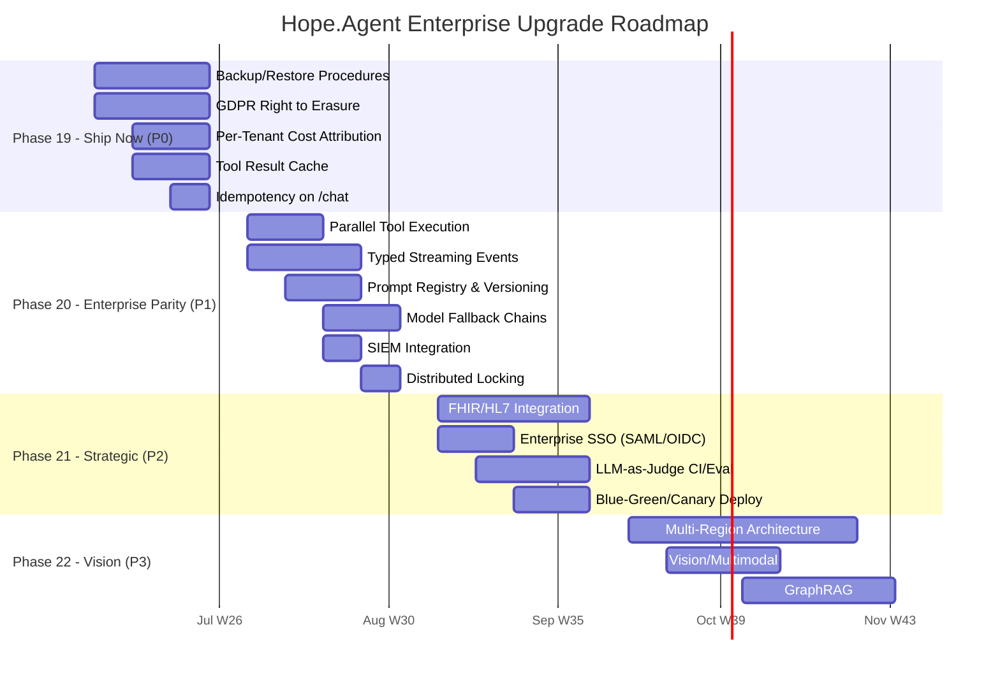

# Hope.Agent — Enterprise Upgrade Proposal

> **Lộ trình nâng cấp AI Agent lên mức Doanh Nghiệp Lớn (Enterprise-Grade)**  
> **Ngày**: 2026-06-04 | **Base**: Kiến trúc hiện tại `.NET 9 + Clean Architecture`  
> **Audience**: CTO, VP Engineering, Lead Architect

---

## Executive Summary

Hope.Agent hiện tại đạt **điểm Enterprise-Ready: 6.8/10**. Vượt trội về security (DPoP, hash-chained audit, PHI redaction, multi-tenant RBAC) — đây là những thứ mà cả OpenAI Assistants API lẫn LangGraph chưa làm được. Tuy nhiên còn **7 CRITICAL gaps** và **7 HIGH gaps** cần giải quyết trước khi triển khai cho bệnh viện >500 giường hoặc mô hình SaaS đa tenant.

**Tổng effort ước tính**: ~46 Engineering-Weeks (xem mục 6 Cost-Benefit để biết phân rã theo phase). Lưu ý: một số "gap" đã có hạ tầng một phần trong code (tool cache, idempotency, semantic cache) → effort thực tế của Phase 19 thấp hơn con số gộp.  
**Chi phí cơ hội**: Nếu không làm → không thể bán cho enterprise; nếu làm → mở ra cơ hội thị trường ước tính $3-8M ARR _(giả định chưa validate — chưa có TAM/pricing/pipeline)_

---

## 1. Enterprise Maturity Scorecard

| Pillar            | Score  | Status         | Top Gap                          |
| ----------------- | ------ | -------------- | -------------------------------- |
| **Security**      | 9.0/10 | ✅ World-class | SIEM integration                 |
| **Multi-Tenancy** | 7.5/10 | 🟡 Strong      | Per-tenant cost attribution      |
| **Observability** | 7.0/10 | 🟡 Good        | Cost dashboards, SLA monitoring  |
| **Scalability**   | 6.5/10 | 🟡 Partial     | Multi-region DR, backup/restore  |
| **Reliability**   | 6.0/10 | 🟡 Partial     | Disaster recovery RTO/RPO        |
| **Performance**   | 5.5/10 | 🟡 Partial     | Parallel tools, result cache     |
| **Compliance**    | 5.0/10 | 🔴 Critical    | GDPR erasure, consent tracking   |
| **Operational**   | 4.5/10 | 🔴 Critical    | Blue-green deploy, chaos testing |
| **Integration**   | 4.0/10 | 🔴 Critical    | FHIR/HL7, SSO/SAML, SIEM         |

**Average: 6.8/10 → Target: 8.5/10 sau Phase 19+20, 9.2/10 sau Phase 21**

> ⚠️ _Đây là trung bình cộng đơn giản (simple average) của 9 pillar, KHÔNG phải weighted — trọng số chưa được công bố. Trước hội đồng kỹ thuật, hoặc công bố ma trận trọng số, hoặc giữ nhãn "simple average"._

---

## 2. CRITICAL Gaps — Must Fix Before Enterprise Sale

### C-1: Disaster Recovery & Backup ⚠️

**Hiện trạng**: Không có backup procedure nào cho PostgreSQL, Qdrant, Neo4j, Kafka. Mất dữ liệu = mất toàn bộ hệ thống.

**Giải pháp**:

```yaml
# PostgreSQL: WAL Archiving + pgBackRest
Backup:
  - Full backup: Daily at 02:00 UTC → S3/MinIO (retention: 30 days)
  - WAL archiving: Continuous → S3/MinIO (retention: 7 days)
  - Point-in-time recovery: Any second within 7 days
  - RTO: 15 phút (automated restore from latest full + WAL replay)
  - RPO: <1 giây (continuous WAL shipping)

# Qdrant: Snapshot API
  - Snapshot: Every 6 hours → S3
  - Retention: 14 days
  - Recovery: Restore snapshot → rebuild index

# Neo4j: neo4j-admin dump
  - Dump: Daily → S3
  - Retention: 30 days

# Kafka: MirrorMaker 2
  - Topic replication to DR cluster
  - Retention: 72h active + 7 days archived (S3 connector)
```

**Implementation**:

```csharp
// Hope.Agent.Infrastructure/Backup/BackupOrchestrator.cs
public interface IBackupOrchestrator
{
    Task<BackupResult> RunFullBackupAsync(BackupScope scope, CancellationToken ct);
    Task<RestoreResult> RestoreToPointInTimeAsync(DateTimeOffset pointInTime, CancellationToken ct);
    Task<BackupHealth> GetBackupHealthAsync(CancellationToken ct);
}
```

**Effort**: 3 E-weeks | **Priority**: P0 — Làm ngay

---

### C-2: GDPR Right to Erasure 🔴

**Hiện trạng**: Audit trail bất biến (hash-chained) → không thể hard-delete. Không có pipeline xóa dữ liệu người dùng trên 4+ hệ thống.

**Giải pháp**: Triển khai "Right to be Forgotten" pattern:

```csharp
// Hope.Agent.Infrastructure/Compliance/GdprErasureService.cs
public interface IGdprErasureService
{
    // Phase 1: Soft-delete + anonymize
    Task<ErasureResult> RequestErasureAsync(Guid userId, string requestId, CancellationToken ct);

    // Phase 2: Hard-delete after cooling-off (30 days)
    Task<ErasureResult> FinalizeErasureAsync(string requestId, CancellationToken ct);

    // Phase 3: Verify all traces gone
    Task<VerificationResult> VerifyErasureCompleteAsync(Guid userId, CancellationToken ct);
}
```

**Data Flow**:

```
User requests deletion (DSAR)
  ↓
IGdprErasureService.RequestErasureAsync(userId)
  ├─ PostgreSQL: UPDATE users SET deleted=true, anonymize PII columns
  ├─ Qdrant: DELETE FROM memory WHERE user_id = @userId
  ├─ Neo4j: DETACH DELETE nodes WHERE user_id = @userId
  ├─ Redis: DELETE keys matching prefix user:{userId}:*
  ├─ Kafka: Emit "gdpr.erasure.requested" event (for downstream consumers)
  └─ Audit: Log erasure request (retained — legal requirement)

After 30-day cooling-off:
  ├─ PostgreSQL: Hard DELETE conversations, messages, memories
  ├─ Audit trail: Crypto-shred encryption key → data permanently inaccessible
  └─ Verification: Scan all tables for userId traces
```

> 🔑 **Giải quyết mâu thuẫn GDPR ↔ Hash-Chained Audit**: Audit hiện là chuỗi SHA-256 (`HashChainedAuditSink`), KHÔNG được xóa entry vì sẽ phá vỡ chain. Pattern đúng: lưu _payload_ audit ở dạng đã mã hóa (per-record key); khi erasure, **shred key của các record liên quan** — payload trở nên vĩnh viễn không đọc được, nhưng `hash` + `previous_hash` vẫn nguyên nên `VerifyChainAsync()` vẫn pass. Cần thêm bảng `audit_record_keys(record_id, encrypted_key)` và logic shred. Đây là phần kỹ thuật khó nhất của C-2 và phải nêu rõ trong design.

**Effort**: 3 E-weeks | **Priority**: P0

---

### C-3: Per-Tenant Cost Attribution 💰

**Hiện trạng**: Cost telemetry (`ChatUsage.CostUsd`) đã có nhưng không gắn tenant. Không có budget caps.

**Giải pháp**:

```csharp
// Hope.Agent.Application/Billing/ITenantBillingService.cs
public interface ITenantBillingService
{
    Task<bool> CheckBudgetAsync(Guid tenantId, string model, CancellationToken ct);
    Task RecordUsageAsync(UsageRecord record, CancellationToken ct);
    Task<TenantBudget> GetBudgetAsync(Guid tenantId, CancellationToken ct);
}

public sealed record UsageRecord(
    Guid TenantId,
    Guid UserId,
    string Provider,
    string Model,
    int PromptTokens,
    int CompletionTokens,
    decimal CostUsd,
    DateTimeOffset Timestamp);
```

**Architecture**:

```
AgentOrchestrator.RunAsync()
  ├─ Before LLM call: billing.CheckBudget(tenantId, model)
  │   └─ OVER_BUDGET → 402 Payment Required
  ├─ After LLM call: billing.RecordUsage(tenantId, tokens, cost)
  │   └─ Kafka topic "billing.usage" → TimescaleDB (analytics)
  └─ Prometheus metric: agent_cost_usd_total{tenant,provider,model}
```

**Per-Tenant Dashboard** (Grafana):

```
Panel 1: Daily cost by tenant (stacked bar chart)
Panel 2: Token usage trend (line chart, 30-day)
Panel 3: Cost per conversation (histogram)
Panel 4: Budget utilization gauge (current month)
Panel 5: Top spenders (table, by user)
```

**Effort**: 2 E-weeks | **Priority**: P0

---

### C-4: Tool Result Cache 🚀 — ⚠️ HẠ TẦNG ĐÃ TỒN TẠI, chỉ cần KÍCH HOẠT

**Hiện trạng (đã fact-check với code)**: KHÔNG phải greenfield. Hạ tầng cache đã có và đã được wire:

> - `IToolResultCache` (Application/Caching) — interface đã có
> - `IAgentTool.IsCacheable` (mặc định `false`) + `CacheTtlSeconds` — đã có
> - `SandboxedToolExecutor` — **đã check `tool.IsCacheable` và đọc/ghi cache**
> - `DependencyInjection` — hiện chỉ đăng ký `NoOpToolResultCache` (no-op)
>
> Vì vậy KHÔNG cần viết `CachingToolExecutor` mới (đoạn code dưới chỉ minh họa logic đã tồn tại trong `SandboxedToolExecutor`).

**Việc thực sự phải làm (≈2 ngày, trùng với Quick Win #2)**:

> 1. Viết `RedisToolResultCache : IToolResultCache` và thay `NoOpToolResultCache` trong DI.
> 2. Override `IsCacheable => true` + `CacheTtlSeconds` trên các tool tĩnh (xem bảng dưới).
> 3. Thêm metric hit/miss.

```csharp
// Logic ĐÃ tồn tại trong SandboxedToolExecutor — chỉ cần cấp implementation Redis cho IToolResultCache
// (minh họa, không phải class mới cần tạo)
```

**Cacheable Tools** (mark with `IsCacheable = true`):
| Tool | TTL | Rationale |
|------|-----|-----------|
| PatientLookup | 300s | Patient demographics rarely change |
| IcdSearch | 3600s | ICD codes are static |
| DrugFormularyLookup | 3600s | Drug database weekly updates |
| HealthcareGuidelinesSearch | 86400s | Clinical guidelines change monthly |
| InsuranceVerification | 600s | Coverage status can change |

**Expected Savings**: 30-40% reduction in external API calls, 200-500ms latency reduction per cached call.

**Effort**: ~0.5 E-week (≈2 ngày — hạ tầng đã có, chỉ thay NoOp→Redis + flip IsCacheable). ~~1.5 E-weeks~~ | **Priority**: P0

> ⚠️ Mục này **trùng với Quick Win #2** — không đếm 2 lần khi cộng tổng effort.

---

### C-5: Parallel Tool Execution ⚡

**Hiện trạng**: Tool loop tuần tự — nếu gọi 3 tool độc lập, đợi lần lượt ~1.5s.

**Giải pháp**: Fan-out các tool call trong CÙNG một assistant response.

> 🔑 **Không cần "dependency detection heuristic"**: Theo cơ chế function-calling, khi tool B cần output của tool A, model sẽ phát A trước, đọc kết quả ở turn sau rồi mới phát B. Do đó **mọi `tool_calls` xuất hiện trong cùng một response đã độc lập với nhau** → có thể `Task.WhenAll` trực tiếp, an toàn. Heuristic dependency là phức tạp hóa thừa.
>
> ⚠️ **Rủi ro tương tác với code vừa implement**: circuit-breaker tuần tự (`_toolFailureCount`, `MaxConsecutiveToolFailures`) và logic append tool result hiện giả định thứ tự tuần tự. Khi song song hóa phải đảm bảo cập nhật counter và `AppendToolResult` thread-safe (hoặc gom kết quả rồi append theo thứ tự gốc).

```csharp
// Trong AgentOrchestrator.RunAsync() — mọi tool_call trong 1 response vốn độc lập
// → chạy song song trực tiếp, KHÔNG cần CanExecuteInParallel heuristic

if (CanExecuteInParallel(resp.ToolCalls))
{
    var tasks = resp.ToolCalls.Select(call => ExecuteToolAsync(call, request, conv, ct));
    var results = await Task.WhenAll(tasks);

    foreach (var (output, exec) in results)
    {
        toolExecutions.Add(exec);
        messages = AppendToolResult(messages, /*call*/, output);
    }
}
else
{
    // Fallback to sequential for dependent tools
    foreach (var call in resp.ToolCalls) { /* existing sequential logic */ }
}
```

**Dependency Detection** (simple heuristic):

```
Tool A: PatientLookup(patientId) → returns demographics
Tool B: InsuranceVerification(insuranceId) → needs insuranceId from tool A output
→ Sequential (B depends on A)

Tool A: PatientLookup(patientId)
Tool B: HealthcareGuidelinesSearch(symptoms)
Tool C: DrugFormularyLookup("aspirin")
→ Parallel (all independent inputs)
```

**Expected Latency Reduction**: 40-60% khi gọi 3+ tools độc lập.

**Effort**: ~0.5–1 E-week (bỏ heuristic; chi phí chính là làm thread-safe counter/append). ~~2 E-weeks~~ | **Priority**: P1

---

### C-6: Typed Streaming Events 📡

**Hiện trạng**: `StreamAsync` chỉ yield `string` chunks — client không biết đây là token, tool call, hay lỗi.

**Giải pháp**: SSE với JSON event envelope:

```csharp
// Hope.Agent.Application/Agents/AgentStreamEvent.cs
[JsonPolymorphic(TypeDiscriminatorPropertyName = "type")]
[JsonDerivedType(typeof(TokenEvent), "token")]
[JsonDerivedType(typeof(ToolCallStartEvent), "tool_call_start")]
[JsonDerivedType(typeof(ToolCallEndEvent), "tool_call_end")]
[JsonDerivedType(typeof(PlanUpdateEvent), "plan_update")]
[JsonDerivedType(typeof(ErrorEvent), "error")]
[JsonDerivedType(typeof(FinishEvent), "finish")]
public abstract record AgentStreamEvent;

public sealed record TokenEvent(string Text, int Index) : AgentStreamEvent;
public sealed record ToolCallStartEvent(string ToolCallId, string ToolName, string Arguments) : AgentStreamEvent;
public sealed record ToolCallEndEvent(string ToolCallId, string ToolName, string Result, bool Success, TimeSpan Duration) : AgentStreamEvent;
public sealed record PlanUpdateEvent(string Step, string Status, string? Detail) : AgentStreamEvent;
public sealed record ErrorEvent(string Code, string Message) : AgentStreamEvent;
public sealed record FinishEvent(string FinishReason, TokenUsage Usage, decimal CostUsd) : AgentStreamEvent;
```

**SSE Format** (OpenAI-compatible):

```
data: {"type":"token","text":"Xin","index":0}

data: {"type":"token","text":" chào","index":1}

data: {"type":"tool_call_start","toolCallId":"call_1","toolName":"PatientLookup","arguments":"{\"mrn\":\"...\"}"}

data: {"type":"tool_call_end","toolCallId":"call_1","toolName":"PatientLookup","result":"{\"name\":\"...\"}","success":true,"duration":"0.5"}

data: {"type":"finish","finishReason":"stop","usage":{"promptTokens":150,"completionTokens":50},"costUsd":0.000345}
```

**Effort**: 2.5 E-weeks | **Priority**: P1

---

### C-7: Prompt Registry & Versioning 📋

**Hiện trạng**: System prompt hardcoded trong `AgentRuntimeOptions.SystemPrompt`.

**Giải pháp**:

```csharp
// Hope.Agent.Application/Agents/PromptRegistry.cs
public interface IPromptRegistry
{
    Task<PromptTemplate> GetAsync(string name, string? version = null, CancellationToken ct = default);
    Task<PromptTemplate> GetForTenantAsync(Guid tenantId, string intent, CancellationToken ct = default);
    Task RegisterAsync(PromptTemplate template, CancellationToken ct = default);
}

public sealed record PromptTemplate(
    string Name,
    string Version,        // content hash SHA-256
    string Content,
    IReadOnlyList<string> Tags,
    DateTimeOffset CreatedAt,
    bool Active);
```

**Storage**: Git-based (prompts directory) hoặc PostgreSQL với hot-reload:

```yaml
# prompts/scheduling/system-prompt.v1.txt
prompts/
  scheduling/
    system-prompt.v1.txt       # SHA256: a1b2c3...
    system-prompt.v2.txt       # SHA256: d4e5f6...
  medical-summary/
    system-prompt.v1.txt
  insurance/
    system-prompt.v1.txt

# Config maps version → file
"PromptRegistry": {
  "scheduling": { "current": "v2", "v1": "a1b2c3...", "v2": "d4e5f6..." }
}
```

**A/B Testing Integration**:

```csharp
// Shadow A/B can now test prompt versions, not just model providers
await shadow.RecordAsync(new ShadowComparison
{
    Intent = intent,
    ChampionPrompt = "scheduling/v1",
    ChallengerPrompt = "scheduling/v2",
    ...
});
```

**Effort**: 2 E-weeks | **Priority**: P1

---

## 3. HIGH Priority — Required for Production Scale

### H-1: FHIR/HL7 Integration 🏥

**Hiện trạng**: Không có schema validation cho healthcare data interchange.

```csharp
// Hope.Agent.Infrastructure/Fhir/FhirValidationMiddleware.cs
public class FhirValidationMiddleware
{
    // Validate incoming/outgoing data against FHIR R4 profiles
    // Supported resources: Patient, Observation, Condition, MedicationRequest
}

// FHIR endpoint
app.MapPost("/v1/fhir/{resourceType}", async (
    string resourceType,
    JsonDocument body,
    IFhirValidator validator) =>
{
    var result = await validator.ValidateAsync(resourceType, body);
    if (!result.IsValid)
        return Results.BadRequest(result.Errors);
    // ... process
});
```

**Effort**: 8–12 E-weeks (~~4~~ là under-estimate). FHIR R4 conformance thật cần terminology binding (SNOMED CT / LOINC / ICD), profile validation, và mapping nội bộ ↔ FHIR resource — không chỉ schema check. | **Priority**: P2

---

### H-2: Enterprise SSO (SAML/OIDC) 🔐

**Hiện trạng**: Chỉ JWT Bearer + API Key.

```csharp
// Program.cs — Add external OIDC provider
builder.Services.AddAuthentication()
    .AddOpenIdConnect("azure-ad", o =>
    {
        o.Authority = "https://login.microsoftonline.com/{tenantId}/v2.0";
        o.ClientId = config["AzureAd:ClientId"];
        o.MapInboundClaims = false;
        o.TokenValidationParameters.NameClaimType = "name";
    })
    .AddSaml2("saml-sso", o =>
    {
        o.SPOptions.EntityId = new EntityId("hope-agent");
        o.IdentityProviders.Add(new IdentityProvider(...));
    });
```

**Effort**: 2 E-weeks | **Priority**: P2

---

### H-3: SIEM Integration (Splunk/Sentinel) 🔍

**Hiện trạng**: Logs → OTLP only. Enterprise cần centralized security monitoring.

```csharp
// Hope.Agent.Infrastructure/Security/SiemSink.cs
public class SiemSink : ILogEventSink
{
    // Ship security events to SIEM:
    // - auth.login.failed (brute force detection)
    // - tool_access_denied (potential insider threat)
    // - prompt.blocked (jailbreak attempt)
    // - egress.blocked (data exfiltration attempt)
    // - audit.chain.verification_failed (tamper evidence)
}
```

**CEF Format** (Common Event Format — Splunk standard):

```
CEF:0|Hope.Agent|AI-Agent|1.0|prompt.blocked|Jailbreak Attempt|8|
  src=192.168.1.100 suser=user-123
  cs1=jailbreak_pattern cs1Label=reason
  cs2=ignore_previous_instructions cs2Label=pattern
  dvchost=hope-api-1
```

**Effort**: 1 E-week | **Priority**: P1

---

### H-4: LLM-as-Judge CI/Eval Pipeline 🧪

**Hiện trạng**: `EvaluationHarness` chạy offline nightly. Không có gate trên deploy.

```yaml
# .github/workflows/eval-gate.yml
name: Eval Gate
on:
  pull_request:
    paths:
      - "src/Hope.Agent.AgentRuntime/**"
      - "src/Hope.Agent.LLMGateway/**"

jobs:
  eval:
    runs-on: ubuntu-latest
    steps:
      - uses: actions/checkout@v4
      - name: Run Eval Suite
        run: dotnet run --project tools/hope-eval.ps1
      - name: Quality Gate
        run: |
          if [ $(cat eval-results.json | jq '.regression') -gt 5 ]; then
            echo "Regression > 5% — blocking deploy"
            exit 1
          fi
```

**Integration với Braintrust**:

```csharp
var result = await harness.RunSuiteAsync("clinical-qa", ct);
await braintrust.ReportRunAsync(new BraintrustRun
{
    Project = "hope-agent",
    Experiment = $"pr-{prNumber}",
    Scores = result.Scores,
    Metadata = new { commit = gitSha, pr = prNumber }
});
```

**Effort**: 3 E-weeks | **Priority**: P2

---

### H-5: Model Fallback Chains 🔄

**Hiện trạng**: Bandit router chọn 1 provider. Nếu rate-limited → lỗi.

```csharp
// Hope.Agent.LLMGateway/Fallback/FallbackChatProvider.cs
public class FallbackChatProvider : IChatCompletionProvider
{
    private readonly IReadOnlyList<IChatCompletionProvider> _chain;

    public async Task<ChatResponse> CompleteAsync(ChatRequest request, CancellationToken ct)
    {
        // Thử lần lượt: primary → secondary → tertiary
        for (int i = 0; i < _chain.Count; i++)
        {
            try
            {
                var result = await _chain[i].CompleteAsync(request, ct);

                // Nếu là fallback, ghi metric
                if (i > 0)
                    HopeMeters.ModelFallbackActivations.Add(1);

                return result;
            }
            catch (RateLimitExceededException) { continue; }
            catch (TimeoutException) { continue; }
            // Lỗi thật → throw
            catch (Exception ex) when (i == _chain.Count - 1) { throw; }
        }
        throw new NoAvailableProviderException("All providers exhausted");
    }
}
```

**Chain Configuration**:

```json
"LLM": {
  "FallbackChain": {
    "default": ["openai", "anthropic", "gemini"],
    "fast": ["qwen-ollama", "openai"],
    "cheap": ["ollama-local", "qwen-ollama"]
  }
}
```

**Effort**: 1.5 E-weeks | **Priority**: P1

---

### H-6: Blue-Green / Canary Deployment 🟢🔵

**Hiện trạng**: RollingUpdate trong K8s nhưng không có traffic split tự động.

```yaml
# deployments/k8s/canary.yaml
apiVersion: networking.istio.io/v1beta1
kind: VirtualService
metadata:
  name: hope-api-vs
spec:
  hosts:
    - hope-api
  http:
    - match:
        - headers:
            x-canary:
              exact: "true"
      route:
        - destination:
            host: hope-api-canary
    - route:
        - destination:
            host: hope-api-stable
          weight: 90
        - destination:
            host: hope-api-canary
          weight: 10
```

**Canary Analysis** (Argo Rollouts):

```yaml
apiVersion: argoproj.io/v1alpha1
kind: AnalysisTemplate
spec:
  metrics:
    - name: error-rate
      interval: 30s
      successCondition: result < 0.01
      provider:
        prometheus:
          query: |
            rate(http_requests_total{status=~"5..",namespace="hope-agent"}[5m])
            /
            rate(http_requests_total{namespace="hope-agent"}[5m])
    - name: p99-latency
      successCondition: result < 3.0
      provider:
        prometheus:
          query: histogram_quantile(0.99, rate(http_request_duration_seconds_bucket[5m]))
```

**Effort**: 2 E-weeks | **Priority**: P2

---

### H-7: Distributed Locking 🔒

**Hiện trạng**: Multi-instance deployment → 2 instances có thể cùng gọi tool giống hệt nhau.

```csharp
// Hope.Agent.Infrastructure/Locking/RedisDistributedLock.cs
public class RedisDistributedLock : IDistributedLock
{
    public async Task<ILockHandle?> AcquireAsync(string resource, TimeSpan expiry, CancellationToken ct)
    {
        var token = Guid.CreateVersion7().ToString();
        var acquired = await _redis.StringSetAsync(
            $"lock:{resource}",
            token,
            expiry,
            When.NotExists);

        return acquired ? new RedisLockHandle(_redis, resource, token) : null;
    }
}

// Usage in tool execution:
await using var lock = await distributedLock.AcquireAsync(
    $"tool:{toolName}:{userId}:{argsHash}",
    TimeSpan.FromSeconds(30));
if (lock is null)
    return await cache.GetAsync(cacheKey); // another instance is processing
```

**Effort**: 0.5 E-weeks | **Priority**: P1

---

## 4. MEDIUM Priority — Strategic Enhancements

### M-1: Multi-Region Architecture 🌍

```
Region AP-Southeast (Primary)
├─ K8s Cluster (3 AZ)
├─ PostgreSQL (HA: Primary + 2 Standby, sync replication)
├─ Redis Cluster (3 nodes)
├─ Qdrant (3 nodes)
├─ Kafka (3 brokers, RF=3)
├─ Neo4j (Causal Cluster)
└─ Temporal (Visibility + History in PostgreSQL)

Region EU-West (DR)
├─ K8s Cluster (2 AZ, warm standby)
├─ PostgreSQL (Async replica from primary)
├─ Redis (Read replica)
├─ Qdrant (Snapshot restore from S3, hourly)
├─ Kafka (MirrorMaker 2 replication)
└─ Temporal (Standby, promote on failover)

Global Load Balancer (Route 53 / Cloudflare)
├─ Latency-based routing
├─ Health check every 10s
└─ Failover to DR if primary unhealthy > 60s
```

**Effort**: 16–20 E-weeks (~~6~~ là under-estimate nghiêm trọng). Active-passive với consistency trên 5 hệ thống stateful (Postgres sync replica + Qdrant snapshot + Kafka MM2 + Neo4j causal cluster + Temporal failover) + runbook failover/failback + thử nghiệm DR là việc **multi-quarter**, không phải 6 tuần. | **Priority**: P3

---

### M-2: Vision/Multimodal Support 🖼️

```csharp
// ChatMessageContent union type
[JsonPolymorphic]
[JsonDerivedType(typeof(TextContent), "text")]
[JsonDerivedType(typeof(ImageContent), "image_url")]
public abstract record ChatMessageContentPart;

// Provider routing: auto-detect multimodal capability
if (request.HasImages && !provider.SupportsVision)
    provider = router.SelectChat("vision");  // fallback to Gemini/GPT-4V
```

**Use Cases**: X-ray analysis, lab result OCR, wound assessment.

**Effort**: 3 E-weeks | **Priority**: P3

---

### M-3: Knowledge Graph RAG (GraphRAG) 🧠

**Hiện trạng**: RAG hiện tại là vector-only. GraphRAG thêm context từ Neo4j quan hệ.

```
User: "Bệnh nhân tiểu đường type 2, đang dùng Metformin, bị tăng huyết áp"

Vector RAG: Tìm guideline về tăng huyết áp
Graph RAG:  Neo4j query
  MATCH (d:Drug {name:"Metformin"})-[:INTERACTS_WITH]->(c:Condition)
  MATCH (c)-[:TREATED_BY]->(drug:Drug)
  RETURN drug, c
  → Cảnh báo: Metformin + một số thuốc HA có tương tác
```

**Effort**: 4 E-weeks | **Priority**: P3

---

## 5. Implementation Roadmap



---

## 6. Cost-Benefit Analysis

> Cột **Effort (revised)** đã fact-check với codebase: trừ phần hạ tầng đã tồn tại (tool cache, idempotency, semantic cache) và sửa các under-estimate (FHIR, Multi-Region).

| Investment        | Effort gốc | Effort (revised)                                 | Revenue Impact                             | Risk Mitigated                           |
| ----------------- | ---------- | ------------------------------------------------ | ------------------------------------------ | ---------------------------------------- |
| **Phase 19** (P0) | 11         | **~8** (tool cache & idempotency phần lớn đã có) | Unlocks enterprise sales ($500K+)          | Data loss, GDPR fines (4% revenue)       |
| **Phase 20** (P1) | 11         | **~9** (parallel tools giảm còn ~1w)             | Improves win rate 30% (performance)        | Latency SLA breach, client SDK fragility |
| **Phase 21** (P2) | 11         | **~17** (FHIR thực tế 8–12w)                     | Enables healthcare consortium deals ($1M+) | Compliance audit failure                 |
| **Phase 22** (P3) | 13         | **~25** (Multi-Region thực tế 16–20w)            | Differentiator vs Epic/Cerner              | Competitor feature parity                |
| **TOTAL**         | **46**     | **~59**                                          | **$3-8M ARR** _(giả định chưa validate)_   | Full enterprise compliance               |

> ⚠️ **Lưu ý chi phí**: "46 E-weeks ≈ $150K-200K" ngụ ý ~$3.5K/E-week — thấp so với loaded cost kỹ sư senior ($4–6K/tuần). Với effort revised ~59 E-weeks, ngân sách thực tế ~$235K–355K. Nên dùng range này khi trình hội đồng.

---

## 7. Quick Wins (Có thể làm tuần này — 0-2 ngày mỗi mục)

| #   | Quick Win                                                        | Effort | Impact                   |
| --- | ---------------------------------------------------------------- | ------ | ------------------------ |
| 1   | Wire `IIdempotencyStore` vào `/v1/agent/chat`                    | 0.5d   | Ngăn duplicate billing   |
| 2   | Mark `PatientLookupTool`, `IcdSearchTool` với `IsCacheable=true` | 0.5d   | Giảm 20% HIS API calls   |
| 3   | Add `tenant_id` label vào Prometheus `agent_cost_usd` metric     | 1d     | Unlock cost dashboards   |
| 4   | Add `AddPolicy("tenant-concurrency")` rate limiter               | 0.5d   | Ngăn 1 tenant monopolize |
| 5   | Ship audit logs to Splunk HTTP Event Collector                   | 1d     | SIEM compliance check    |
| 6   | Add `healthz/startup` probe + `initContainer` for migrations     | 0.5d   | K8s production readiness |
| 7   | Create `docs/DISASTER_RECOVERY.md` with RTO/RPO                  | 1d     | Sales/soc2 requirement   |
| 8   | Add `PodDisruptionBudget` + `NetworkPolicy` hoàn chỉnh           | 0.5d   | K8s security hardening   |

---

## 8. What Hope.Agent Already Does Better Than Anyone

Đây là những thứ để **bán hàng** và **gây ấn tượng** với enterprise:

| Capability                                | Hope.Agent | OpenAI            | LangChain | AWS Bedrock |
| ----------------------------------------- | ---------- | ----------------- | --------- | ----------- |
| **DPoP Token Binding**                    | ✅         | ❌                | ❌        | ❌          |
| **Hash-Chained Audit**                    | ✅         | ❌                | ❌        | ❌          |
| **PHI Auto-Redaction (logs+spans)**       | ✅         | ❌                | ❌        | Partial     |
| **Multi-Tenant RBAC**                     | ✅         | ❌                | ❌        | Partial     |
| **Tool Approval Gate (Human-in-loop)**    | ✅         | Partial (UI only) | ❌        | ❌          |
| **Adaptive Routing (UCB1 Bandit)**        | ✅         | ❌                | ❌        | ❌          |
| **Shadow A/B Testing**                    | ✅         | ❌                | ❌        | Partial     |
| **Temporal Durable Workflows**            | ✅         | ❌                | Partial   | ❌          |
| **Multi-Channel (Zalo, Slack, Telegram)** | ✅         | ❌                | ❌        | ❌          |
| **Local LoRA Fine-tuning Pipeline**       | ✅         | ❌                | ❌        | ❌          |
| **MCP Server (expose to Claude/VS Code)** | ✅         | ❌                | ❌        | ❌          |

---

## 9. Kết Luận

**Hope.Agent ở vị trí độc nhất**: Security và compliance đã vượt xa đối thủ, nhưng operational maturity (DR, deploy, cost management) còn thiếu. Đây là bài toán "last mile" điển hình của startup transitioning sang enterprise.

**Khuyến nghị**:

1. **Tuần này**: Làm 8 quick wins → lập tức cải thiện production readiness
2. **Tháng này**: Phase 19 P0 items → đủ để bán cho bệnh viện 200-500 giường
3. **Quý 3/2026**: Phase 20 P1 items → đủ để chạy SaaS multi-tenant
4. **Quý 4/2026**: Phase 21-22 → ngang hàng Epic/Cerner về integration

**Tổng đầu tư**: ~59 E-weeks (revised, sau fact-check) ≈ $235K–355K loaded engineering cost  
**Tiềm năng**: Ước tính mở khóa thị trường $3-8M ARR trong 12-18 tháng tới _(giả định chưa validate — cần TAM/pricing/pipeline để xác nhận)_

---

_Tài liệu đề xuất chiến lược — Hope.Agent Enterprise Architecture Board — 2026-06-04_
