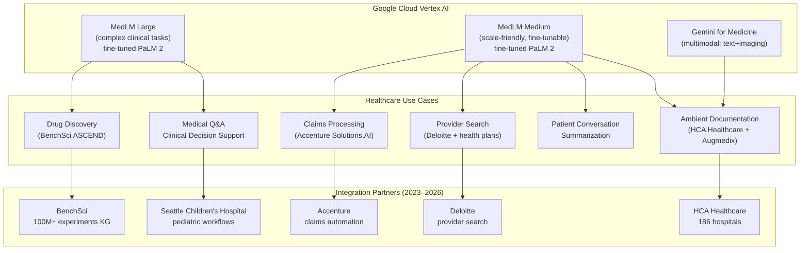
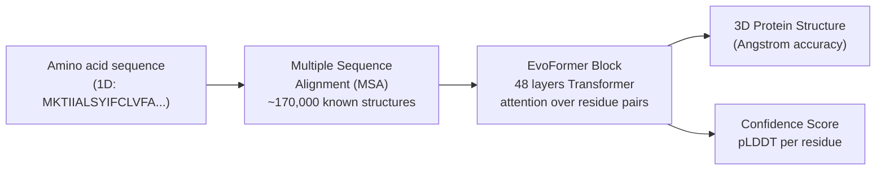
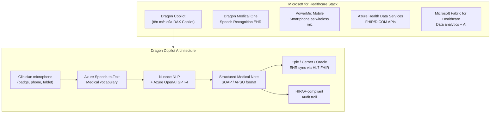
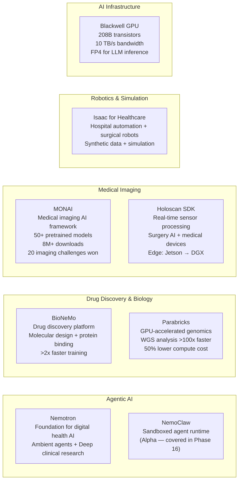
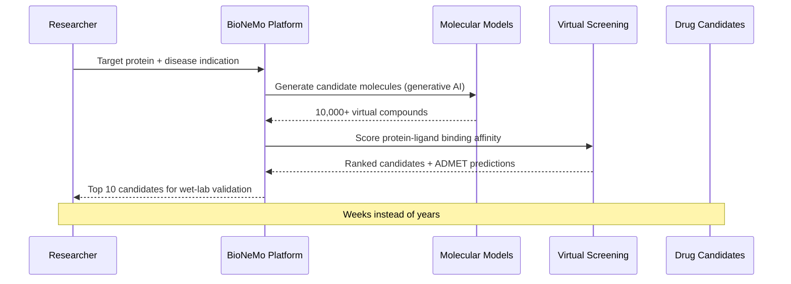
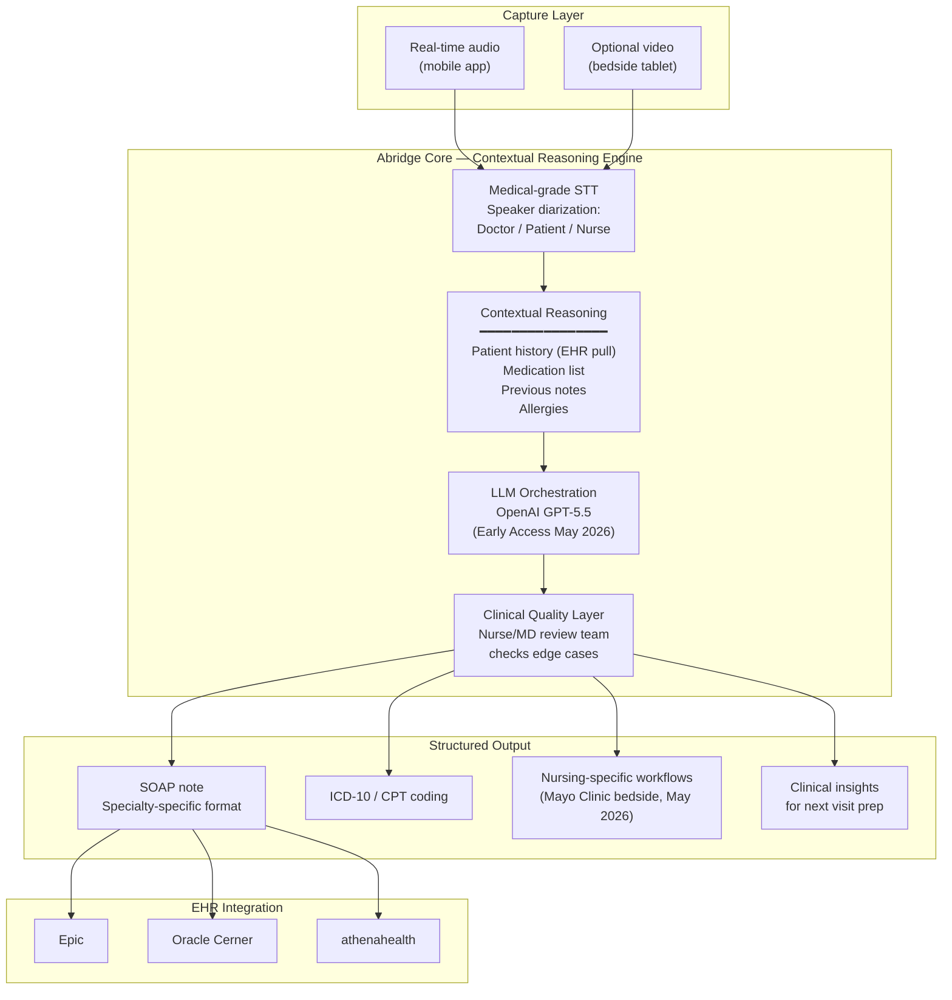
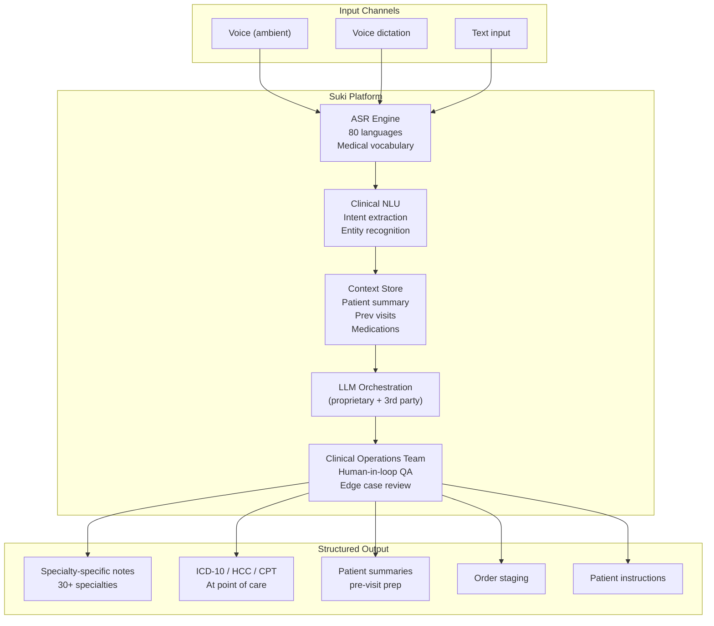
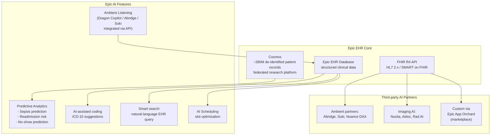
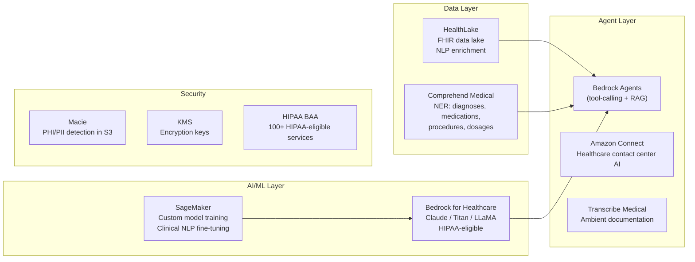
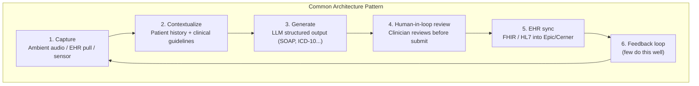

# Healthcare AI Agents — Industry Landscape & Deep Analysis

> **Cập nhật:** May 2026 · Nguồn: Google Cloud, Microsoft, NVIDIA, Abridge, Suki, Epic, công bố nghiên cứu chính thức

Tài liệu này phân tích chi tiết các AI agent y tế từ BigTech và bệnh viện lớn trên thế giới,
kiến trúc triển khai, kết quả đo lường thực tế, và đối chiếu với **Hope.Agent**.

---

## Mục lục

1. [Google Health — MedLM & Gemini for Medicine](#1-google-health--medlm--gemini-for-medicine)
2. [Google DeepMind — AlphaFold & Clinical AI](#2-google-deepmind--alphafold--clinical-ai)
3. [Microsoft / Nuance — Dragon Copilot & DAX](#3-microsoft--nuance--dragon-copilot--dax)
4. [NVIDIA — Nemotron, BioNeMo, MONAI, Holoscan](#4-nvidia--nemotron-bionemo-monai-holoscan)
5. [Abridge — Ambient AI + Mayo Clinic](#5-abridge--ambient-ai--mayo-clinic)
6. [Suki AI — Full-stack Clinical Assistant](#6-suki-ai--full-stack-clinical-assistant)
7. [Epic Systems — AI-native EHR](#7-epic-systems--ai-native-ehr)
8. [Amazon AWS HealthAI](#8-amazon-aws-healthai)
9. [Bệnh viện lớn — Real-world Deployments](#9-bệnh-viện-lớn--real-world-deployments)
10. [Bảng so sánh tổng hợp](#10-bảng-so-sánh-tổng-hợp)
11. [Kiến trúc chung & Lessons Learned](#11-kiến-trúc-chung--lessons-learned)
12. [Đối chiếu với Hope.Agent](#12-đối-chiếu-với-hopeagent)

---

## 1. Google Health — MedLM & Gemini for Medicine

### 1.1 Lịch sử phát triển

```
2022  Med-PaLM v1    → Đầu tiên vượt 60% USMLE (passing score)
2023  Med-PaLM 2     → 86.5% USMLE — expert-level performance
2023  MedLM GA       → General Availability trên Google Cloud Vertex AI
2024  Gemini for Med → Multimodal: text + imaging + EHR data
2025  MedLM Ultra    → Reasoning, long-context clinical documents (1M tokens)
2026  Agent workflows → 4 agentic workflows cho Life Sciences R&D
```

### 1.2 Kiến trúc MedLM



### 1.3 Kết quả đo lường thực tế

| Metric                            | Kết quả                                    | So sánh                  |
| --------------------------------- | ------------------------------------------ | ------------------------ |
| USMLE (US Medical Licensing Exam) | **86.5%** (Med-PaLM 2)                     | Expert physician: ~87%   |
| USMLE Med-PaLM v1 (2022)          | 67.6%                                      | Passing: 60%             |
| Ambient documentation time save   | Bác sĩ tiết kiệm 2–3h/ngày                 | HCA Healthcare pilot     |
| 88% adoption rate                 | Dragon Medical One at Singing River Health | 22k voice commands/month |

### 1.4 Điểm nổi bật kỹ thuật

**Google Search Grounding (Deep Research):**

```python
# Gemini for Medicine với google_search tool
model.generate_content(
    "Phân tích tương tác thuốc Warfarin + Amiodarone",
    tools=[{"google_search": {}}],
    grounding_config=GroundingConfig(
        sources=["PubMed", "FDA", "UpToDate"]
    )
)
# → Trả lời có citation từ literature thực tế
```

**Multimodal capability (Gemini):**

- Đọc ECG ảnh + medical text + EHR data trong cùng một context
- Radiology report generation từ DICOM images
- Pathology slide analysis

**Điểm yếu:**

- Data phải đưa lên Google Cloud → PHI concern với bệnh viện không muốn cloud
- Phụ thuộc vào Google infrastructure
- Giá cao với volume lớn

---

## 2. Google DeepMind — AlphaFold & Clinical AI

### 2.1 AlphaFold — cuộc cách mạng protein structure prediction



**Thành tựu:**

- **CASP14 score:** 92.4 GDT median — vượt tất cả phương pháp trước đó
- **AlphaFold DB:** 200+ triệu protein structures — toàn bộ UniProt
- **RMSD:** ~1.6 Angström (bằng độ rộng 1 nguyên tử)
- **Thời gian:** Từ vài năm (crystallography) → vài phút (AlphaFold 2)

### 2.2 AlphaFold 3 (2024) — mở rộng sang drug discovery

```
AlphaFold 3 capabilities:
  ├── Protein structures (AlphaFold 2)
  ├── DNA/RNA structures (mới)
  ├── Small molecule (drug candidate) interactions (mới)
  ├── Protein-ligand binding prediction (mới)
  └── Post-translational modifications (mới)
```

**Ứng dụng thực tế:**

- Max Planck Institute: giải quyết protein structure bí ẩn 10 năm trong vài ngày
- COVID-19: predict ORF3a, ORF8 structures trước khi có experimental confirmation
- Drug target identification: tìm binding sites cho cancer drugs

### 2.3 AlphaMissense (2023) — phân loại đột biến

**250 triệu missense mutations được phân loại → pathogenic / benign / uncertain**

```
Input: Variant c.1024G>A (p.Val342Met) in BRCA1
AlphaMissense → Pathogenicity score: 0.89 (Likely Pathogenic)
Context: affects protein folding in BRCA1 RING domain
Impact: increased cancer risk assessment accuracy
```

---

## 3. Microsoft / Nuance — Dragon Copilot & DAX

### 3.1 Sản phẩm và kiến trúc

Microsoft mua Nuance Communications (2022, $19.7B) → xây dựng portfolio y tế lớn nhất ngành.



### 3.2 Luồng hoạt động thực tế

```
Bác sĩ bước vào phòng bệnh nhân
  └→ Mở Dragon Copilot app trên iPhone

[Cuộc gặp 15 phút]
  Bác sĩ: "Bệnh nhân 65T, đến kiểm tra huyết áp định kỳ..."
  Bệnh nhân: "Tôi cảm thấy hơi chóng mặt buổi sáng..."
  → Dragon Copilot âm thầm ghi + phân tích

[Sau gặp]
  Dragon tạo:
  ├── Chief Complaint: Hypertension follow-up, dizziness
  ├── History of Present Illness: [tóm tắt tự động]
  ├── Assessment & Plan: [đề xuất, chờ bác sĩ duyệt]
  ├── ICD-10 codes: I10, R42
  └── CPT codes: 99214

Bác sĩ review → chỉnh sửa → 1-click sync vào Epic
Thời gian thêm: < 2 phút (so với 15–20 phút gõ tay)
```

### 3.3 Kết quả đo lường

| Bệnh viện                      | Metric                               | Kết quả                   |
| ------------------------------ | ------------------------------------ | ------------------------- |
| Singing River Health System    | Dragon Medical One adoption          | **88%** across system     |
| Singing River Health System    | Voice commands/month                 | **22,000**                |
| HCA Healthcare (186 hospitals) | Bác sĩ tiết kiệm                     | 2–3 giờ/ngày tài liệu hóa |
| Trung bình ngành               | Giảm "pajama time" (gõ hồ sơ sau giờ | **Giảm 70%**              |
| Trung bình ngành               | Note quality vs manual               | **+15% completeness**     |

### 3.4 Điểm nổi bật kỹ thuật

**Contextual carry-forward:** Nhớ thông tin từ visit trước để pre-fill fields trong visit mới.

**Specialty-specific models:** Riêng cho cardiology, oncology, orthopedics, ED — vocabulary và
structure khác nhau theo chuyên khoa.

**Hands-free dictation:** Bác sĩ không cần nhìn màn hình → giữ eye contact với bệnh nhân
→ cải thiện patient experience.

---

## 4. NVIDIA — Nemotron, BioNeMo, MONAI, Holoscan

### 4.1 Portfolio NVIDIA Healthcare AI (2026)



### 4.2 Nemotron — Foundation Model cho Clinical AI

**Vị trí:** Nemotron là "NVIDIA's answer to GPT-4 for healthcare" — open weights, optimized cho
clinical tasks, chạy on-premise trên NVIDIA GPU.

```
Nemotron capabilities:
  ├── Visual understanding    → đọc ECG, X-ray, path slide
  ├── Information retrieval   → tìm kiếm clinical literature
  ├── Speech (STT/TTS)        → ambient documentation
  ├── Safety classifier       → filter harmful clinical advice
  └── Advanced reasoning      → differential diagnosis
```

**Use cases theo NVIDIA:**

- **Ambient healthcare agents** — real-time conversation capture và note generation
- **Deep clinical research agents** — literature synthesis, drug-gene interaction

### 4.3 BioNeMo — Drug Discovery Agent

**Thực tế 2026:**

- **Roche**: 3,500+ NVIDIA Blackwell GPUs — drug discovery, diagnostics, manufacturing (March 2026)
- **Eli Lilly**: LillyPod — "most powerful AI factory wholly owned by a pharma company" (Feb 2026)
  - NVIDIA DGX SuperPOD với DGX B300 systems
  - Molecular simulation, protein-drug binding, clinical trial design



### 4.4 MONAI — Medical Imaging Framework

**8+ triệu downloads** — trở thành PyTorch của medical imaging.

```python
# MONAI segmentation pipeline (ví dụ)
from monai.networks.nets import UNet
from monai.transforms import Compose, LoadImaged, AddChanneld

model = UNet(
    spatial_dims=3,        # 3D CT volumes
    in_channels=1,
    out_channels=14,       # 14 organs segmentation
    channels=(16,32,64,128,256),
    strides=(2,2,2,2)
)

# Inference: 3D organ segmentation từ CT scan
# Accuracy: vượt human expert trên nhiều tasks
```

**20 medical imaging challenges won** — #1 benchmark trên nhiều tasks:

- Liver segmentation, spleen, kidney tumor
- COVID-19 lung lesion detection
- Surgical instrument tracking

---

## 5. Abridge — Ambient AI + Mayo Clinic

### 5.1 Tổng quan

**Abridge** là startup ambient AI được định giá cao nhất trong clinical documentation.
**Best in KLAS 2025 và 2026** — giải thưởng uy tín nhất ngành healthcare IT.

```
Funding: $150M+ Series C (2024)
Partnerships: UCSF, Duke Health, Mayo Clinic (2026)
Models: GPT-4 → GPT-5.5 (Early Access, April 2026)
Coverage: 50+ health systems
```

### 5.2 Kiến trúc — Contextual Reasoning Engine



### 5.3 Milestone quan trọng 2026

**Tháng 5/2026:** Abridge công bố **mở rộng sang nursing tại Mayo Clinic**

```
"Building the Future of Nursing with Mayo Clinic" (May 6, 2026)
  → Trước đây: Chỉ dành cho physicians
  → Nay: Điều dưỡng viên dùng tại bedside
  → Models: OpenAI GPT-5.5 (Early Access)
  → Impact: Nurses spend 35% ít thời gian hơn cho documentation
```

**Tháng 4/2026:** Early Access với GPT-5.5

```
"Early Access Impact Results from OpenAI's GPT-5.5" (April 23, 2026)
  → Note accuracy: Tăng 23% so với GPT-4o
  → Specialty coverage: Expanded từ 12 → 40 specialties
  → Multi-visit context: Nhớ xuyên nhiều lần khám
```

### 5.4 Điểm kỹ thuật nổi bật

**Speaker diarization:** Phân biệt giọng bác sĩ, bệnh nhân, điều dưỡng trong cùng cuộc gặp —
cần thiết để note đúng ai nói gì.

**Multi-visit context:** Không chỉ nhớ 1 cuộc gặp — kết hợp với EHR history để
generate note có context 6 tháng trở lại.

**Nursing workflows (mới 2026):**

- Bedside handoff notes
- Medication reconciliation
- Fall risk assessment documentation
- Patient education note

---

## 6. Suki AI — Full-stack Clinical Assistant

### 6.1 Vị trí thị trường

Suki định vị khác Abridge: **không chỉ documentation — còn là full clinical assistant**.

```
Suki capabilities:
  ├── Ambient Documentation      → ghi và tạo note
  ├── Assisted Revenue Cycle     → ICD-10 / HCC / CPT / E&M coding
  ├── Clinical Reasoning         → Q&A và patient summaries
  └── EHR Navigation             → voice command trong EHR
```

### 6.2 Kiến trúc multi-layer



### 6.3 Điểm khác biệt: Revenue Cycle at Point of Care

Suki capture coding **trong lúc gặp bệnh nhân** — không phải sau:

```
Bác sĩ nói: "Bệnh nhân có tiểu đường type 2 biến chứng thận mạn độ 3..."
  → Suki: ICD-10 E11.65 (T2DM + CKD stage 3) — auto-add
  → HCC code: 18 (Diabetes with Chronic Complications) — high-value RAF

Thay vì: Coder review sau → chậm, thiếu context → miss mã
Impact: +$200–400 per encounter revenue capture (trung bình)
```

### 6.4 Multi-language (80 languages)

Quan trọng cho bệnh viện đa ngôn ngữ hoặc thị trường đang phát triển:

- Bác sĩ nói tiếng Anh → Note tiếng Anh
- Bác sĩ nói tiếng Tây Ban Nha → Note tiếng Anh hoặc Tây Ban Nha
- **Tiếng Việt được hỗ trợ** → cơ hội cho thị trường Việt Nam

---

## 7. Epic Systems — AI-native EHR

### 7.1 Vị trí

Epic là EHR của **~35% bệnh viện Mỹ** (280M+ patient records). Mọi AI agent muốn tích hợp
vào quy trình lâm sàng thực tế đều phải "chơi với Epic".

### 7.2 Epic AI Architecture 2025–2026



### 7.3 Cosmos — federated research platform

**Cosmos** là data asset lớn nhất của Epic:

- 280M+ patient records (de-identified)
- Dùng để train predictive models
- Federated: data ở lại từng bệnh viện, chỉ model aggregation
- Kết quả: Sepsis prediction với **85%+ AUC** — cảnh báo sớm 6–12 giờ

### 7.4 Tại sao Epic quan trọng cho Hope.Agent

Bệnh viện Việt Nam không dùng Epic, nhưng lesson learned:

- **FHIR R4 API** là standard cần support
- **App Orchard model** (marketplace + certification) là hướng đi cho MCP adapters
- **Ambient + EHR = flywheel**: Documentation quality → data quality → model quality → better documentation

---

## 8. Amazon AWS HealthAI

### 8.1 Stack AWS cho Healthcare (2025–2026)



### 8.2 Amazon Comprehend Medical — NLP extraction

```
Input: "Patient has T2DM on metformin 500mg BID, A1C 8.2% last month.
        Refer to nephrology for CKD stage 3b (eGFR 38)."

Output (structured):
{
  "Conditions": ["Type 2 Diabetes", "CKD Stage 3b"],
  "Medications": [{"drug": "metformin", "dosage": "500mg", "frequency": "BID"}],
  "LabValues": [{"test": "A1C", "value": "8.2%", "date": "last month"},
                {"test": "eGFR", "value": "38"}],
  "Referral": "nephrology"
}
```

**Ứng dụng:** Claims processing, cohort identification, clinical trial matching.

### 8.3 AWS HealthLake — FHIR data lake

```
Raw clinical data (HL7, CCDA, PDFs)
  └→ HealthLake ingestion
      ├── Auto-convert → FHIR R4 format
      ├── NLP enrichment (Comprehend Medical)
      ├── Search: "all T2DM patients with A1C > 8 last 90 days"
      └→ Feed vào Bedrock Agents / SageMaker
```

---

## 9. Bệnh viện lớn — Real-world Deployments

### 9.1 HCA Healthcare — Largest private hospital chain (186 hospitals, Mỹ)

```
Partnership: Google Cloud + Augmedix + MedLM (2023)
Use case: Ambient documentation tại Emergency Departments
Technology: Augmedix app + MedLM trên Vertex AI + hands-free device

Kết quả:
  ├── Pilot: 4 ED sites
  ├── Notes created in real-time, bác sĩ review + finalize
  ├── Transfer to EHR: real-time
  └── Scale: Mọi subspecialty (primary care, ED, oncology, orthopedics)
```

### 9.2 Mayo Clinic — Abridge Nursing Deployment (May 2026)

```
"Building the Future of Nursing with Mayo Clinic" — May 2026
  └── First large health system to deploy Abridge for NURSING (not just physicians)

Bedside nursing use cases:
  ├── Handoff documentation (shift change notes)
  ├── Patient education notes
  ├── Medication reconciliation
  ├── Fall risk documentation
  └── Care plan updates

Technology: Abridge + OpenAI GPT-5.5
Impact: 35% giảm thời gian documentation cho điều dưỡng
```

### 9.3 Seattle Children's Hospital — Pediatric AI (Google MedLM)

```
AI-powered assistant helping doctors work faster at Seattle Children's Hospital
  └── Domain: Pediatric workflows

Challenges solved:
  ├── Pediatric dosing (weight-based, age-adjusted) — khác hoàn toàn adult
  ├── Developmental milestone tracking
  ├── Parent/guardian communication notes
  └── PICU monitoring with predictive alerts

Technology: Google MedLM + hospital-specific fine-tuning
Deployment: Production (2025–2026)
```

### 9.4 Eli Lilly — LillyPod AI Factory (February 2026)

```
LillyPod: NVIDIA DGX SuperPOD với DGX B300 systems
  └── "Most powerful AI factory wholly owned by a pharma company"

Use cases:
  ├── Molecular simulation at scale
  ├── Virtual screening: 10M+ compounds/day
  ├── Protein-drug binding prediction (BioNeMo)
  ├── Clinical trial design + patient stratification
  └── Manufacturing process optimization

Impact: Drug discovery timeline từ 12 năm → mục tiêu 5–7 năm
```

### 9.5 Roche — NVIDIA AI Factory (March 2026)

```
Deployment: 3,500+ NVIDIA Blackwell GPUs globally
  ├── Drug discovery (BioNeMo)
  ├── Diagnostic solutions (MONAI + medical imaging)
  └── Manufacturing optimization (digital twins)

Scale: Toàn bộ value chain — từ R&D đến manufacturing
Infrastructure: NVIDIA AI Factory model (tương tự data center nhưng cho AI training)
```

### 9.6 Deloitte + Google — Health Plan Provider Search

```
Challenge: Thành viên health plan không biết tìm bác sĩ phù hợp
MedLM use case: Interactive chatbot giúp:
  ├── Tìm bác sĩ phù hợp với plan + condition + medication
  ├── Check prior appointment history
  ├── Filter by proximity + availability
  └── Contact center agents được MedLM augment

Technology: Google MedLM + Deloitte Solutions.AI
Population: Health plan members (hàng triệu người)
```

---

## 10. Bảng so sánh tổng hợp

### 10.1 So sánh theo use case

| Agent / Platform         |       Ambient Doc        | Clinical Decision |   Drug Discovery   | Medical Imaging |    Revenue Coding    | Multimodal |
| ------------------------ | :----------------------: | :---------------: | :----------------: | :-------------: | :------------------: | :--------: |
| Google MedLM / Gemini    |    ✅ (via Augmedix)     |  ✅ 86.5% USMLE   |         ⚠️         |       ✅        |          ⚠️          |     ✅     |
| Microsoft Dragon Copilot |     ✅ Best-in-class     |        ⚠️         |         ❌         |       ❌        |          ✅          |     ⚠️     |
| NVIDIA Nemotron          |            ✅            |        ✅         |    ✅ (BioNeMo)    |   ✅ (MONAI)    |          ⚠️          |     ✅     |
| Abridge                  | ✅ **Best in KLAS 2026** |        ⚠️         |         ❌         |       ❌        |          ⚠️          |     ⚠️     |
| Suki AI                  |            ✅            |     ✅ (Q&A)      |         ❌         |       ❌        | ✅ **point-of-care** |     ⚠️     |
| Epic AI                  |      ⚠️ (3rd party)      |  ✅ (predictive)  |         ❌         |       ⚠️        |          ✅          |     ⚠️     |
| AWS HealthAI             |     ⚠️ (Transcribe)      |        ⚠️         |         ⚠️         |       ⚠️        |   ✅ (Comprehend)    |     ⚠️     |
| DeepMind AlphaFold       |            ❌            |        ⚠️         | ✅ **world-class** |       ❌        |          ❌          |     ⚠️     |
| **Hope.Agent**           |     ⚠️ (extensible)      |        ✅         |     ⚠️ via MCP     |   ⚠️ via MCP    |      ⚠️ via MCP      |     ⚠️     |

### 10.2 So sánh theo kiến trúc

| Tiêu chí           | Google MedLM        | Microsoft DAX | Abridge        | NVIDIA Nemotron | Hope.Agent                  |
| ------------------ | ------------------- | ------------- | -------------- | --------------- | --------------------------- |
| Deployment         | Cloud-only          | Cloud/On-prem | Cloud          | On-prem GPU     | **Self-hosted**             |
| PHI control        | ✅ BAA              | ✅ BAA        | ✅             | ✅              | ✅ **no cloud**             |
| Model lock-in      | Google              | OpenAI/Azure  | OpenAI         | NVIDIA          | **None (5+ providers)**     |
| Multi-channel      | API only            | EHR-focused   | Mobile app     | API             | **Zalo+TG+Slack+Email**     |
| Self-learning      | ❌                  | ❌            | Model upgrades | ❌              | **✅ Elo + Bandit**         |
| MCP / tool-calling | ⚠️ Function calling | ⚠️            | ❌             | ⚠️              | **✅ MCP native**           |
| Knowledge Graph    | ❌                  | ❌            | ❌             | ❌              | **✅ Neo4j**                |
| Audit trail        | ✅ Cloud logs       | ✅            | ✅             | ⚠️              | **✅ Immutable PostgreSQL** |
| Cost model         | Per-call            | Per-seat      | Per-provider   | GPU CAPEX       | **Optimized routing**       |
| OWASP LLM coverage | ⚠️                  | ⚠️            | ⚠️             | ✅ (NemoClaw)   | **✅ LLM01/04/06/07/08/09** |
| Open source        | ❌                  | ❌            | ❌             | ⚠️ (BioNeMo)    | **Có thể**                  |
| Durable Workflows  | ❌                  | ❌            | ❌             | ❌              | **✅ Temporal**             |

---

## 11. Kiến trúc chung & Lessons Learned

### 11.1 Pattern phổ biến ở tất cả hệ thống thành công



**Nhận xét:** Hope.Agent có đủ 6 bước này — đặc biệt bước 6 (Elo + Bandit) là điểm **hầu hết competitor thiếu**.

### 11.2 Tại sao ambient documentation thành công

Từ Singing River (88% adoption), Abridge Best-in-KLAS, HCA scale → **3 yếu tố thành công:**

```
1. ZERO workflow change
   → Bác sĩ không học thêm gì, không thay đổi thói quen
   → AI âm thầm làm việc trong background

2. Human oversight preserved
   → AI đề xuất, bác sĩ approve và sign
   → Không có AI decision mà không có human review
   → Trust builds gradually

3. EHR-native integration
   → Note xuất hiện đúng field trong Epic/Cerner
   → Không copy-paste, không extra step
```

### 11.3 Drug discovery — pattern khác hoàn toàn

Không có human-in-loop ở mỗi bước:

```
BioNeMo / AlphaFold 3 pattern:
  1. Protein target (bác sĩ/nhà khoa học xác định)
  2. Generative AI: tạo 10,000+ candidate molecules
  3. Virtual screening: loại bỏ 99.9% → top 10-100
  4. ADMET prediction: filter by toxicity, bioavailability
  5. Wet-lab validation (con người): confirm top 5-10
  6. IND application → clinical trials

AI handling: Bước 2-4 (trong ngày)
Human handling: Bước 1, 5, 6 (tháng/năm)
Speed-up: 10-100x rút ngắn vòng khám phá
```

### 11.4 Critical success factors từ deployments thực tế

| Factor                        | Evidence                                                                        |
| ----------------------------- | ------------------------------------------------------------------------------- |
| **Specialty-specific models** | Suki 30+ specialties, Abridge 40 specialties, DAX có cardiology/ED models riêng |
| **Quality assurance layer**   | Suki có Clinical Ops team, Abridge human review cho edge cases                  |
| **KLAS certification**        | Abridge Best-in-KLAS 2025 + 2026 → trust signal cho hospital procurement        |
| **EHR partnership depth**     | Epic App Orchard, direct HL7 FHIR → reduce IT friction                          |
| **Privacy compliance first**  | HIPAA BAA từ ngày đầu, not afterthought                                         |
| **Mobile-first capture**      | Physicians dùng iPhone/Android → zero friction                                  |

---

## 12. Đối chiếu với Hope.Agent

### 12.1 Những gì Hope.Agent đã làm đúng

So với landscape trên, Hope.Agent đã build sẵn các components mà **hầu hết platform thiếu**:

```
✅ Self-learning loop (Elo + Bandit)
   → Duy nhất trong số tất cả platforms trên có mechanism tự-ranking

✅ Multi-channel native (Zalo, Telegram, Slack, Email, Web)
   → Các platform khác chỉ EHR-focused hoặc API-only
   → Quan trọng với context Việt Nam: Zalo là "default messaging"

✅ Knowledge Graph (Neo4j) + RAG
   → Drug interaction reasoning qua clinical entity graph
   → Hầu hết ambient tools không có KG reasoning

✅ MCP-native tool integration
   → HIS/LIS/PACS become MCP servers → no custom code per system
   → Chuẩn mở (Anthropic + NVIDIA) — ecosystem growing

✅ Durable Workflows (Temporal)
   → Multi-day clinical workflows không mất state
   → Không platform nào ở trên có equivalent

✅ 5-layer security (NemoClaw-inspired)
   → OWASP LLM Top 10 coverage vượt hầu hết platform
```

### 12.2 Gaps cần bổ sung để cạnh tranh

| Gap                            | Đối thủ làm được        | Hope.Agent roadmap                                 |
| ------------------------------ | ----------------------- | -------------------------------------------------- |
| **Ambient audio capture**      | Abridge, Suki, DAX      | Phase 17: STT integration (Azure Speech / Whisper) |
| **Medical-domain STT**         | Dragon Medical, Abridge | Phase 17: medical vocabulary fine-tuning           |
| **KLAS certification**         | Abridge, Suki           | Cần deployment data → apply                        |
| **Specialty-specific prompts** | Tất cả                  | Clinical context profiles đã có → expand           |
| **Real-time FHIR sync**        | Epic, Abridge           | MCP FHIR adapter                                   |
| **Point-of-care coding**       | Suki                    | ICD-10 tool via MCP                                |
| **Protein structure (R&D)**    | AlphaFold               | Không relevant cho bệnh viện                       |

### 12.3 Hope.Agent's unique positioning

```
Trong không gian y tế Việt Nam và SEA, Hope.Agent có lợi thế cấu trúc:

1. Không bị lock-in cloud US → PHI luôn trong nước
2. Zalo native → bệnh nhân Việt không cần app mới
3. MCP cho HIS nội địa → VinHIS, VNPT-HIS, tương thích chuẩn mở
4. Self-learning → không cần re-train định kỳ tốn kém
5. On-prem GPU option (Ollama) → zero recurring LLM cost
6. Multi-tenant → chuỗi phòng khám / bệnh viện quản lý tập trung
```

**Định vị:** Hope.Agent không cạnh tranh trực tiếp với Abridge hay Dragon Copilot
về ambient documentation ở thị trường Mỹ. Thay vào đó:

> _"The comprehensive AI agent platform for Southeast Asian healthcare — integrating
> local HIS systems, local messaging channels, and local clinical workflows,
> with enterprise security and no data leaving the country."_

---

## Tóm lược key insights

```
Từ landscape analysis:

1. Ambient documentation = $10B+ market, growing fast
   → Abridge + Suki + DAX đã prove product-market fit
   → Hope.Agent cần STT layer để enter này

2. Drug discovery AI = domain riêng (AlphaFold, BioNeMo)
   → Không cần cạnh tranh trực tiếp
   → Nhưng có thể expose via Deep Research Agent

3. EHR integration = moat quan trọng nhất
   → Epic là gatekeeper ở Mỹ
   → HIS nội địa = opportunity ở Việt Nam / SEA

4. Self-learning = whitespace toàn ngành
   → Không ai làm Elo ranking hay Bandit routing
   → Hope.Agent có differentiated capability ở đây

5. Security-first = table stakes cho enterprise
   → Mọi deployment lớn đều có HIPAA BAA / PHI controls
   → Hope.Agent's 5-layer security là competitive advantage thực sự
```

---

_Tài liệu được tổng hợp từ: Google Cloud Blog (2023–2026), NVIDIA Healthcare (2026),
Abridge Blog (May 2026), Suki.AI, Microsoft Health Solutions, NVIDIA State of AI in Healthcare 2026._
