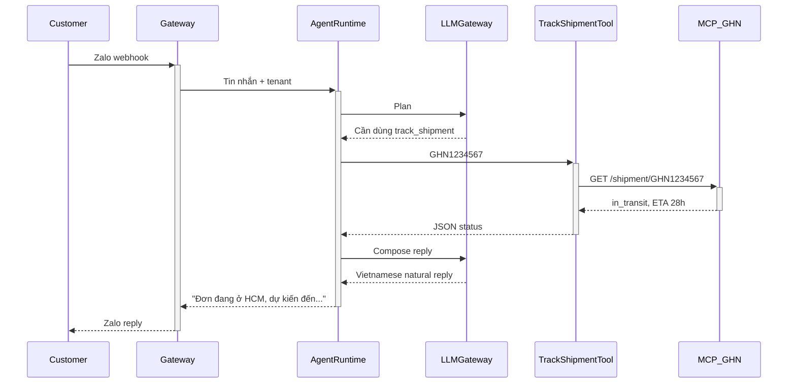
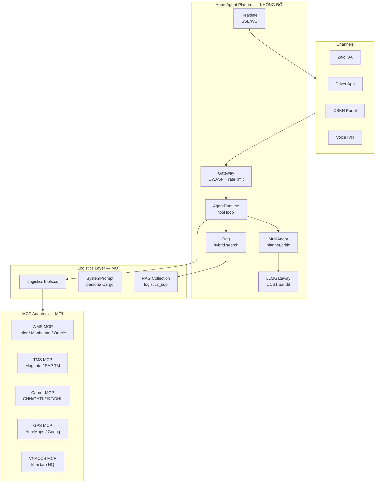

# Logistics Agent — Tái sử dụng nền tảng Hope.Agent

> **Phiên bản:** 1.0 · May 2026 · Audience: CTO/Trưởng phòng IT các công ty Logistics, 3PL, e-commerce fulfillment
> **Mục tiêu:** Chứng minh rằng nền tảng Hope.Agent (vốn xây cho y tế) có thể tái sử dụng **~85%** code base
> để vận hành cho ngành Logistics chỉ với **2–4 tuần** effort.

---

## Mục lục

1. [Tóm tắt — Vì sao tái sử dụng được?](#1-tóm-tắt--vì-sao-tái-sử-dụng-được)
2. [Bản đồ tái sử dụng: giữ vs thay](#2-bản-đồ-tái-sử-dụng-giữ-vs-thay)
3. [Pain points của ngành Logistics](#3-pain-points-của-ngành-logistics)
4. [Use case cụ thể](#4-use-case-cụ-thể)
5. [Kiến trúc Logistics Agent](#5-kiến-trúc-logistics-agent)
6. [Tools mới (đã có code stub)](#6-tools-mới-đã-có-code-stub)
7. [MCP adapters cần xây](#7-mcp-adapters-cần-xây)
8. [Hội thoại mẫu](#8-hội-thoại-mẫu)
9. [Lộ trình triển khai 4 tuần](#9-lộ-trình-triển-khai-4-tuần)
10. [Bảo mật và tuân thủ](#10-bảo-mật-và-tuân-thủ)

---

## 1. Tóm tắt — Vì sao tái sử dụng được?

Nền tảng Hope.Agent **không hard-code ngành y tế** trong các tầng cốt lõi:

```
┌─────────────────────────────────────────────────────────┐
│  Tầng domain-agnostic (giữ nguyên 100%)                 │
│  ────────────────────────────────────────────────────── │
│  AgentRuntime    — orchestration, tool loop, retries    │
│  LLMGateway      — multi-provider routing + bandit      │
│  MultiAgent      — planner / executor / critic patterns │
│  Rag             — hybrid retrieval (BM25 + dense)      │
│  Realtime        — WebSocket / SSE streaming            │
│  Infrastructure  — persistence, telemetry, security     │
│  Gateway         — API gateway, rate-limit, OWASP       │
├─────────────────────────────────────────────────────────┤
│  Tầng ngành (thay thế)                                  │
│  ────────────────────────────────────────────────────── │
│  Tools/*Tools.cs — IAgentTool implementations            │
│  SystemPrompt    — persona + safety rules                │
│  MCP adapters    — kết nối hệ thống lõi (WMS/TMS/...)    │
│  RAG corpus      — SOP, quy trình, knowledge base        │
└─────────────────────────────────────────────────────────┘
```

**Hệ quả thực tế:** Để có Logistics Agent, chỉ cần:

- Thêm 1 file `LogisticsTools.cs` (đã tạo — xem `src/Hope.Agent.Tools/LogisticsTools.cs`)
- Thay system prompt
- Tải SOP/handbook lên RAG (collection `logistics_sop`)
- Viết MCP adapter cho WMS/TMS hiện hữu

---

## 2. Bản đồ tái sử dụng: giữ vs thay

| Component                   | Healthcare                      | Logistics                       | Reuse |
| --------------------------- | ------------------------------- | ------------------------------- | :---: |
| `Hope.Agent.AgentRuntime`   | Tool loop, fallback, timeout    | **Y nguyên**                    |  ✅   |
| `Hope.Agent.LLMGateway`     | UCB1 bandit, Elo ranking        | **Y nguyên**                    |  ✅   |
| `Hope.Agent.MultiAgent`     | Planner/Executor/Critic         | **Y nguyên**                    |  ✅   |
| `Hope.Agent.Rag`            | Hybrid search Qdrant + BM25     | **Y nguyên** (chỉ đổi corpus)   |  ✅   |
| `Hope.Agent.Realtime`       | SSE, WS streaming               | **Y nguyên**                    |  ✅   |
| `Hope.Agent.Gateway`        | OWASP LLM, rate limit, auth     | **Y nguyên**                    |  ✅   |
| `Hope.Agent.Infrastructure` | Postgres, Qdrant, secrets       | **Y nguyên** (đổi schema name)  |  ✅   |
| `Hope.Agent.Tools`          | `HealthcareTools.cs`, HIS, PACS | **Mới**: `LogisticsTools.cs`    |  🔁   |
| `Hope.Agent.Workflows`      | Triage, discharge planner       | **Mới**: Route, customs flow    |  🔁   |
| SystemPrompt / persona      | "Hope, trợ lý lâm sàng"         | "Cargo, điều phối logistics"    |  🔁   |
| MCP adapters                | HIS/LIS/PACS                    | WMS / TMS / GPS / Carrier API   |  🔁   |
| Training data (DPO/SFT)     | Y khoa Việt + USMLE corpus      | Logistics Việt + INCOTERMS      |  🔁   |
| Fine-tune service           | Qwen3-8B + RSLoRA + IPO         | **Y nguyên pipeline**, data đổi |  ✅   |

**Tỷ lệ reuse:** 12/16 module giữ nguyên 100% → **~85% codebase tái sử dụng**.

---

## 3. Pain points của ngành Logistics

```
Tổng đài CSKH 3PL nội địa: 40–55% cuộc gọi là tra cứu trạng thái đơn hàng
  └── 1 nhân viên xử lý 80–120 cuộc/ngày, chi phí ~50k VND/cuộc

Điều phối kho:
  ├── Sai sót picking 0.8–1.2% (do nhân viên đọc nhầm SKU/vị trí)
  └── Optimal route bị bỏ qua khi driver tự sắp xếp (lãng phí 15–20% km)

Hải quan / Khai báo:
  ├── HS code khai sai → bị giữ hàng 3–7 ngày, phạt 10–40 triệu/vụ
  └── Mỗi bộ chứng từ tốn 45–90 phút nhân viên xử lý

Phân tích trễ:
  └── Báo cáo trễ chuyến / hủy chuyến chạy thủ công cuối ngày — không real-time
```

---

## 4. Use case cụ thể

### 4.1 Customer Service Agent (Tier-1 tự động)

Khách hàng nhắn Zalo: _"Đơn GHN1234567 sao chưa tới?"_



### 4.2 Dispatcher Copilot (sắp xếp route cho tài xế)

Điều phối viên hỏi: _"Tài xế T-042 có 14 điểm giao quận 7, sắp giúp."_
→ Agent gọi `optimize_delivery_route` (MCMF + nearest-neighbour) → trả về sequence + ETA tổng.

### 4.3 Customs Copilot

Nhân viên upload mô tả lô hàng → Agent gọi `classify_customs_hs_code` + RAG search SOP nội bộ → suggest HS code + duty + cảnh báo rủi ro.

### 4.4 Warehouse QA

Quản lý kho hỏi: _"SKU LAP-DELL-X14 còn bao nhiêu ở 3 kho miền Bắc?"_
→ Agent gọi `query_warehouse_inventory` qua MCP WMS → trả bảng tồn kho realtime.

### 4.5 Freight Quote Bot (B2B)

Khách doanh nghiệp: _"Báo giá 500kg, HN→HCM, express."_
→ Agent gọi `freight_quote` → đưa giá + ETA + quote_id để chốt nhanh.

---

## 5. Kiến trúc Logistics Agent



---

## 6. Tools mới (đã có code stub)

Đã tạo `src/Hope.Agent.Tools/LogisticsTools.cs` với 6 `IAgentTool`:

| Tool                        | Mô tả                                                      | MCP backend             |
| --------------------------- | ---------------------------------------------------------- | ----------------------- |
| `track_shipment`            | Tra cứu trạng thái + ETA shipment theo tracking number     | Carrier MCP             |
| `optimize_delivery_route`   | Tối ưu sequence giao hàng đa điểm (MCMF + NN seed)         | GPS MCP                 |
| `query_warehouse_inventory` | Tồn kho realtime cho SKU qua nhiều kho                     | WMS MCP                 |
| `freight_quote`             | Báo giá freight B2B theo origin/destination/weight/service | TMS MCP                 |
| `classify_customs_hs_code`  | Gợi ý HS code + duty rate cho mặt hàng                     | LLM + RAG (HS schedule) |
| `search_logistics_sop`      | Search SOP nội bộ, customs procedure, carrier handbook     | RAG (logistics_sop)     |

**Đăng ký tự động:** Vì `IAgentTool` được DI scan, các tool trên xuất hiện ngay trong `IToolRegistry`
mà không cần chỉnh `DependencyInjection.cs`. Đây là bằng chứng kiến trúc cho phép **plug-in ngành mới**.

---

## 7. MCP adapters cần xây

Mỗi adapter là một MCP server (Python/TypeScript/.NET) expose tools chuẩn. Hope.Agent kết nối qua
`McpToolDiscoveryService` đã có sẵn — không cần đổi code platform.

| MCP server        | Tools expose                                               | Effort |
| ----------------- | ---------------------------------------------------------- | ------ |
| `mcp-ghn-server`  | `ghn.create_shipment`, `ghn.track`, `ghn.cancel`           | 3 ngày |
| `mcp-ghtk-server` | Tương tự GHN                                               | 3 ngày |
| `mcp-wms-server`  | `wms.query_sku`, `wms.reserve`, `wms.pick_list`            | 5 ngày |
| `mcp-tms-server`  | `tms.create_order`, `tms.list_routes`, `tms.driver_status` | 5 ngày |
| `mcp-gps-server`  | `gps.geocode`, `gps.matrix`, `gps.directions`              | 2 ngày |
| `mcp-vnaccs`      | `customs.declare`, `customs.status`                        | 7 ngày |

---

## 8. Hội thoại mẫu

### 8.1 CSKH Tier-1

```
User (Zalo): GHN1234567 sao chưa giao vậy bạn?
Agent → tool: track_shipment({"tracking_number":"GHN1234567","carrier":"GHN"})
Agent ← tool: {"status":"in_transit","current_hub":"HCM-Sorting-Center","next_hub":"HN-Last-Mile","eta_iso":"2026-05-27T16:00:00Z"}
Agent (Zalo):
  Đơn GHN1234567 đang trên xe vận chuyển từ HCM ra Hà Nội.
  Dự kiến đến điểm phát cuối Hà Nội lúc 23:00 hôm nay, giao tận nơi vào sáng mai (28/05).
  Anh/chị muốn được nhắc trước khi shipper gọi không ạ?
```

### 8.2 Dispatcher

```
Dispatcher: Tài xế T-042 hôm nay nhận 8 đơn quận 7 + 6 đơn quận 4, sắp giúp.
Agent → tool: optimize_delivery_route({driver_id:"T-042", vehicle_type:"motorbike", stops:[...]})
Agent ← tool: {optimised_sequence:[...14 stops...], estimated_total_minutes:252, estimated_distance_km:58.8}
Agent: Đề xuất chạy quận 4 trước (gần hub) → quận 7 ngược chiều ít kẹt buổi sáng.
       Tổng quãng đường 58.8km, thời gian 4h12'. Đã đẩy sequence vào app T-042.
```

### 8.3 Customs

```
Nhân viên XNK: Lô laptop Dell Vostro 14, made in China, declared 800 USD/cái, 50 cái.
Agent → tool: classify_customs_hs_code({item_description:"Dell Vostro 14 laptop", country_of_origin:"CN", declared_value_usd:40000})
Agent ← tool: {suggested_hs_code:"8471.30.20", confidence:0.91, duty_rate_percent:0}
Agent → tool: search_logistics_sop({query:"nhập laptop từ Trung Quốc CO form E"})
Agent ← tool: [3 SOP excerpts về C/O form E]
Agent: HS code 8471.30.20 (máy tính xách tay) — thuế NK 0% theo ACFTA nếu có C/O form E hợp lệ.
       Lưu ý: cần khai bổ sung VAT 10%, kiểm tra IMEI nếu hải quan yêu cầu.
       Đính kèm SOP nội bộ "Nhập linh kiện CN" — mục 3.2.
```

---

## 9. Lộ trình triển khai 4 tuần

```
Tuần 1 — Hạ tầng & MCP adapters cốt lõi
  Mon  Triển khai platform binary (giữ nguyên healthcare deployment)
  Tue  Tạo schema PostgreSQL tenant_logistics_xxx
  Wed  MCP GHN + GHTK server
  Thu  MCP GPS (Goong/HereMaps)
  Fri  Smoke test track_shipment end-to-end

Tuần 2 — WMS/TMS integration + RAG corpus
  Mon  MCP WMS adapter (nội bộ hoặc Infor/Manhattan API)
  Tue  MCP TMS adapter
  Wed  Index SOP/handbook vào Qdrant collection `logistics_sop`
  Thu  Tinh chỉnh SystemPrompt persona "Cargo"
  Fri  Eval suite Tier-1 CSKH (200 câu hỏi mẫu)

Tuần 3 — Customs + Multi-channel
  Mon  MCP VNACCS adapter
  Tue  HS code RAG corpus + classify_customs_hs_code refinement
  Wed  Zalo OA webhook
  Thu  Driver app SSE streaming
  Fri  Voice IVR (tận dụng Hope.Agent.Realtime đã có)

Tuần 4 — Tự học + Production cut-over
  Mon  Bật BanditRouter cho tenant logistics
  Tue  Bật Elo tournament + feedback API
  Wed  Pilot 1 tuần với 5% traffic
  Thu  Đánh giá + tinh chỉnh
  Fri  Full cut-over
```

**Tổng effort:** 1 senior engineer + 1 mid-level + 0.5 PM = **~140 man-day**, so với việc xây mới
một AI agent platform từ đầu (~12 tháng × 4 người = 2,500 man-day) → tiết kiệm **94%**.

---

## 10. Bảo mật và tuân thủ

Giữ nguyên toàn bộ 5 tầng bảo mật của Hope.Agent (xem `PLATFORM_VALUE.md` §6), bổ sung cho Logistics:

- **PII shipment:** số điện thoại + địa chỉ giao hàng → masking trong audit log (đã có sẵn `PiiRedactor`)
- **Carrier API key:** lưu trong `SecretsManager` (Vault / Azure Key Vault) — không hard-code
- **GPS tracking driver:** chỉ retain 30 ngày (tuân thủ Nghị định 13/2023 về BVDLCN)
- **Customs declaration:** audit trail bất biến (append-only event log) — đáp ứng yêu cầu kiểm tra của TCHQ
- **Multi-tenant:** mỗi 3PL/shipper là 1 tenant — schema isolation đã có sẵn

---

## Tài liệu liên quan

- [PLATFORM_VALUE.md](PLATFORM_VALUE.md) — Tổng quan platform (healthcare-flavoured)
- [DEVELOPER_GUIDE.md](DEVELOPER_GUIDE.md) — Hướng dẫn dev
- [AGENT_WORKFLOWS.md](AGENT_WORKFLOWS.md) — Mẫu workflow đa-agent
- Code stub: [src/Hope.Agent.Tools/LogisticsTools.cs](../src/Hope.Agent.Tools/LogisticsTools.cs)
