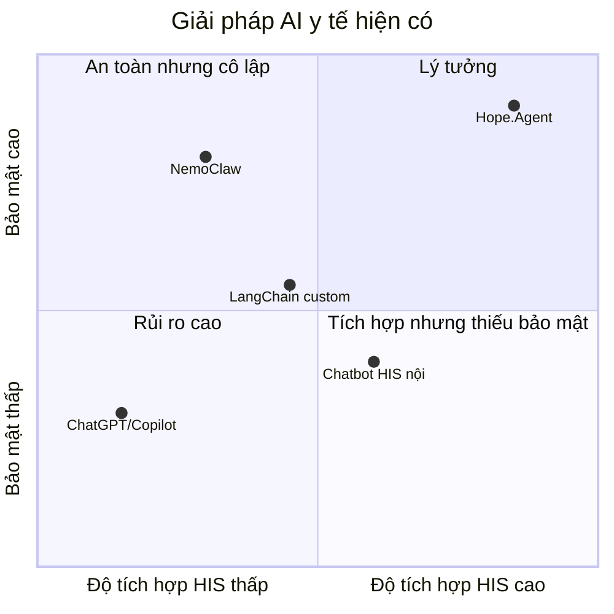
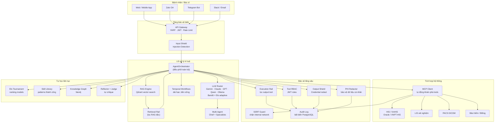
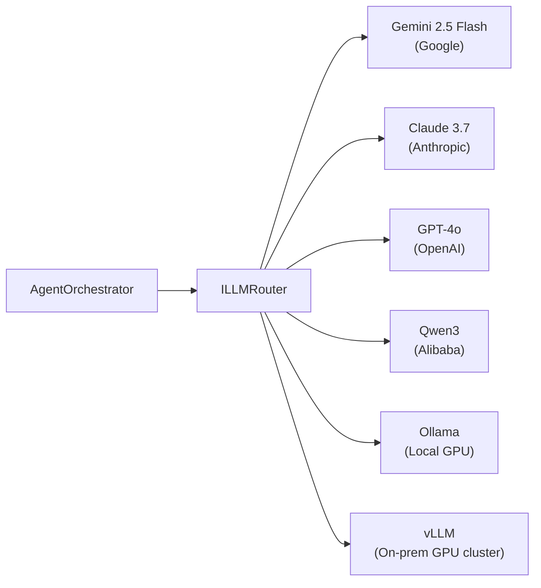
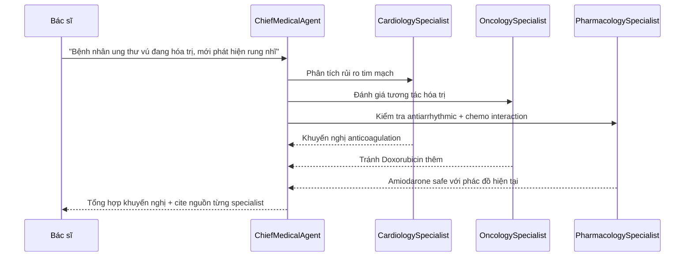
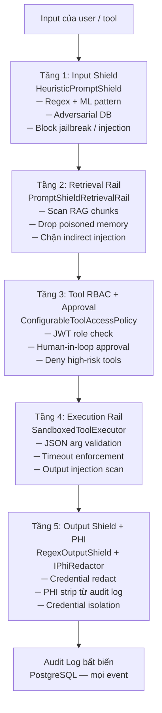
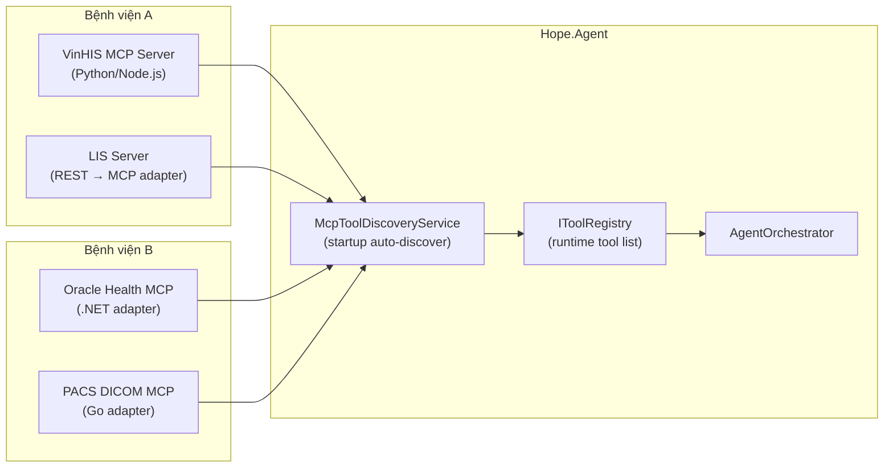
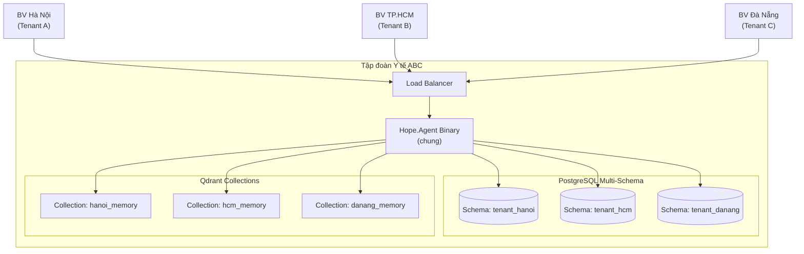
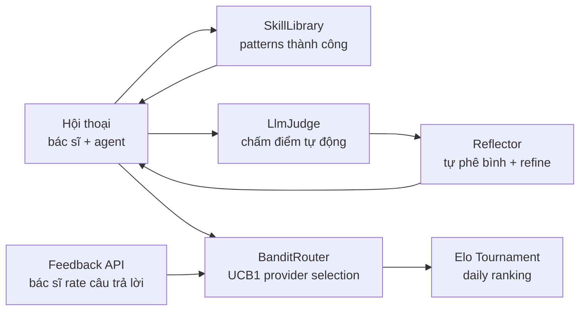
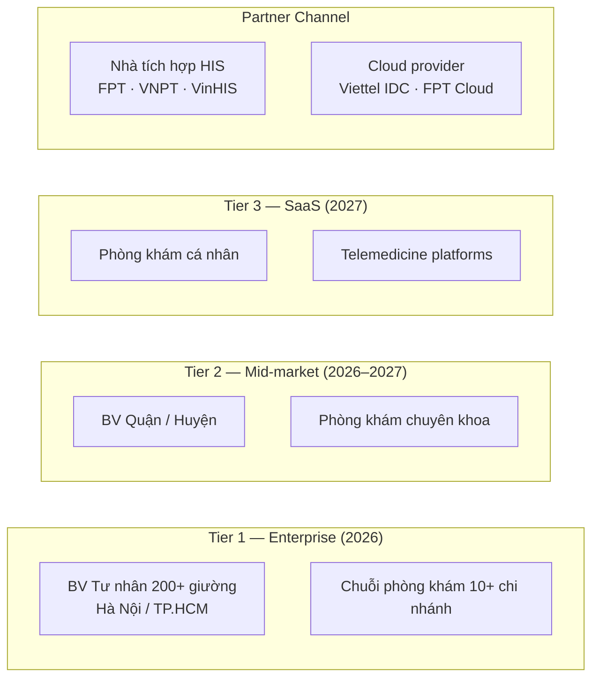

# Hope.Agent — Platform Value & Strategic Overview

> **Phiên bản tài liệu:** 1.0 · May 2026 · Dành cho: CTO, CIO, Giám đốc Bệnh viện, IT Decision Makers

---

## Mục lục

1. [Tóm tắt điều hành](#1-tóm-tắt-điều-hành)
2. [Vấn đề bệnh viện đang gặp phải](#2-vấn-đề-bệnh-viện-đang-gặp-phải)
3. [Giải pháp — Kiến trúc tổng quan](#3-giải-pháp--kiến-trúc-tổng-quan)
4. [Giá trị cốt lõi cho khách hàng](#4-giá-trị-cốt-lõi-cho-khách-hàng)
5. [Ưu việt kỹ thuật](#5-ưu-việt-kỹ-thuật)
6. [Bảo mật phân tầng — Enterprise-grade](#6-bảo-mật-phân-tầng--enterprise-grade)
7. [Khả năng mở rộng và tích hợp](#7-khả-năng-mở-rộng-và-tích-hợp)
8. [Tự học liên tục — hệ thống ngày càng tốt hơn](#8-tự-học-liên-tục--hệ-thống-ngày-càng-tốt-hơn)
9. [So sánh với giải pháp thay thế](#9-so-sánh-với-giải-pháp-thay-thế)
10. [Tình huống triển khai thực tế](#10-tình-huống-triển-khai-thực-tế)
11. [Yêu cầu hạ tầng](#11-yêu-cầu-hạ-tầng)
12. [Lộ trình thương mại hóa](#12-lộ-trình-thương-mại-hóa)
13. [Câu hỏi thường gặp (FAQ)](#13-câu-hỏi-thường-gặp-faq)

---

## 1. Tóm tắt điều hành

**Hope.Agent** là nền tảng AI Agent y tế cấp enterprise được xây dựng trên **.NET 9** với kiến trúc
Clean Architecture 16-phase, tích hợp đầy đủ các tiêu chuẩn bảo mật OWASP LLM Top 10 và mô hình
bảo vệ phân tầng lấy cảm hứng từ NVIDIA NemoClaw.

**Điểm khác biệt then chốt:**

|                           | Hope.Agent                                           |
| ------------------------- | ---------------------------------------------------- |
| **Dữ liệu bệnh nhân**     | Không bao giờ rời server của bệnh viện               |
| **Tự học**                | Elo ranking + bandit router tự tối ưu mỗi ngày       |
| **Tích hợp HIS/LIS/PACS** | Model Context Protocol — plug & play                 |
| **Đa kênh**               | Zalo · Telegram · Slack · Email · Web/Mobile         |
| **Bảo mật**               | 5 tầng kiểm soát, audit trail bất biến               |
| **Mô hình LLM**           | Không lock-in: Gemini · Claude · GPT · Qwen · Ollama |

---

## 2. Vấn đề bệnh viện đang gặp phải

### 2.1 Gánh nặng vận hành thủ công

```
Điều dưỡng viên: 35–40% thời gian dành cho điều phối hành chính
  ├── Gọi điện xếp lịch hẹn
  ├── Nhập thủ công vào HIS
  ├── Nhắc thuốc / tái khám qua điện thoại
  └── In phiếu chỉ định xét nghiệm / PACS

Bác sĩ: 45 phút/ngày gõ tóm tắt bệnh án theo chuẩn
Kế toán: Kiểm tra bảo hiểm thủ công từng ca
IT: Không có cách audit AI actions khi xảy ra sự cố
```

### 2.2 Rủi ro khi dùng AI thương mại (ChatGPT, Copilot)

- Dữ liệu bệnh nhân (PHI/PII) được gửi ra ngoài → vi phạm **Nghị định 13/2023/NĐ-CP** về BVDLCN
- Không có audit trail → không đáp ứng yêu cầu kiểm định **JCI / ISO 15189**
- Không tích hợp được với HIS nội địa (VinHIS, VNPT-HIS, Oracle Health)
- Không có cơ chế rollback khi AI trả lời sai lâm sàng

### 2.3 Khoảng trống thị trường



Hope.Agent lấp đầy góc phần tư lý tưởng: **tích hợp sâu HIS** đồng thời **bảo mật cấp enterprise**.

---

## 3. Giải pháp — Kiến trúc tổng quan



---

## 4. Giá trị cốt lõi cho khách hàng

### 4.1 Tự động hoá vận hành — tiết kiệm thời gian đo được

| Quy trình           | Thủ công hiện tại               | Với Hope.Agent                          | Tiết kiệm             |
| ------------------- | ------------------------------- | --------------------------------------- | --------------------- |
| Xếp lịch hẹn        | 8–12 phút/ca (điện thoại + HIS) | <30 giây (agent tự tra lịch + đặt)      | **~95%**              |
| Tóm tắt bệnh án     | 30–45 phút/bác sĩ/ngày          | <30 giây/ca (AI + ICD-10)               | **~93%**              |
| Kiểm tra bảo hiểm   | 5–15 phút/ca (hotline)          | 1 lượt chat → tool gọi HIS API          | **~90%**              |
| Nhắc tái khám/thuốc | Thủ công danh sách → gọi điện   | Scheduled agent → Zalo/Telegram tự động | **~100%**             |
| Viết báo cáo audit  | Thủ công cuối tháng             | Tự động mỗi action → export PDF         | **~100%**             |
| Phân loại triage    | Cảm tính điều dưỡng             | Vitals stream (Kafka) + AI scoring      | Giảm sai sót lâm sàng |

**ROI ước tính cho bệnh viện 300 giường:**

- Tiết kiệm 2–3 FTE điều dưỡng hành chính/tháng
- Giảm 40% thời gian chờ bệnh nhân tại quầy
- Giảm 30% lỗi nhập liệu HIS

### 4.2 Hỗ trợ lâm sàng an toàn — không hallucinate

Không giống ChatGPT trả lời bằng kiến thức huấn luyện, Hope.Agent:

```
Bác sĩ hỏi: "Bệnh nhân Warfarin + Metronidazole — tương tác gì?"
                              │
              ┌───────────────▼───────────────┐
              │  1. Retrieve từ clinical RAG  │  ← phác đồ BV + guideline
              │  2. Gọi tool LIS xét nghiệm  │  ← INR thực tế của bệnh nhân
              │  3. LLM tổng hợp + cite nguồn │
              │  4. Reflector tự chấm điểm   │  ← score < 0.6 → refine
              │  5. Trả lời + ghi audit       │  ← bác sĩ nào, lúc nào, nguồn nào
              └───────────────────────────────┘
```

**Kết quả:** Câu trả lời luôn cite rõ: tool nào được gọi, dữ liệu từ đâu, thời điểm nào.
Khi xảy ra sự cố: audit log có đủ thông tin để điều tra.

### 4.3 Đa kênh — gặp bệnh nhân tại nơi họ đang ở

```
Bệnh nhân cao tuổi   → Zalo OA (quen thuộc nhất với người Việt)
Bác sĩ trực đêm      → Telegram Bot (nhanh, mobile-first)
Admin bệnh viện      → Web Dashboard + Slack
Hệ thống HIS         → Webhook trigger tự động
Tất cả               → cùng một AgentOrchestrator, cùng một context
```

Không có kênh nào "second-class" — bác sĩ hỏi qua Telegram và hệ thống xử lý
y hệt như hỏi qua Web API.

### 4.4 Tuân thủ pháp lý — sẵn sàng cho JCI / ISO / HIPAA

| Yêu cầu                               | Cơ chế trong Hope.Agent                                       |
| ------------------------------------- | ------------------------------------------------------------- |
| Không lộ dữ liệu cá nhân ra ngoài     | `IPhiRedactor` xóa PHI khỏi mọi log trước khi ghi             |
| Audit trail cho mọi AI action         | `AuditEvent` bất biến trong PostgreSQL với timestamp + userId |
| Phân quyền truy cập tool theo vai trò | `IToolAccessPolicy` — RBAC theo JWT claim                     |
| Không gửi dữ liệu lên Cloud AI        | Self-hosted + Ollama local model option                       |
| Phát hiện thử nghiệm jailbreak        | `HeuristicPromptShield` + adversarial pattern store           |
| Không để credential rò rỉ qua LLM     | `RegexOutputShield` scan mọi output trước khi trả về          |

---

## 5. Ưu việt kỹ thuật

### 5.1 Không bị khóa nhà cung cấp LLM (No Vendor Lock-in)



**Bandit Adaptive Router (UCB1):**

- Theo dõi performance của từng provider theo từng `intent` (cardiology / oncology / emergency)
- Tự điều chỉnh traffic weight dựa trên reward signal từ bác sĩ
- Khi một provider tăng giá hoặc giảm chất lượng → tự động route sang provider khác
- **Không cần thay đổi code** khi swap model

**Elo Tournament (Phase 14):**

- Mỗi ngày sau eval, so sánh 2 cấu hình gần nhất theo K=32 Elo
- Leaderboard `GET /v1/learning/eval/leaderboard` → operator thấy ngay model nào đang tốt nhất

### 5.2 Bộ nhớ dài hạn — agent nhớ bệnh nhân

```
Lần 1: "Tôi bị cao huyết áp, đang dùng Amlodipine 5mg"
  → Lưu vào Qdrant (episodic memory)

Lần 2 (3 tháng sau): "Hôm nay tôi đau đầu"
  → Agent retrieve: [memory] "bệnh nhân cao HA, Amlodipine 5mg"
  → Hỏi: "Huyết áp gần đây của bạn là bao nhiêu? Có điều chỉnh thuốc không?"
```

Ba loại memory:

- **Episodic** — lịch sử hội thoại
- **Semantic** — kiến thức lâm sàng từ tài liệu
- **Skill** — patterns câu trả lời đã được bác sĩ confirm tốt

### 5.3 Knowledge Graph lâm sàng (Neo4j)

Sau mỗi cuộc hội thoại, hệ thống tự extract entities và relations:

```
(Bệnh nhân A) --[có chẩn đoán]--> (Tăng huyết áp độ 2)
(Tăng huyết áp độ 2) --[điều trị bằng]--> (Amlodipine)
(Amlodipine) --[tương tác với]--> (Clarithromycin)
(Clarithromycin) --[chống chỉ định cho]--> (Bệnh nhân có QTc kéo dài)
```

Khi bác sĩ kê Clarithromycin → agent truy vấn KG → cảnh báo tương tác **trước khi kê đơn**.

### 5.4 Multi-Agent Orchestration cho ca phức tạp



Parallel execution — 3 specialist chạy đồng thời → tổng hợp trong ~3–5 giây.

### 5.5 Durable Workflows — quy trình không bao giờ mất

Temporal.io đảm bảo:

- Nếu server restart giữa chừng → workflow tiếp tục từ checkpoint
- Quy trình nhập viện 5 bước có thể kéo dài nhiều ngày → không mất trạng thái
- Retry tự động khi HIS API timeout

---

## 6. Bảo mật phân tầng — Enterprise-grade

### 6.1 Mô hình 5 tầng bảo vệ

Mỗi tầng chặn một vector tấn công độc lập:



### 6.2 Bảo vệ chống SSRF (NemoClaw-inspired)

Khi cấu hình MCP server mới (HIS tích hợp), `HeuristicSsrfGuard` tự động chặn:

| Blocked                           | Lý do                                       |
| --------------------------------- | ------------------------------------------- |
| `http://10.0.0.1/api`             | Private IP — có thể là internal database    |
| `http://169.254.169.254/metadata` | AWS/Azure cloud metadata — credential theft |
| `http://localhost:5432`           | PostgreSQL nội bộ                           |
| `ftp://...` hoặc `file://...`     | Scheme không được phép                      |

Không thể cấu hình MCP server trỏ vào internal network dù vô tình hay cố ý.

### 6.3 OWASP LLM Top 10 Coverage

| OWASP LLM | Tên                       | Cơ chế trong Hope.Agent                        |
| --------- | ------------------------- | ---------------------------------------------- |
| LLM01     | Prompt Injection          | `HeuristicPromptShield` + `RetrievalRail`      |
| LLM04     | DoS / Resource Exhaustion | `SandboxedToolExecutor` timeout                |
| LLM06     | Sensitive Info Disclosure | `RegexOutputShield` + `IPhiRedactor`           |
| LLM07     | Insecure Plugin Design    | JSON arg validation trước invoke               |
| LLM08     | Excessive Agency          | `IToolAccessPolicy` RBAC + `IToolApprovalGate` |
| LLM09     | Misinformation            | `IReflector` tự critique + `IJudge` scoring    |

---

## 7. Khả năng mở rộng và tích hợp

### 7.1 Model Context Protocol — tích hợp không cần rewrite

MCP (chuẩn mở Anthropic + NVIDIA) biến bất kỳ hệ thống nào thành "tool":



**Thêm HIS mới:** Chỉ thêm 5 dòng vào `appsettings.json`:

```json
"Mcp": {
  "Servers": [
    { "Name": "vinHIS", "Transport": "http", "Endpoint": "https://his.hospital.local/mcp" }
  ]
}
```

Agent tự động khám phá tất cả tools mà VinHIS expose → đăng ký → sẵn sàng sử dụng.

### 7.2 Thích nghi đa khoa trong cùng bệnh viện

```
Bệnh viện đa khoa 500 giường
  ├── Khoa Tim mạch     → ClinicalContext: "cardiology.md"
  │     "Ưu tiên phân tích ECG, guideline ACC/AHA 2025..."
  ├── Khoa Ung bướu     → ClinicalContext: "oncology.md"
  │     "Phân tích phác đồ NCCN, tương tác hóa trị..."
  ├── Khoa Nhi          → ClinicalContext: "pediatrics.md"
  │     "Liều theo cân nặng, milestone phát triển..."
  └── Cấp cứu           → ClinicalContext: "emergency.md"
        "Ưu tiên tốc độ, ACLS/ATLS protocols..."

→ Cùng một Hope.Agent instance phục vụ toàn bệnh viện
→ Context inject tự động theo AgentProfile trong request
```

### 7.3 Multi-tenant — chuỗi bệnh viện



Data của từng bệnh viện hoàn toàn isolated theo schema + collection. Cùng binary, cùng hạ tầng.

### 7.4 Thích nghi với ngành khác

Vì core architecture dựa trên abstractions, không hardcode y tế:

| Ngành         | Thay `SystemPrompt` + MCP Tools            | Giữ nguyên                        |
| ------------- | ------------------------------------------ | --------------------------------- |
| **Ngân hàng** | Loan assessment context + Core Banking MCP | Runtime, Router, Memory, Security |
| **Logistics** | Shipment priority context + GPS/WMS MCP    | Runtime, Router, Memory, Security |
| **Pháp lý**   | Legal corpus RAG + Case Management MCP     | Runtime, Router, Memory, Security |
| **Giáo dục**  | Student profile + LMS/Plagiarism MCP       | Runtime, Router, Memory, Security |
| **Bảo hiểm**  | Claims processing + Policy MCP             | Runtime, Router, Memory, Security |

**Effort ước tính để port sang ngành mới:** 2–4 tuần (context files + MCP adapters).

> **Case study cụ thể — Logistics:** Xem [LOGISTICS_PLATFORM_REUSE.md](LOGISTICS_PLATFORM_REUSE.md)
> để thấy chi tiết bản đồ tái sử dụng 85% codebase, 6 tool stub đã sẵn sàng
> ([`LogisticsTools.cs`](../src/Hope.Agent.Tools/LogisticsTools.cs)), MCP adapters cần xây,
> hội thoại mẫu và lộ trình triển khai 4 tuần.

---

## 8. Tự học liên tục — hệ thống ngày càng tốt hơn

### 8.1 Vòng lặp học tự động



### 8.2 Elo Ranking — tự biết model nào đang tốt nhất

Mỗi ngày lúc 2:00 sáng:

1. Chạy eval suite trên tập câu hỏi chuẩn lâm sàng
2. So sánh `EvalRun` mới nhất với run trước → Elo tournament
3. Provider/config có Elo cao hơn → được ưu tiên traffic hơn
4. Operator có thể xem `GET /v1/learning/eval/leaderboard` để biết ngay

**Ví dụ:** Tháng 1 dùng Gemini 2.0 Flash → tháng 3 Gemini 2.5 Flash ra → Elo tự nhận ra 2.5 Flash tốt hơn → tăng traffic.

### 8.3 Shadow A/B Testing

```
10% traffic → Challenger model (cấu hình mới)
90% traffic → Champion model (cấu hình hiện tại)

Sau 1000 request:
  - Nếu Challenger score > Champion score → auto-promote
  - Nếu không → rollback, không ảnh hưởng user
```

Không cần downtime, không cần thông báo bệnh viện.

---

## 9. So sánh với giải pháp thay thế

### 9.1 Bảng so sánh tổng quan

| Tiêu chí                 |       Hope.Agent        | ChatGPT / Copilot | LangChain tự build | NVIDIA NemoClaw  | Chatbot HIS nội |
| ------------------------ | :---------------------: | :---------------: | :----------------: | :--------------: | :-------------: |
| Dữ liệu không rời server |           ✅            |        ❌         |         ⚠️         |        ✅        |       ✅        |
| PHI/HIPAA compliance     |       ✅ Built-in       |        ❌         |     ⚠️ Manual      |     ❌ Alpha     |       ⚠️        |
| Multi-LLM (no lock-in)   |     ✅ 6 providers      |  ❌ OpenAI only   |         ✅         | ⚠️ NVIDIA focus  |     ❌ None     |
| Tích hợp HIS/LIS/PACS    |      ✅ MCP native      |        ❌         |   ⚠️ Custom code   |        ⚠️        |       ✅        |
| Bộ nhớ dài hạn           |        ✅ Qdrant        |  ⚠️ Thread only   |         ⚠️         |        ❌        |       ❌        |
| Knowledge Graph          |        ✅ Neo4j         |        ❌         |         ⚠️         |        ❌        |       ❌        |
| Tự học liên tục          |     ✅ Elo + Bandit     |        ❌         |         ❌         |        ❌        |       ❌        |
| Multi-channel (Zalo)     |           ✅            |        ❌         |         ❌         |   ⚠️ Telegram    |       ❌        |
| Durable Workflows        |       ✅ Temporal       |        ❌         |         ❌         |        ❌        |       ⚠️        |
| OWASP LLM coverage       | ✅ LLM01/04/06/07/08/09 |        ⚠️         |         ⚠️         |        ⚠️        |       ❌        |
| Audit trail bất biến     |           ✅            |        ❌         |         ❌         |        ❌        |       ⚠️        |
| Production-ready         |      ✅ 16 phases       |        ✅         |   ⚠️ Effort lớn    |     ❌ Alpha     |       ✅        |
| On-prem deployment       |           ✅            |        ❌         |         ✅         |        ✅        |       ✅        |
| Chi phí LLM/tháng        | Tối ưu (bandit routing) |      Cố định      |     Tùy config     | Cao (NVIDIA GPU) | ❌ Không có AI  |

### 9.2 Tại sao không tự build bằng LangChain?

| Vấn đề                | LangChain DIY         | Hope.Agent                   |
| --------------------- | --------------------- | ---------------------------- |
| Security              | Phải implement từ đầu | 5 tầng built-in              |
| Healthcare compliance | Không có              | PHI redactor, audit trail    |
| Maintainability       | Python scripts        | .NET 9 Clean Architecture    |
| Observability         | Setup riêng           | OTel + Jaeger + Grafana      |
| Learning loop         | Không có              | Elo + Bandit + Skill library |
| Time to market        | 6–12 tháng            | **2–4 tuần deployment**      |

### 9.3 Tại sao không dùng ChatGPT Enterprise?

- **Dữ liệu bệnh nhân:** OpenAI có điều khoản không train trên Enterprise data, nhưng dữ liệu vẫn đi qua server OpenAI → không phù hợp Nghị định 13/2023/NĐ-CP
- **Tích hợp HIS:** Phải code custom từng integration — không có chuẩn chung
- **Audit trail:** GPT không cung cấp audit log y tế
- **Tự học:** Không có mechanism tự cải thiện dựa trên feedback bác sĩ

---

## 10. Tình huống triển khai thực tế

### 10.1 Bệnh viện đa khoa 300 giường — ngày đầu go-live

**Sáng 7:00:**

```
Điều dưỡng Nguyễn Thị A (Zalo): "Bệnh nhân Trần Văn B cần xếp lịch khám Tim mạch"
  → Agent truy vấn HIS tool: slot trống bác sĩ tim mạch
  → Propose: "Thứ 3, 14:30, BS. Phạm Minh C"
  → Điều dưỡng confirm → HIS booking tool ghi tự động
  → Zalo notification gửi cho bệnh nhân
Thời gian: 45 giây (so với 8 phút thủ công)
```

**Sáng 9:30:**

```
BS. Lê Văn D (Web Dashboard): "Tóm tắt bệnh án Nguyễn Thị E — chuẩn bị phẫu thuật"
  → Agent: retrieve lịch sử khám (HIS tool)
  → Agent: retrieve xét nghiệm gần nhất (LIS tool)
  → Agent: retrieve hình ảnh (PACS tool — mô tả radiology)
  → Reflector: self-critique tóm tắt → score 0.82 → pass
  → Output: Tóm tắt ICD-10, highlight contraindications
  → AuditEvent ghi: BS. Lê Văn D, 09:32:15, tools used, data sources
Thời gian: 28 giây (so với 35 phút thủ công)
```

**Đêm 2:00 (tự động):**

```
EvaluationHarnessHostedService:
  → Chạy eval suite 50 câu hỏi lâm sàng chuẩn
  → So sánh với run hôm qua → Elo tournament
  → Kết quả: hôm nay 87.3% accuracy (hôm qua 86.1%) → Elo tăng
  → Log: "EloTournament: Winner=run_today (1024.6 Elo), Loser=run_yesterday (975.4)"
Không có bác sĩ nào bị ảnh hưởng.
```

### 10.2 Kịch bản ca phức tạp — Multi-Agent

```
BS. Tim mạch: "Bệnh nhân 65T, rung nhĩ mới phát hiện, đang hóa trị Paclitaxel"

ChiefMedicalAgent phân tích độ phức tạp → kích hoạt 3 specialists đồng thời:

┌─ CardiologySpecialist (0.8s) ──────────────────────────┐
│  CHA₂DS₂-VASc = 4 → anticoagulation indicated         │
│  QTc = 452ms (từ ECG HIS) → Amiodarone cần monitor   │
└────────────────────────────────────────────────────────┘

┌─ OncologySpecialist (1.2s) ────────────────────────────┐
│  Paclitaxel + Amiodarone: CYP3A4 interaction           │
│  Khuyến nghị dose adjustment 20% + INR monitoring      │
└────────────────────────────────────────────────────────┘

┌─ PharmacologySpecialist (0.9s) ────────────────────────┐
│  Alternative: Edoxaban an toàn hơn với QTc hiện tại   │
│  Tương tác với Paclitaxel: minimal                     │
└────────────────────────────────────────────────────────┘

ChiefMedicalAgent tổng hợp (1.1s):
→ "Khuyến nghị Edoxaban 60mg/ngày thay Warfarin.
   Lý do: 1) QTc 452ms → tránh Amiodarone; 2) Paclitaxel interaction thấp hơn;
   3) Không cần INR monitoring thường xuyên trong HT.
   Nguồn: CardiologySpecialist (ACC/AHA 2025), OncologySpecialist (NCCN 2025)"

Tổng thời gian: 3.9 giây
```

---

## 11. Yêu cầu hạ tầng

### 11.1 Cấu hình tối thiểu (bệnh viện 100–300 giường)

| Component          | Spec                       | Ghi chú                             |
| ------------------ | -------------------------- | ----------------------------------- |
| **App Server**     | 8 core CPU, 16GB RAM       | Hope.Agent API + Runtime            |
| **PostgreSQL**     | 4 core, 8GB RAM, 500GB SSD | Conversations, Audit, Learning data |
| **Qdrant**         | 4 core, 16GB RAM           | Vector embeddings (memory)          |
| **Redis**          | 2 core, 4GB RAM            | Cache, real-time state              |
| **Neo4j**          | 4 core, 8GB RAM            | Knowledge graph (optional)          |
| **Kafka**          | 3 nodes × (4 core, 8GB)    | Event bus (optional cho scale)      |
| **GPU (optional)** | NVIDIA RTX 4090 hoặc A100  | Chỉ cần nếu dùng Ollama local model |

**Total on-prem:** ~8 máy chủ hoặc 1 cụm VMware/Proxmox.

### 11.2 Triển khai Docker Swarm / Kubernetes

```yaml
# docker-compose.prod.yml (tóm tắt)
services:
  hope-api:
    image: hope-agent:latest
    deploy:
      replicas: 3
      resources: { limits: { cpus: "4", memory: 8G } }
    environment:
      - ConnectionStrings__Postgres=...
      - Gemini__ApiKey=${GEMINI_KEY} # từ Docker secret

  postgres: { image: postgres:16 }
  qdrant: { image: qdrant/qdrant:latest }
  redis: { image: redis:7-alpine }
  neo4j: { image: neo4j:5 }
  kafka: { image: confluentinc/cp-kafka:7 }
```

JWT cross-replica: `JwtKeyService` detect existing RSA key tại `/app/keys/jwt/jwt-private.pem`
→ dùng chung 1 key cho tất cả replicas → không cần session affinity.

### 11.3 Observability stack

```
Hope.Agent → OTel Collector → Jaeger (traces) + Prometheus (metrics)
                                      ↓
                             Grafana Dashboard
                               - Agent run rate
                               - Tool error rate
                               - LLM latency p50/p95/p99
                               - Prompt shield blocks
                               - Elo ranking over time
```

---

## 12. Lộ trình thương mại hóa

### 12.1 Phân khúc khách hàng



### 12.2 Lộ trình sản phẩm

| Giai đoạn                 | Timeline | Deliverable                                    | Target                     |
| ------------------------- | -------- | ---------------------------------------------- | -------------------------- |
| **MVP On-prem**           | Q2 2026  | Deployment tại 1 BV pilot                      | BV tư nhân 200–500 giường  |
| **Multi-tenant SaaS**     | Q3 2026  | Schema isolation, billing per-tenant           | Chuỗi BV, phòng khám       |
| **MCP Marketplace**       | Q4 2026  | HIS adapter library (VinHIS, VNPT-HIS, Oracle) | Nhà tích hợp               |
| **Deep Research API**     | Q4 2026  | `POST /v1/research` SaaS API                   | Viện nghiên cứu, đại học y |
| **Voice + Bedside**       | Q1 2027  | STT/TTS tích hợp thiết bị bedside tablet       | BV lớn, ICU                |
| **Regulatory Submission** | Q2 2027  | ISO 13485 / CE marking cho AI medical device   | Export thị trường SEA      |

### 12.3 Mô hình doanh thu

| Model                       | Mô tả                             | Phù hợp với                                      |
| --------------------------- | --------------------------------- | ------------------------------------------------ |
| **On-prem License**         | Phí một lần + maintenance 20%/năm | BV tư nhân lớn, yêu cầu data isolation tuyệt đối |
| **SaaS Subscription**       | Per-seat hoặc per-API-call        | Chuỗi phòng khám, mid-market                     |
| **Revenue Share**           | % tiết kiệm chi phí vận hành      | BV công lập, PPP projects                        |
| **MCP Adapter Marketplace** | Phí tích hợp + support            | IT integrators, HIS vendors                      |

---

## 13. Câu hỏi thường gặp (FAQ)

**Q: Nếu Gemini/OpenAI ngừng dịch vụ thì sao?**

> A: `ILLMRouter` abstraction cho phép switch provider trong <5 phút bằng config change. Không cần rewrite code. Có thể fallback sang Ollama local model nếu cần.

**Q: Dữ liệu bệnh nhân có bị gửi lên LLM provider không?**

> A: `IPhiRedactor` strip PHI trước khi gửi đến LLM. Có thể cấu hình Ollama local để **không có data nào rời server**.

**Q: Nếu agent trả lời sai lâm sàng thì xử lý như thế nào?**

> A: Mọi response đều có `AuditEvent` với đầy đủ: user, timestamp, tool calls, LLM provider, raw input/output. Operator có thể trace lại 100% nguyên nhân và add adversarial pattern để ngăn tái diễn.

**Q: Tích hợp với HIS mất bao lâu?**

> A: Nếu HIS có REST API: viết MCP adapter ~1–3 ngày. Nếu HIS chỉ có HL7 v2: cần HL7 parser layer ~1–2 tuần.

**Q: Hệ thống có thể thay thế bác sĩ không?**

> A: Không và không thiết kế để làm vậy. Hope.Agent là **clinical decision support** — hỗ trợ bác sĩ ra quyết định nhanh hơn, với thông tin đầy đủ hơn. Quyết định cuối cùng luôn thuộc về bác sĩ. Tool RBAC và approval gate đảm bảo high-risk actions cần human confirmation.

**Q: Chi phí LLM/tháng ước tính là bao nhiêu?**

> A: BanditAdaptiveRouter tự tối ưu: route câu đơn giản sang model rẻ (Qwen/Flash), câu phức tạp sang model mạnh. Ước tính BV 300 giường: **$200–800/tháng** tùy volume (so với $3000+/tháng nếu dùng GPT-4o cho tất cả).

---

_Tài liệu này dành cho mục đích đánh giá và ra quyết định triển khai._
_Liên hệ team kỹ thuật để được demo trực tiếp và PoC tại môi trường bệnh viện._
