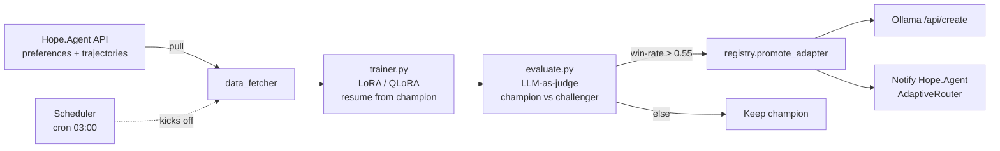

# Hope.Agent — Production Fine-Tuning Service (Phase 14b)

A **continuous-learning** LoRA fine-tuning pipeline for Hope.Agent's Vietnamese
clinical model. Doctors rate responses → preferences accumulate → the service
auto-trains a challenger → evaluates against the current champion → **only
promotes if the challenger wins**. The model gets smarter every day.

## Architecture



## Why this is "production enterprise"

| Capability          | Implementation                                                     |
| ------------------- | ------------------------------------------------------------------ |
| Persistent state    | SQLite (`registry.db`) — jobs, runs, adapters, evaluations         |
| Continuous learning | Each cycle resumes from current champion adapter                   |
| Safe promotion      | Champion-vs-challenger eval, LLM-as-judge, win-rate gate           |
| Reproducibility     | Dataset SHA-256 hash + config hash + seed pinning                  |
| Safety              | NaN/Inf guard, time-budget guard, gradient checkpointing           |
| Observability       | Structured JSON logs, Prometheus `/metrics`                        |
| Scheduling          | APScheduler cron loop (`HOPE_FT_AUTO_TRAIN_CRON`)                  |
| API auth            | `X-Api-Key` header on every endpoint                               |
| Concurrency         | `asyncio.Semaphore` (`HOPE_FT_MAX_CONCURRENT_JOBS`)                |
| Deployment          | Dockerfile (CUDA 12.4) + `docker-compose.yml` with GPU reservation |

## Files

| File                                                                | Purpose                                    |
| ------------------------------------------------------------------- | ------------------------------------------ |
| [config.py](config.py)                                              | Pydantic settings (env-driven)             |
| [logging_setup.py](logging_setup.py)                                | Structured JSON logging                    |
| [registry.py](registry.py)                                          | SQLite job / adapter / evaluation registry |
| [data_fetcher.py](data_fetcher.py)                                  | Pulls SFT/DPO data, computes dataset hash  |
| [callbacks.py](callbacks.py)                                        | NaN guard, time-budget guard, metric sink  |
| [trainer.py](trainer.py)                                            | In-process LoRA/QLoRA SFT + DPO trainer    |
| [evaluate.py](evaluate.py)                                          | Champion-vs-challenger eval with LLM judge |
| [ollama_client.py](ollama_client.py)                                | Adapter registration with Ollama           |
| [orchestrator.py](orchestrator.py)                                  | Closed-loop: data → train → eval → promote |
| [scheduler.py](scheduler.py)                                        | Cron-driven continuous learning            |
| [serve_training_api.py](serve_training_api.py)                      | FastAPI service                            |
| [Dockerfile](Dockerfile) / [docker-compose.yml](docker-compose.yml) | Deployment                                 |
| [tests/](tests/)                                                    | pytest suite (no GPU required)             |

## Quick start

### 1. Run with Docker (recommended)

```bash
cp .env.example .env
# edit .env: set HOPE_FT_API_KEY, HOPE_FT_AGENT_API_TOKEN, model name
docker compose up -d --build
docker compose logs -f hope-finetune
```

Service is at `http://localhost:8765`. Metrics at `/metrics`. Health at `/healthz`.

### 2. Bare-metal dev mode

```bash
python -m venv .venv && . .venv/Scripts/activate   # Windows
pip install -r requirements.txt
export HOPE_FT_API_KEY=dev
python serve_training_api.py
```

### 3. Submit a DPO job

```bash
curl -X POST http://localhost:8765/jobs \
  -H "X-Api-Key: $HOPE_FT_API_KEY" \
  -H "Content-Type: application/json" \
  -d '{"job_type":"dpo","specialty":"cardio","max_records":3000}'
```

Poll status: `GET /jobs/{id}`. List champions: `GET /champion?specialty=cardio`.

### 4. Golden eval suite

Put a held-out test set at:

```
$HOPE_FT_DATA_DIR/suites/golden_<specialty>.jsonl
```

Each line: `{"id":"q1","prompt":[{"role":"system",...},{"role":"user",...}]}`

The judge (Ollama, `HOPE_FT_EVAL_JUDGE_MODEL`) returns A/B/TIE. Order is swapped
on alternating items to mitigate positional bias.

## Run tests

```bash
pip install -r requirements.txt
pytest tests/ -v
```

Tests don't load models / require a GPU — they validate registry, hashing,
and Elo math.

## Endpoints

| Method | Path                            | Notes                      |
| ------ | ------------------------------- | -------------------------- |
| POST   | `/jobs`                         | Submit DPO training cycle  |
| GET    | `/jobs`                         | List recent jobs           |
| GET    | `/jobs/{id}`                    | Detail incl. live progress |
| DELETE | `/jobs/{id}`                    | Best-effort cancel         |
| GET    | `/adapters`                     | All adapters ranked by Elo |
| GET    | `/champion?specialty=&type=dpo` | Current champion           |
| POST   | `/champion/{tag}/promote`       | Manual override            |
| GET    | `/evaluations`                  | Recent evaluation outcomes |
| GET    | `/healthz` `/readyz`            | Probes                     |
| GET    | `/metrics`                      | Prometheus                 |

## Promotion logic (the "smarter every day" core)

1. Cycle starts; pull new preference data since last cycle.
2. Compute SHA-256 of the dataset. If unchanged → skip.
3. Hold out 10% as eval-loss validation split.
4. Train LoRA, **resuming from the current champion adapter** (curriculum
   learning — never starts from scratch).
5. NaN guard aborts on bad gradients; time-budget guard aborts on runaway runs.
6. Evaluate challenger vs champion on the **golden suite** using an
   LLM-as-judge. Compute Elo update + win rate.
7. **Promote only if** `win_rate ≥ HOPE_FT_EVAL_WIN_RATE_PROMOTE` and
   `samples ≥ HOPE_FT_EVAL_MIN_SAMPLES`. Otherwise discard challenger; champion
   stays in production.
8. On promotion → register with Ollama (`POST /api/create`) and notify
   Hope.Agent so the AdaptiveRouter starts routing to the new model.

## Operations notes

- **VRAM**: Qwen3-8B with 4-bit QLoRA needs ~14 GB; bf16 full-LoRA needs ~24 GB.
- **Judge model**: Use a strong-but-cheap local model (e.g.
  `qwen2.5:7b-instruct`). Avoid using the model you're training as the judge.
- **Cold start**: With no champion present, the first successful run is
  auto-promoted (no comparison possible).
- **PHI**: Hope.Agent's `/v1/training/export/dpo` redacts PHI server-side
  (`redactPhi: true`). This service never sees raw patient data.
- **Backups**: `docker compose down` then snapshot the
  `hope_finetune_state` volume (contains `registry.db` + all adapters).
